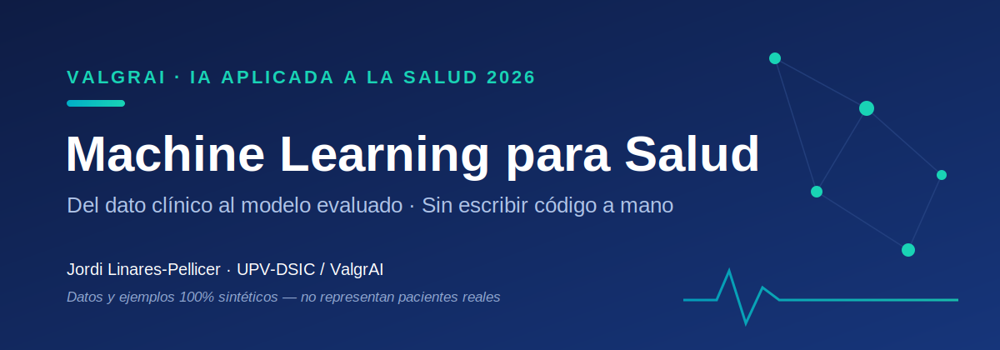

# Introducción

<figure><figcaption></figcaption></figure>

## Machine Learning para Salud · 2026

> Un recorrido conceptual y práctico, **del dato clínico al modelo evaluado y explicado**, con todos los ejemplos ejecutables en **Google Colab** apoyándose en asistentes de IA. Pensado para profesionales sanitarios, no para programadores.


**Todos los datos y ejemplos de este curso son sintéticos.** No representan ni derivan de pacientes reales: se generan con código reproducible y su única función es didáctica. Este aviso, además, es contenido formativo: en salud no se trabaja con datos de pacientes sin las debidas garantías éticas y legales.


### Para quién es este curso

Este material forma parte de la **parte de Machine Learning** del *Curso de Especialización de IA aplicada a la Salud* (marco ValgrAI). Está diseñado para **personal facultativo (asistencial y de gestión), investigación biosanitaria y perfiles TIC de salud**. No hace falta saber programar: la premisa del curso es justamente que **el criterio clínico lo pones tú y el código lo escribe la IA**.

### De qué va este curso

La hipótesis de partida es que, en 2026, entender Machine Learning **ya no consiste en escribir a mano cada línea de `scikit-learn`**, sino en **comprender qué hace cada familia de modelos, cuándo tiene sentido usarla, cómo evaluarla con honestidad y cómo interpretar lo que dice** — dejando que un asistente de IA (Gemini en Colab, Claude, u otros) genere el código a partir de la idea.

Para un profesional sanitario esto no es una comodidad: es lo que hace el curso **posible**. Por eso renunciamos deliberadamente a la profundidad matemática y nos centramos en el **criterio**: qué resuelve cada técnica, sus virtudes, sus límites y su campo de aplicación, siempre con ejemplos **anclados al mundo clínico** (riesgo cardiovascular, urgencias, notas clínicas, imagen médica) y reutilizando un **conjunto de datos sintéticos** común a lo largo de todas las unidades.

### Estructura

El curso se organiza en **doce unidades** (U0–U11) de dificultad incremental, más **material complementario** y los **notebooks** y **datasets** para la parte práctica. Las unidades del núcleo síncrono son **U1–U5 y U8**; el resto se trabaja a ritmo propio en asíncrono (lectura + notebooks + vídeos).

| #   | Unidad                                                                            | Contenido                                                                                     |
| --- | --------------------------------------------------------------------------------- | --------------------------------------------------------------------------------------------- |
| U0  | [Puesta a punto: Colab y Python](unidades/u00-colab-python.md)                     | Qué es Colab, celdas, Python/pandas/matplotlib — *ideas, no detalle* (on-ramp opcional)       |
| U1  | [¿Qué está pasando con la IA en salud?](unidades/u01-ia-hoy-en-salud.md)          | Oportunidades, posibilidades y límites reales hoy; encuadre para el colectivo sanitario       |
| U2  | [Fundamentos, método 2026 y EDA](unidades/u02-fundamentos-eda.md)                 | IA/ML/DL, generalización, cuándo NO usar ML, EDA y limpieza sobre datos de pacientes          |
| U3  | [Evaluar bien: métricas y validación](unidades/u03-metricas-validacion.md)        | Sensibilidad/especificidad, VPP/VPN, ROC/PR, calibración, prevalencia, coste del error        |
| U4  | [Supervisados I](unidades/u04-supervisados-i.md)                                  | Regresión lineal, **logística** (el modelo clínico por excelencia) y Naïve Bayes              |
| U5  | [Supervisados II + cómo elegir](unidades/u05-supervisados-ii.md)                  | SVM, árboles, ensembles, **validación cruzada, hiperparámetros, elegir el mejor**, SHAP       |
| U6  | [No supervisado](unidades/u06-no-supervisado.md)                                  | Clustering y **fenotipado de pacientes**, PCA, detección de anomalías                         |
| U7  | [Series temporales en salud](unidades/u07-series-temporales.md)                   | Validación temporal sin fugas; ingresos en urgencias como ejemplo clínico                     |
| U8  | [Redes, imagen y señal](unidades/u08-redes-imagen-senal.md)                       | Intuición del deep learning, **CNN → ViT**, qué es hoy posible con imagen y señal médica      |
| U9  | [Modelos fundacionales](unidades/u09-fundacionales.md)                            | **Hugging Face** y `pipeline()`; modelos biomédicos ES/EN; **APIs** (OpenAI/Claude/Qwen)      |
| U10 | [La IA como copiloto de ciencia de datos](unidades/u10-copiloto-datascience.md)   | **Prompting, metaprompting y loop engineering**; Cowork, Claude Code, Codex, Manus            |
| U11 | [Ética, sesgo, validación y privacidad](unidades/u11-etica-privacidad.md)         | Sesgo y equidad, validación clínica, privacidad, encuadre regulatorio (transversal, breve)    |

**Material complementario:** [Guía docente y plan de vídeos](docencia/guia-docente.md) · [Copiloto de ciencia de datos (guía end-to-end)](estudio/copiloto-datascience.md) · [Prompting, metaprompting y loop engineering](estudio/prompting-loops.md) · [Notebooks de Colab](notebooks/README.md) · [Datasets sintéticos](datasets/README.md)

### Cómo usar este material

* **Como libro/web (GitBook):** léelo de principio a fin o consulta la unidad que necesites.
* **Como colección de prácticas (Google Colab):** cada unidad enlaza con su notebook, que **abre directamente en Colab**. Empieza por [`00_Datos_Sinteticos_Maestro.ipynb`](notebooks/README.md) (genera los datasets) o simplemente abre el notebook de cualquier unidad: su **primera celda genera los datos sintéticos** por sí sola, así que no tienes que descargar nada.


**Una promesa para quien nunca ha programado.** No vas a escribir código de memoria. Vas a **leer** código bien comentado, **entender** qué decide en cada paso y **pedirle a un asistente** que lo adapte. Si en algún momento te pierdes con Colab o Python, la [Unidad 0](unidades/u00-colab-python.md) es tu red de seguridad.

