# U2 · Fundamentos, método 2026 y datos clínicos (EDA)

Esta es la primera unidad *densa* del núcleo síncrono, y tiene un objetivo doble.

Por un lado, nivelar el vocabulario y los conceptos para que todo el mundo —con independencia de su contacto previo con el Machine Learning— comparta el mismo mapa mental.

Por otro, fijar el **método de trabajo del curso**, que es deliberadamente distinto al de una asignatura clásica: aquí **el profesional sanitario razona en conceptos clínicos y el código lo genera un asistente de IA** (Gemini integrado en Google Colab, y donde tenga sentido Claude u otros).

No buscamos formar a nadie para que escriba `scikit-learn` de memoria, sino profesionales con **criterio** para decidir **qué familia de modelos** encaja en un problema clínico, **por qué**, y **cómo** llevar esa idea a un notebook ejecutable. Para un sanitario, que la IA escriba el código no es una comodidad: es lo que hace este curso **posible**.

A lo largo de la unidad construiremos también la base práctica que reutilizaremos durante todo el curso: un **conjunto de datos sintéticos de pacientes** (demografía, constantes y analítica orientadas al **riesgo cardiovascular**) sobre el que practicaremos el análisis exploratorio (EDA) y la limpieza.


**⚠️ Todos los datos de este curso son sintéticos.** No representan ni derivan de pacientes reales: se generan con código reproducible y su única función es didáctica. Este aviso, además, es contenido formativo: en salud **no se trabaja con datos de pacientes sin las debidas garantías éticas y legales**, y buena parte de nuestro esfuerzo consistirá precisamente en aprender a mirar los datos con esa responsabilidad. El dataset de riesgo cardiovascular *imita la lógica* de las tablas de riesgo que ya conocéis, pero **no es una herramienta validada y no debe usarse jamás con pacientes.**



**💡 Idea clave**

En 2026, el valor de un profesional que aplica ML no está en memorizar algoritmos, sino en **(1) entender qué hace cada familia de modelos y dónde encaja**, **(2) evaluar si un modelo "funciona" de verdad**, y **(3) saber pedir y leer críticamente el código que genera el asistente**. Esta unidad pone los cimientos de esas tres capacidades.


### Objetivos de esta unidad

* Un mapa claro de la relación entre **IA, Machine Learning, Deep Learning y estadística clásica**, y cuándo aporta valor cada enfoque en clínica.
* El vocabulario mínimo imprescindible: **feature, label, observación, dataset, modelo, entrenamiento e inferencia**, explicado con intuición.
* El criterio para responder a la pregunta más rentable de todas: **¿cuándo NO usar Machine Learning?** —especialmente importante en un contexto sanitario.
* La intuición de **generalización**: entrenamiento / validación / test, *overfitting* y *underfitting*, y cómo detectarlos sin entrar en matemática.
* El **método 2026** con Google Colab + un asistente de IA: de la idea clínica al notebook, con patrones de *prompt* reutilizables.
* Una primera práctica completa de **Análisis Exploratorio de Datos (EDA)** y limpieza sobre un fichero de pacientes con problemas reales de calidad.

## 2.1 Inteligencia Artificial, Machine Learning, Deep Learning y estadística: un mapa práctico

La primera fuente de confusión en cualquier conversación sobre IA es terminológica. Conviene ordenarla, porque decidir mal en qué "caja" cae un problema lleva a elegir herramientas equivocadas.

Empecemos por la más amplia.


**Concepto · Inteligencia Artificial (IA)**

Disciplina que busca que las máquinas realicen tareas que asociamos a la inteligencia humana: percibir, razonar, decidir, planificar, aprender o comunicarse. Es un paraguas enorme que incluye desde la búsqueda y la planificación clásicas o los sistemas expertos basados en reglas, hasta el aprendizaje automático y la optimización.


**No existe una única definición de IA aceptada por todos.** De hecho, la propia disciplina se ha definido históricamente de varias maneras según se priorice *pensar* o *actuar*, y hacerlo *como un humano* o *de forma racional*. Esta pluralidad no es un defecto: refleja que la IA es un campo amplio, con muchas escuelas.

<figure>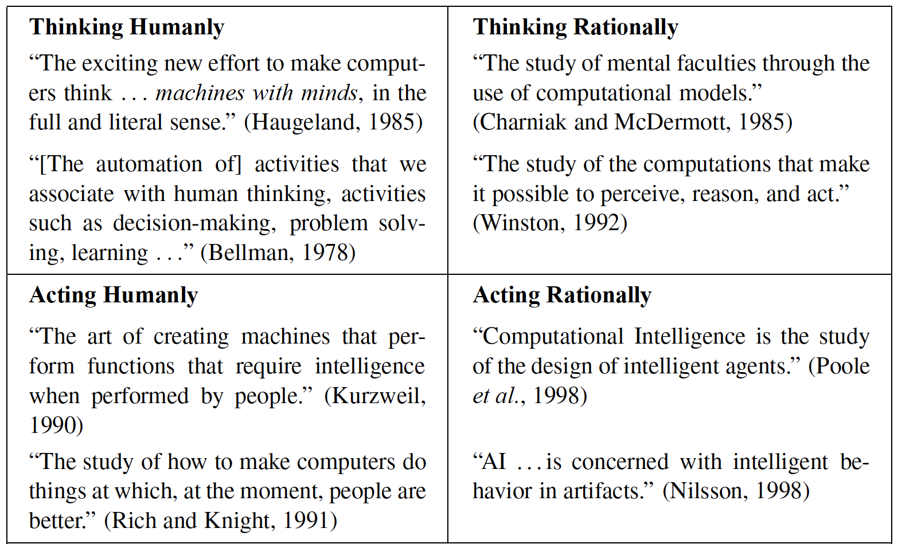<figcaption><p>Las cuatro grandes formas de definir la Inteligencia Artificial (pensar/actuar, como un humano/racionalmente). No hay una definición única.</p></figcaption></figure>

Dentro de ese paraguas conviven áreas muy distintas. Es útil verlas como un mapa: el razonamiento y la representación del conocimiento, la planificación y búsqueda, el procesamiento del lenguaje natural, la visión por computador, la robótica y, ocupando hoy el centro de gravedad, el **aprendizaje automático (Machine Learning)**.

<figure>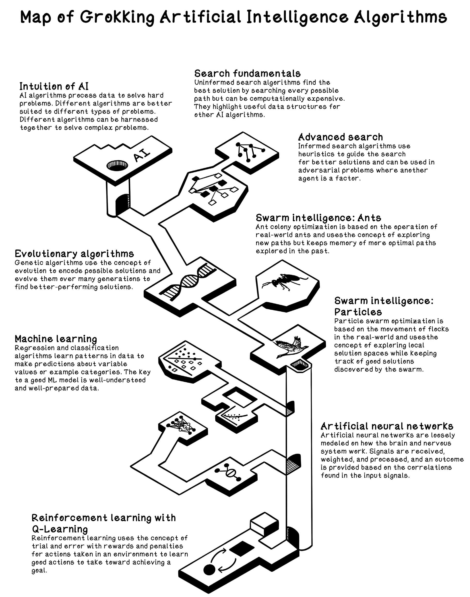<figcaption><p>Las grandes áreas de la Inteligencia Artificial. El Machine Learning es una de ellas, no un sinónimo de IA.</p></figcaption></figure>


**Concepto · Machine Learning (ML)**

Subcampo de la IA en el que el sistema **aprende patrones a partir de datos** en lugar de seguir reglas programadas explícitamente. En vez de escribir nosotros las reglas, le mostramos ejemplos y el algoritmo infiere una función que relaciona entradas con salidas.


La diferencia con la programación clásica es profunda y conviene interiorizarla.

**En el software tradicional, la persona escribe las reglas:** *si la creatinina supera este umbral, marcar alerta*. Las reglas las pone el conocimiento humano, una a una.

**En Machine Learning, en cambio, mostramos al sistema muchos ejemplos de "situación → resultado"** y es el algoritmo el que **deduce la regla**. Esto es especialmente valioso cuando las reglas son demasiado complejas, cambian con el tiempo o sencillamente no sabemos formularlas.

¿Qué regla exacta combina edad, tensión, glucemia, colesterol, hábito tabáquico y actividad física para estimar el riesgo cardiovascular a diez años de una persona concreta? Existen tablas de riesgo consolidadas (SCORE2, Framingham y otras) precisamente porque esa relación es difícil de escribir a mano.

Es lo que llamamos **INDUCCIÓN**: de muchos ejemplos particulares, el algoritmo generaliza una regla.


**Concepto · Deep Learning (aprendizaje profundo)**

Familia dentro del ML basada en **redes neuronales con muchas capas**. Su rasgo distintivo es que aprende automáticamente las representaciones útiles de los datos (las *features*) en lugar de que se las diseñe una persona. Domina en imagen, texto, audio y señal, donde los datos son de alta dimensión y poco estructurados —justo el terreno de la imagen médica y la monitorización.


La relación entre los tres términos es de muñecas rusas: **el Deep Learning es un tipo de Machine Learning, y el Machine Learning es una parte de la Inteligencia Artificial**. No son sinónimos, y usarlos como tales lleva a malentendidos costosos —también en un comité clínico donde se decide invertir en una u otra tecnología.

### ¿Y la estadística clásica? ¿Y la "ciencia de datos"?

Una pregunta legítima de cualquier profesional con formación cuantitativa es: *¿no es esto la estadística de siempre?*

La respuesta honesta es que hay un solapamiento enorme. La regresión lineal, que veremos en la U4, es a la vez un método estadístico centenario y el modelo de ML más simple. La diferencia es de **énfasis y objetivo**, no de fórmulas:

* La **estadística clásica** pone el foco en *explicar* y en la *inferencia*: entender qué variables influyen, cuantificar la incertidumbre, contrastar hipótesis. **Prioriza la interpretabilidad** y los supuestos del modelo. Es el lenguaje natural de la investigación biosanitaria (¿es este factor de riesgo significativo? ¿cuál es su intervalo de confianza?).
* El **Machine Learning** pone el foco en **predecir bien sobre datos nuevos**: le importa menos el *porqué* y más que el error en la práctica real sea bajo. Acepta modelos "caja negra" si generalizan mejor.
* La **ciencia de datos** es el oficio que envuelve a ambos: obtener, limpiar, explorar y visualizar datos, construir modelos y comunicar resultados. Es más amplia que el ML y, en la práctica, donde se pasa la mayor parte del tiempo.

<figure>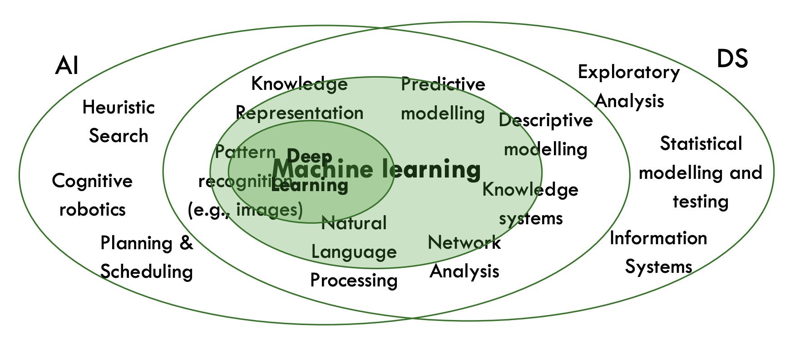<figcaption><p>Inteligencia Artificial frente a Ciencia de Datos: comparten herramientas (el Machine Learning) pero persiguen objetivos distintos. Explicar con rigor no es lo mismo que predecir bien.</p></figcaption></figure>


**💡 Idea clave**

Regla práctica: si el problema es **predecir un número o una categoría a partir de un histórico de pacientes**, piensa en Machine Learning. Si es **explicar y cuantificar relaciones con rigor** (un estudio de asociación, un factor de riesgo), piensa en estadística. Si los datos son **imágenes, texto, señal o audio** (una radiografía, una nota clínica, un ECG), piensa en Deep Learning. En salud, además, la elección casi nunca es solo técnica: la explicabilidad y la regulación pesan tanto como la precisión.


## 2.2 La idea central del Machine Learning: estimar una función a partir de datos

Si tuviéramos que resumir el Machine Learning supervisado en una sola frase, sería esta: **intentamos estimar una función desconocida f() que relaciona unas entradas con una salida, usando ejemplos observados**.

No conocemos la fórmula real que gobierna el riesgo cardiovascular de una persona, pero disponemos de un histórico de pacientes con sus características y su evolución; el algoritmo construye una aproximación de esa función.

<figure>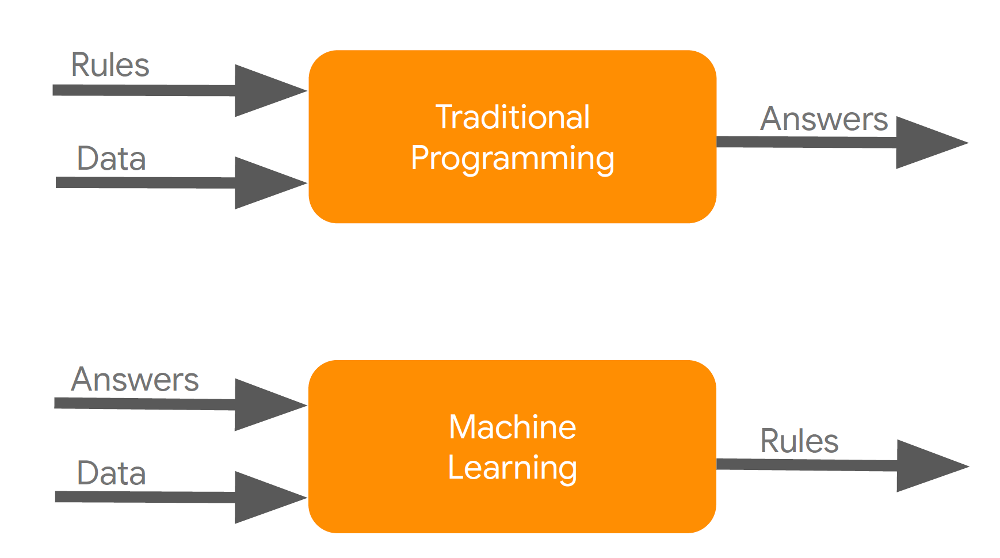<figcaption><p>El planteamiento del ML supervisado: a partir de pares (entrada, salida) observados —perfil del paciente y desenlace—, el algoritmo estima la función f() que los relaciona, para luego predecir sobre casos nuevos.</p></figcaption></figure>

El modelo más simple imaginable de esa función es una recta: la **regresión lineal**. A pesar de su sencillez, es un modelo de Machine Learning en todo derecho y un magnífico punto de partida conceptual: ajustamos la recta (o el plano) que mejor pasa por los puntos observados y la usamos para predecir valores nuevos.


**Concepto · Modelo**

Es la función aprendida: el objeto que, dada una entrada (el perfil de un paciente), produce una predicción (su riesgo, su clase). Entrenar consiste en ajustar los parámetros internos del modelo para que sus predicciones se parezcan lo más posible a los desenlaces reales del histórico, **y consiga generalizar ante entradas nuevas**.


Lo que hace especial al ML es que el modelo **mejora con los datos** y se adapta sin reprogramarlo: **si mañana disponemos de más pacientes o de nuevas variables, podemos reentrenar y el comportamiento evoluciona**.


**⚠️ Aviso**

Los modelos **deben** mantenerse **vivos**: una población cambia, aparecen nuevos tratamientos y guías, y un modelo congelado envejece mal.


<figure>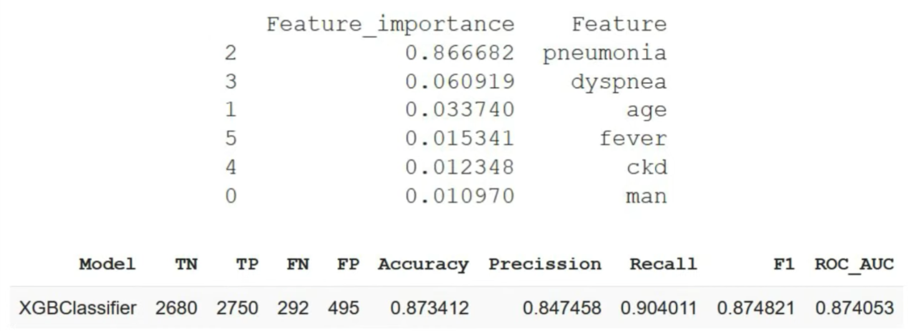<figcaption><p>Aprender de los datos significa que el comportamiento del sistema evoluciona al alimentarlo con nueva información, sin reescribir las reglas a mano. Un modelo clínico envejece si no se revalida y actualiza.</p></figcaption></figure>


**🩺 Aplicación clínica · De la idea a la función**

Pensemos en **estimar el riesgo cardiovascular a diez años** de una persona. La función real que lo determina es desconocida y muy compleja: depende de la edad, el sexo, la tensión, la glucemia, el colesterol (total y HDL), el hábito tabáquico, la actividad física, los antecedentes familiares… **Nadie puede escribir esa fórmula exacta a mano.**

El enfoque de ML invierte el problema: **recogemos un histórico** de pacientes con todas esas variables y su desenlace real, y **dejamos que el algoritmo estime la función**. El resultado es un modelo que, dado un paciente nuevo, estima su riesgo. En nuestro dataset sintético `pacientes.csv` conviven dos formas de plantearlo: predecir `riesgo_cv_10a` (un porcentaje → **regresión**) o predecir `evento_cv` (ocurre / no ocurre → **clasificación**, con una prevalencia en torno al 19 %).


## 2.3 Los tres grandes tipos de aprendizaje

El Machine Learning se organiza en tres grandes paradigmas según **qué información** tiene el algoritmo durante el entrenamiento. Distinguirlos bien es el primer filtro para encarar cualquier problema.

### Aprendizaje supervisado

Disponemos de ejemplos **etiquetados**: para cada entrada conocemos la salida correcta. El algoritmo **aprende la relación entrada→salida** para predecir la etiqueta de casos nuevos. Es el paradigma más común y el que más usaremos.

Dentro de él hay dos grandes tareas:

* **Regresión**: la salida es un *número continuo*. Ejemplo clínico: estimar el `riesgo_cv_10a` (un 7,3 %, un 21 %…) o una constante analítica.
* **Clasificación**: la salida es una *categoría*. Ejemplo clínico: predecir si habrá `evento_cv` (sí/no); clasificar una nota clínica por especialidad; decidir si una lesión es "sospechosa" o "benigna".

<figure>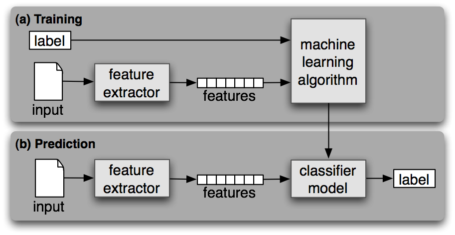<figcaption><p>Aprendizaje supervisado: a partir de datos observados con su etiqueta —pacientes con desenlace conocido—, el modelo aprende a predecir en casos nuevos.</p></figcaption></figure>

### Aprendizaje no supervisado

No hay etiquetas: solo tenemos las entradas y buscamos **estructura oculta** en los datos. Las tareas típicas son el ***clustering*** (agrupar elementos similares: **fenotipar** pacientes en subgrupos, agrupar centros parecidos) y la **reducción de dimensionalidad** (comprimir y visualizar muchas variables). Lo trataremos a fondo en la U6.

<figure>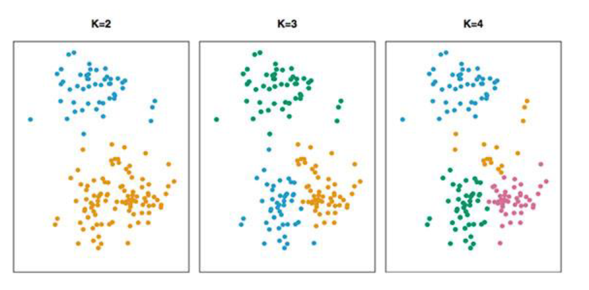<figcaption><p>Aprendizaje no supervisado (clustering): sin etiquetas de referencia, el algoritmo agrupa por similitud. En clínica, la base del fenotipado de pacientes.</p></figcaption></figure>

### Aprendizaje por refuerzo

Un agente aprende por **ensayo y error** interactuando con un entorno: toma acciones, recibe recompensas o penalizaciones y ajusta su política para maximizar el resultado a largo plazo. Es el paradigma detrás de la robótica, el control y los agentes de juego, y se investiga para políticas de tratamiento adaptativas.

En este curso solo lo mencionamos: tiene gran proyección, pero su aplicación directa a nuestro histórico de pacientes es menos inmediata, y su uso clínico exige cautelas específicas.

<figure>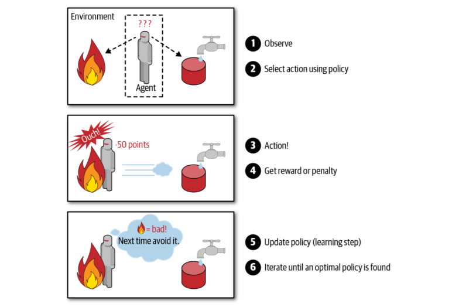<figcaption><p>Aprendizaje por refuerzo: el agente actúa en un entorno y aprende de las recompensas que recibe. Prometedor, pero delicado cuando las "acciones" afectan a personas.</p></figcaption></figure>


**💡 Idea clave**

Primer filtro ante cualquier problema clínico: **¿tengo la respuesta correcta en mi histórico?**

* Si **sí** → supervisado (¿un número? regresión; ¿una categoría? clasificación).
* Si **no, pero quiero descubrir subgrupos o casos raros** → no supervisado.
* Si **el sistema aprende decidiendo y recibiendo feedback** → refuerzo.


## 2.4 Vocabulario esencial (sin él, nada encaja)

Cuatro o cinco términos aparecerán en cada unidad. Vale la pena fijarlos ahora con un ejemplo concreto: una fila de nuestro histórico de pacientes.

<figure>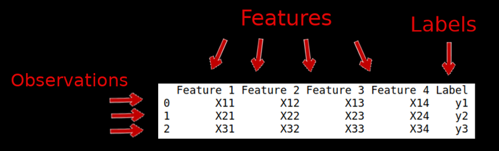<figcaption><p>El vocabulario del aprendizaje supervisado: las entradas son las <strong>features</strong> (atributos, variables independientes) y la salida es la <strong>label</strong> (variable dependiente, el desenlace).</p></figcaption></figure>

| Término | Qué es | En el histórico de pacientes |
| --- | --- | --- |
| Feature (variable, atributo) | Cada dato de entrada que describe el caso | edad, sexo, imc, tensión, glucemia, colesterol, hdl, tabaquismo, actividad física… |
| Label (etiqueta, objetivo, clase) | La salida que queremos predecir | `riesgo_cv_10a` (número) o `evento_cv` (0/1) |
| Observación (instancia, ejemplo, muestra) | Una fila: un paciente con sus **features** y su **label** | el paciente `P00042` con todas sus variables y su desenlace |
| Dataset | El conjunto de observaciones | el histórico completo (20 000 pacientes sintéticos) |
| Modelo | La función aprendida que mapea **features → label** | el estimador de riesgo cardiovascular entrenado |


**Concepto · Entrenamiento vs. inferencia**

**Entrenamiento** (*training*) es el proceso, normalmente costoso y puntual, de ajustar el modelo con el histórico.

**Inferencia** (*prediction*) es usar el modelo ya entrenado para predecir sobre datos nuevos; es rápida y repetida.

Un modelo se entrena pocas veces y se usa para inferir muchas. La distinción importa: se dimensiona y despliega de forma muy distinta el entrenamiento (ocasional, intensivo) y la inferencia (continua, de baja latencia, integrada en el punto de atención).


Conviene además anticipar un fenómeno que nos perseguirá: la **maldición de la dimensionalidad**.

A medida que añadimos *features*, el espacio de posibilidades crece exponencialmente y necesitamos muchísimos más datos para cubrirlo; con demasiadas variables y pocos pacientes, muchos modelos empeoran. En investigación biosanitaria esto es habitual (pensemos en datos "ómicos": miles de variables, pocas muestras).


**⚠️ Aviso**

**Más *features* no es siempre mejor.**


<figure>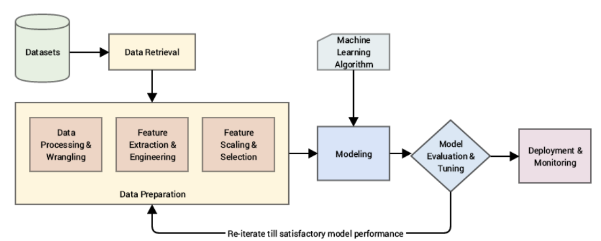<figcaption><p>La preparación del <strong>dataset</strong> (obtención, limpieza, integración) y la selección de variables (<strong>feature engineering</strong>) son el verdadero cuello de botella de la mayor parte del trabajo de datos. Con muchas variables y pocos casos, los modelos empeoran.</p></figcaption></figure>

## 2.5 El mapa de técnicas que recorreremos

Antes de entrar en cada familia, conviene tener una panorámica. Durante el curso recorreremos, de lo más simple a lo más sofisticado, un repertorio de técnicas supervisadas y no supervisadas.

Esta galería sirve de "índice visual": cada modelo "dibuja" la frontera o la relación de una manera distinta, y esa forma determina sus fortalezas.

| Familia | Técnica | Unidad | Idea en una frase |
| --- | --- | --- | --- |
| Supervisado · regresión | Regresión lineal | U4 | La recta (o plano) que mejor ajusta los puntos. |
| Supervisado · clasificación | Regresión logística | U4 | Como la lineal, pero devuelve una probabilidad de clase (el modelo clínico por excelencia). |
| Supervisado · clasificación | Naïve Bayes | U4 | Probabilidad de clase vía teorema de Bayes. |
| Supervisado · clasificación | SVM | U5 | El margen máximo que separa las clases. |
| Supervisado · ambas | Árboles de decisión | U5 | Reglas anidadas tipo "si… entonces". |
| Supervisado · ambas | Random Forest / Boosting | U5 | Muchos árboles combinados; reyes de lo tabular. |
| No supervisado | Clustering (k-means, DBSCAN) | U6 | Agrupar por similitud sin etiquetas. |
| Redes | Redes neuronales / CNN / ViT | U8 | Capas que aprenden representaciones; imagen y señal. |

Las imágenes siguientes muestran la intuición geométrica de varias de estas familias. No hace falta entender ahora los detalles: basta con registrar que **cada modelo separa o relaciona los datos de una forma distinta**.

<figure>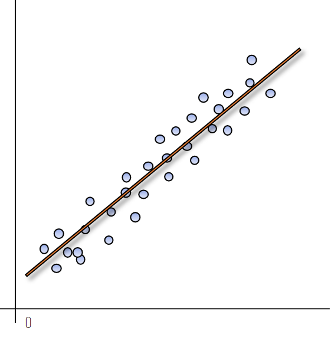<figcaption><p>Regresión lineal: ajusta una recta/plano a los datos.</p></figcaption></figure>

<figure>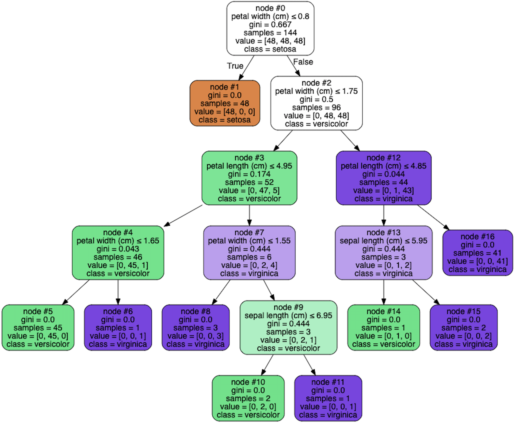<figcaption><p>Árboles de decisión: particiones rectangulares del espacio y máxima interpretabilidad —"si la tensión &gt; X y la edad &gt; Y…". Muy afines a la forma de razonar en clínica.</p></figcaption></figure>

<figure>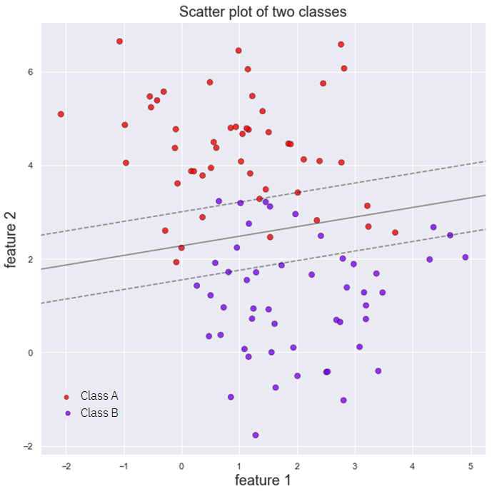<figcaption><p>SVM: busca el hiperplano de separación con margen máximo entre clases.</p></figcaption></figure>

<figure>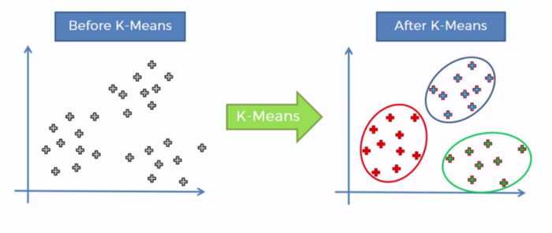<figcaption><p>Clustering (k-means / jerárquico): agrupa sin etiquetas por proximidad. La base del fenotipado de subgrupos de pacientes.</p></figcaption></figure>


**🩺 Aplicación clínica · Un adelanto que ya dice mucho**

Con este mismo dataset veremos en U4–U5 un resultado que conviene tener en mente desde ya: para clasificar `evento_cv`, la **regresión logística** (un modelo simple e interpretable) alcanza un rendimiento excelente (**AUC ≈ 0,84**) y **supera** a un Random Forest más sofisticado (≈ 0,83), porque el riesgo en estos datos es aproximadamente *aditivo* en escala logarítmica. En cambio, para estimar el **valor** del `riesgo_cv_10a` (regresión), Random Forest (R² ≈ 0,91) supera a la lineal (R² ≈ 0,81) al capturar interacciones. Gran lección anticipada: **empieza siempre por lo simple**; lo complejo solo se justifica si mejora de verdad.


## 2.6 La pregunta más rentable: ¿cuándo NO usar Machine Learning?

Un buen profesional se distingue tanto por los proyectos de ML que impulsa como por los que descarta a tiempo. En salud esto es doblemente cierto: un modelo mal planteado no solo desperdicia recursos, sino que puede **hacer daño**.

El ML no es gratis: requiere datos, infraestructura, mantenimiento, gobierno y —en clínica— validación y supervisión humana. Antes de emprender un proyecto, conviene pasar este filtro.


**⚠️ Señales de que probablemente NO necesitas Machine Learning**

**El problema se resuelve con reglas o guías clínicas claras.** Si un criterio validado o un umbral de guía cubre el caso ("si la glucemia en ayunas > 126 mg/dL, sospecha de diabetes"), una regla es más barata, más rápida y **auditable**. No pongas un modelo caja negra donde basta un criterio explícito y trazable.

**No tienes datos suficientes, de calidad o representativos.** Sin un histórico limpio y **representativo de la población a la que se aplicará**, el modelo aprenderá ruido o sesgo. En salud, un modelo entrenado en un solo hospital o en un perfil demográfico concreto puede no transferir a otro. A veces el proyecto correcto es primero *instrumentar y recoger buenos datos*, no entrenar.

**El coste supera al valor.** Si el error es barato de asumir o el volumen es pequeño, el esfuerzo de construir, validar, desplegar y mantener un modelo puede no compensar.

**Necesitas explicabilidad total o hay exigencia regulatoria.** Muchas decisiones clínicas deben poder justificarse. La regulación europea (marco de producto sanitario, EU AI Act) sitúa numerosos usos sanitarios como de **alto riesgo**, con requisitos estrictos de transparencia y supervisión. Un modelo opaco puede ser directamente inviable; convendrá uno simple e interpretable, o reglas.

**El entorno cambia más rápido de lo que puedes revalidar.** Nuevas guías, nuevos fármacos, cambios en la población o en cómo se registran los datos pueden dejar obsoleto el modelo antes de que aporte.

**El sesgo tendría consecuencias de equidad.** Si el modelo decide *sobre personas* y el histórico arrastra desigualdades (de acceso, de registro, de representación), el modelo las heredará y amplificará. Eso exige una cautela extra o, a veces, no hacerlo.



**💡 Idea clave**

El ML aporta valor cuando el patrón es **complejo** (difícil de codificar a mano), **estable** (el pasado se parece al futuro), hay **datos suficientes y representativos**, y el **error tiene un coste** que justifica reducirlo —**y** cuando podemos explicarlo y supervisarlo con las garantías que la clínica exige. Si fallan esas condiciones, las reglas, las guías o la estadística simple suelen ser mejores opciones.


## 2.7 El problema central de todo modelo: generalizar

Aquí está el corazón conceptual de la unidad, y el error más común de quien empieza.

El objetivo de un modelo **no** es acertar en los datos con los que aprendió, sino acertar en **datos nuevos que nunca ha visto**. A esa capacidad la llamamos ***generalización***.


**⚠️ Aviso**

Un modelo que se memoriza el histórico (predice de maravilla el pasado) pero **falla con pacientes nuevos** es **inútil** —y en clínica, potencialmente **peligroso**, porque genera una falsa confianza.


### Sobreajuste (overfitting) e infraajuste (underfitting)


**Concepto · Overfitting (sobreajuste)**

El modelo aprende **demasiado** del conjunto de entrenamiento, incluidos su **ruido** y sus **casualidades**. Acierta casi perfecto en los datos vistos pero falla con los nuevos. Es como quien memoriza los casos de un examen anterior sin entender la materia. En datos clínicos, puede "aprender" una peculiaridad de un aparato o de un centro que no se repite fuera.



**Concepto · Underfitting (infraajuste)**

El modelo es **demasiado simple** para capturar el patrón real. Falla tanto en entrenamiento como en datos nuevos. Es quien ni siquiera ha aprendido lo básico.


<figure>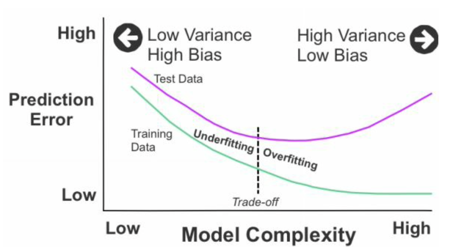<figcaption><p>El equilibrio entre infraajuste y sobreajuste: el infraajuste no captura el patrón; el sobreajuste se pega al ruido; el buen modelo encuentra el punto intermedio que generaliza.</p></figcaption></figure>

La intuición visual es muy potente. En **infraajuste**, la frontera del modelo es demasiado rígida y deja muchos errores. En el **punto bueno**, sigue la tendencia general sin obsesionarse con cada punto. En **sobreajuste**, la frontera se retuerce para capturar cada caso particular —incluido el ruido—, lo que la hace frágil ante datos nuevos.

<figure><figcaption><p>Otra mirada al sobreajuste: una frontera excesivamente compleja "memoriza" los datos de entrenamiento y pierde capacidad de generalizar. Cuanto más se retuerce para no fallar ni un caso, peor irá con pacientes nuevos.</p></figcaption></figure>

### Cómo se detecta y cómo nos protegemos: separar los datos con honestidad

Para medir la generalización sin engañarnos, partimos los datos en bloques con roles distintos. Esta disciplina es **innegociable**: mezclarlos es la causa número uno de modelos que brillan en la demo y fracasan en la práctica.

1. **Entrenamiento (train)**: con estos datos el modelo ajusta sus parámetros. Es lo único que "ve" para aprender.
2. **Validación (validation)**: se usa para tomar decisiones *sobre* el modelo (elegir configuración, comparar familias) sin tocar el test. Hace de "examen de práctica".
3. **Test**: se reserva y **no se toca** hasta el final. Es el "examen real" que estima cómo se comportará el modelo con pacientes nuevos. Si lo usas para decidir parámetros, deja de ser honesto.

El síntoma del sobreajuste es inconfundible al comparar el error en entrenamiento con el de un conjunto independiente: el error de entrenamiento sigue bajando, pero el de validación deja de mejorar e incluso empeora. Esa brecha que se abre es la firma del *overfitting*.

Cuando los datos escasean —lo habitual en muchos problemas clínicos—, una sola partición es una única tirada de dados: depende de qué pacientes cayeron por azar en cada bloque. La **validación cruzada** (*k-fold*) resuelve esto no fiándose de una única partición, sino promediando sobre varias: dividimos el dataset en *k* bloques, entrenamos *k* veces rotando cuál actúa como validación, y promediamos. Da una estimación **más estable** y aprovecha mejor unos datos escasos, a costa de más cómputo.

<figure>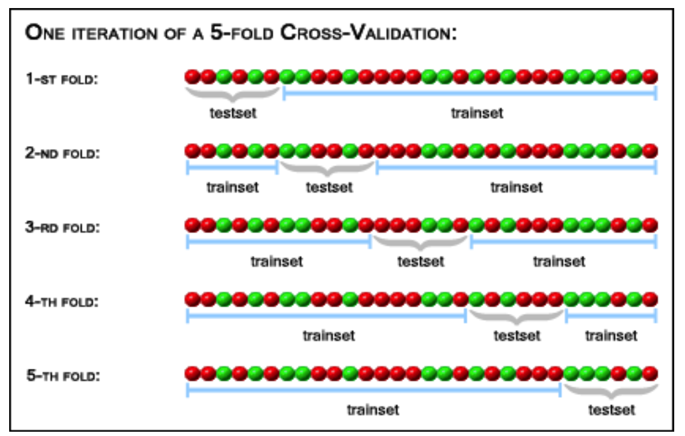<figcaption><p>Validación cruzada (k-fold): se rota el bloque de validación k veces y se promedia, obteniendo una estimación más fiable del rendimiento. Especialmente útil cuando los datos clínicos son escasos.</p></figcaption></figure>


**Concepto · Validación cruzada (k-fold)**

En lugar de una única partición train/validation, dividimos los datos en *k* bloques y repetimos el entrenamiento *k* veces, usando cada vez un bloque distinto como validación. Promediamos los resultados. Da una estimación más estable y aprovecha mejor los datos, a costa de más cómputo.



**⚠️ Fuga de información (data leakage): el error que más caro se paga**

Ocurre cuando información que el modelo **no debería conocer en el momento de predecir** se cuela en el entrenamiento. El resultado es un modelo con métricas espectaculares en pruebas que se desploma en la práctica.

Ejemplos típicos en datos clínicos: normalizar usando estadísticas calculadas sobre **todo** el dataset (incluido el test) *antes* de partir; o incluir como *feature* algo que en realidad es **consecuencia** del desenlace y no causa (por ejemplo, un dato registrado solo *porque* ocurrió el evento, o una prueba solicitada *después* del momento en que se supone que predecimos). En series temporales, usar datos del futuro para predecir el pasado —lo veremos en la U7, donde es especialmente traicionero.


### Interpretabilidad frente a rendimiento

Asociada a la complejidad aparece otra disyuntiva permanente: **interpretabilidad frente a rendimiento**.

Los modelos simples (regresión lineal o logística, árboles pequeños) son fáciles de explicar pero a veces menos precisos; los complejos (boosting, redes) suelen predecir mejor pero son más difíciles de auditar. En clínica, la elección depende del caso de uso y de las exigencias de gobierno y regulación: a menudo un modelo algo menos preciso pero **explicable** es preferible a una caja negra opaca. En la U5 veremos técnicas (como SHAP) que ayudan a *abrir* modelos complejos.


**💡 Idea clave**

Esto es solo la **intuición** de la evaluación honesta. El instrumental completo para juzgar un modelo clínico —sensibilidad y especificidad, VPP/VPN, curvas ROC y PR, calibración, el efecto de la **prevalencia** y el **coste asimétrico** de los errores (no cuesta lo mismo un falso negativo que un falso positivo)— es el objeto de la **U3**. Un modelo sin una métrica honesta y adecuada al problema es solo una opinión.


## 2.8 El método 2026: el clínico razona, el asistente programa

Llegamos al cambio de mentalidad que vertebra todo el curso. En una asignatura clásica dedicaríamos horas a escribir a mano el descenso de gradiente o a derivar una SVM. Aquí **no**.

La hipótesis de trabajo de 2026 es que ese código lo genera con solvencia un asistente de IA a partir de una buena descripción del problema. El tiempo del profesional se invierte donde de verdad aporta: **plantear bien el problema clínico, elegir el enfoque, leer críticamente el código y discutir los resultados**.


**💡 Idea clave**

No medimos el dominio por cuántas líneas de `scikit-learn` recordamos, sino por la calidad de nuestras **decisiones** y de nuestros *prompts*. El asistente es un programador rapidísimo; tú eres quien aporta el **criterio clínico**: qué pedir, qué revisar y cuándo desconfiar.


### El entorno: Google Colab con un asistente integrado

**Google Colab** es un entorno de *notebooks* Python que se ejecuta en la nube, sin instalar nada, con las librerías de ciencia de datos preinstaladas y **GPU gratuita** (que aprovecharemos para redes neuronales en la U8).

Su integración con **Gemini** permite generar y explicar código directamente desde el notebook, en lenguaje natural. Donde convenga, usaremos también **Claude** u otros modelos para tareas más amplias. Si nunca has tocado Colab, la [Unidad 0](u00-colab-python.md) es tu red de seguridad.

1. Abre un notebook nuevo en `colab.research.google.com` con tu cuenta de Google.
2. Activa la GPU cuando la necesites: *Entorno de ejecución → Cambiar tipo de entorno de ejecución → GPU*.
3. Pide código al asistente describiendo la tarea; **revisa siempre** lo que produce antes de ejecutarlo.
4. En este curso no tendrás que descargar datos: **la primera celda de cada notebook genera los datasets sintéticos** por sí sola.

### Anatomía de un buen prompt para generar un pipeline de ML

La calidad del código generado depende casi por completo de la calidad de la petición. Un buen *prompt* de ML especifica: **objetivo**, **datos** (fichero, columnas, *target*), **restricciones** (partición honesta, validación, sin fugas), **salidas** esperadas (métricas, gráficas) y **estilo** (comentado, paso a paso).

Este es el patrón que usaremos una y otra vez:

**🤖 Prompt para el asistente (Gemini en Colab) · Plantilla general de pipeline**

```
Actúa como científico de datos clínicos. Tengo el fichero 'pacientes.csv'
(datos SINTÉTICOS) con columnas: paciente_id, edad, sexo, imc, ta_sistolica,
ta_diastolica, glucemia, colesterol_total, hdl, tabaquismo, actividad_fisica,
antecedentes_familiares, diabetes, riesgo_cv_10a, evento_cv.

Objetivo: predecir 'evento_cv' (clasificación 0/1; prevalencia ~19%).

Hazlo paso a paso, en celdas separadas y con comentarios en español:
1. Carga y EDA breve (tipos, nulos, describe, 3 gráficas clave).
2. Prepara features (codifica categóricas) SIN fuga de datos.
3. Separa train/test de forma honesta y usa validación cruzada.
4. Entrena un baseline simple (regresión logística) y un modelo más
   fuerte (Random Forest); compáralos.
5. Reporta las métricas adecuadas para un problema clínico con clases
   desbalanceadas y dibuja la curva ROC.
Explica brevemente cada decisión antes de cada celda.
```

*Pídelo así y obtendrás un notebook completo. Tu trabajo es leerlo con criterio: ¿parte bien train/test? ¿hay alguna fuga? ¿la métrica tiene sentido clínico? (esto último lo afinamos en la U3).*


**⚠️ Leer el código del asistente con ojo crítico**

El asistente acierta la mayoría de las veces, pero **no siempre**. Revisa especialmente: que la partición train/test se haga **antes** de cualquier ajuste que use estadísticas globales; que no se incluya como *feature* algo que filtre la respuesta o sea consecuencia del desenlace; que la métrica elegida sea la adecuada para el problema (¡ojo con el *accuracy* cuando hay desbalance!); y que, en series temporales, no se mezcle futuro y pasado. El asistente programa; **el criterio lo pones tú.**


## 2.9 Análisis Exploratorio de Datos (EDA): conocer antes de modelar

Ningún modelo salva unos datos mal entendidos. Antes de entrenar nada, dedicamos tiempo a **mirar los datos**: su forma, sus tipos, sus valores ausentes, sus rarezas.

Esto es el **Análisis Exploratorio de Datos (EDA)**, y en un proyecto real consume buena parte del esfuerzo. Es, además, donde un asistente de IA brilla: genera en segundos el código de exploración que antes escribíamos a mano.


**Concepto · EDA (Exploratory Data Analysis)**

Proceso de investigación inicial de un dataset para descubrir patrones, detectar anomalías, comprobar supuestos y formular hipótesis, apoyándose en estadísticas resumen y visualización. Su objetivo es *entender* los datos antes de modelarlos.


<figure>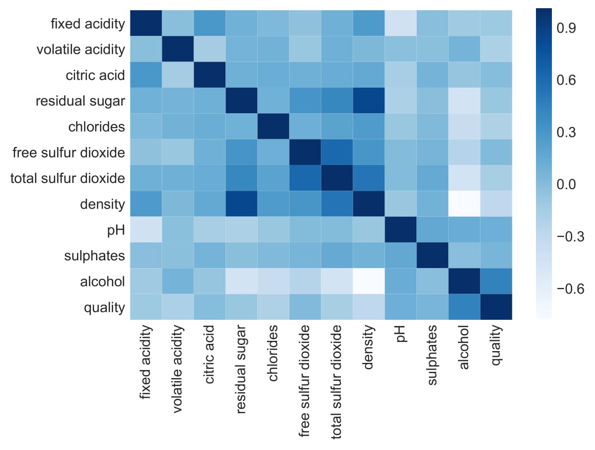<figcaption><p>El EDA es el paso de investigación inicial: resúmenes y gráficas para entender la forma y la calidad de los datos antes de modelar. Una matriz de correlación, por ejemplo, revela qué variables se mueven juntas.</p></figcaption></figure>


**Concepto · Data wrangling (preparación/limpieza)**

Proceso de transformar los datos de su forma cruda a una forma ordenada y lista para el análisis: corregir tipos, unificar categorías, tratar valores ausentes y atípicos, reconvertir unidades, eliminar duplicados. Suele ser la fase más larga de un proyecto de datos.


<figure>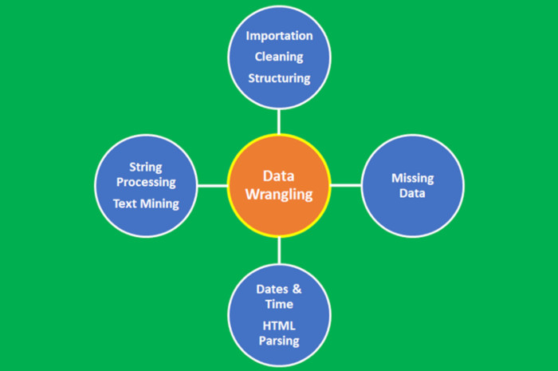<figcaption><p>Data wrangling: convertir los datos crudos en datos ordenados y listos para analizar. Rara vez los datos —y menos los clínicos— llegan limpios.</p></figcaption></figure>

Por qué esto importa tanto en salud lo resume una sola idea, y conviene grabarla:


**💡 Idea clave — la que hay que martillar**

Un modelo **aprende del histórico**. Si el histórico está **sucio o sesgado**, el modelo **hereda el sesgo**. No es un fallo técnico que se arregle con un algoritmo mejor: es un espejo. Si en los datos las mujeres jóvenes tienen menos analíticas completas, o un colectivo está infrarrepresentado, el modelo será peor precisamente con quien menos datos hay —y eso es un problema de **equidad clínica**, no solo de calidad de dato. La limpieza no es maquillaje: es una decisión con consecuencias.


## 2.10 EDA y limpieza de `pacientes_sucio.csv` con reglas de dominio clínico

Para que la práctica sea realista, hemos generado a propósito una versión **con problemas de calidad** del histórico de pacientes (`pacientes_sucio.csv`): la misma tabla de ~20 000 filas, pero con los defectos que encontraríamos en un volcado real de una historia clínica.

El EDA debe sacarlos a la luz. Estos son los que hemos inyectado:

| Problema de calidad | Cómo se manifiesta en el dataset | Tratamiento con regla de dominio clínico |
| --- | --- | --- |
| Sexo inconsistente | `M`, `m`, `Masculino`, `H`, `Hombre`, `Mujer`, `F`… mezclados | Normalizar y **mapear** a `M`/`F` con criterio; **flag** para los ambiguos |
| Glucemia con unidades mezcladas | Parte en mg/dL y parte en **mmol/L** (con coma decimal: `5,5`) | Detectar por magnitud y **reconvertir a mg/dL (×18)** |
| Nulos **no** aleatorios | `hdl` ausente sobre todo en pacientes jóvenes (patrón, no azar) | Imputar/tratar con cuidado; **documentar el sesgo**, no ocultarlo |
| Outliers imposibles | `edad` 250, `ta_sistolica` negativa, `imc` de 80–200 | Reglas de rango fisiológico, no solo IQR ciego |
| Texto en campos numéricos | `"desconocido"`, `"N/D"` dentro de columnas numéricas | Convertir a numérico (lo no válido → nulo) y luego tratar |
| Tabaquismo inconsistente | `nunca`/`ex`/`activo` con variantes (`Nunca`, `EX`, `Fumador`…) | Normalizar y mapear a las 3 categorías canónicas |
| Duplicados | Filas repetidas y pacientes repetidos por `paciente_id` | Eliminar duplicados exactos; resolver los lógicos con una regla |

Al ejecutar un EDA básico sobre este fichero, el diagnóstico es revelador. Verás algo así (los valores concretos dependen del fichero generado; lo importante es **el tipo** de hallazgo):

```
# Diagnóstico de calidad (esquema de la salida del EDA sobre el fichero sucio)
filas:                 ~20.000
valores únicos en 'sexo':   ['M', 'm', 'F', 'Masculino', 'Mujer', 'H', 'Hombre', ...]
'glucemia' (tipo):          object   <- ¡debería ser numérica! (comas y texto)
'glucemia' (histograma):    dos grupos: uno ~80–140 (mg/dL) y otro ~4–9 (mmol/L)
'edad'          min: 18    max: 250      (¡imposible!)
'ta_sistolica'  min: <0    ...           (¡negativa!)
'imc'           min: ...   max: ~200     (¡imposible!)
tokens de texto en numéricas: 'desconocido', 'N/D'
'hdl' ausente: más frecuente en el tramo de edad joven  (nulo NO aleatorio)
duplicados: filas repetidas y pacientes repetidos por 'paciente_id'
```

La lección es inmediata: lo que deberían ser **dos** valores de sexo aparece como media docena; una constante analítica llega en **dos unidades distintas** mezcladas; hay edades y tensiones de otro planeta; y faltan valores de forma **no aleatoria**.


**⚠️ Aviso**

Si entrenáramos sin limpiar, el modelo aprendería basura —y sesgo. El EDA es lo que nos permite verlo.


Ahora bien, cada uno de estos problemas es, en el fondo, una **decisión clínica**, no una receta mecánica. Repasemos los tres más delicados.

### Sexo: cuidado con mapear a ciegas

Parece trivial —bastaría con "poner todo en mayúsculas"— pero esconde una trampa. Tenemos `Masculino`, `H`, `Hombre` (varón), `Mujer` (mujer) y, sobre todo, `M` y `m` sueltos.

Y aquí está el problema: en español, **`M` es ambiguo**. Puede significar *Masculino* o *Mujer*, según quién lo tecleara. Nuestro objetivo canónico es `M`/`F` (como en `pacientes.csv`, con `M` = hombre/masculino y `F` = mujer/femenino), de modo que:

* `Masculino`, `Hombre`, `H` → `M`
* `Mujer`, `Femenino` → `F`

…pero **`M`/`m` a secas hay que resolverlo con cabeza**: revisando cómo se codificó en el origen o cruzando con otra variable, no adivinando. Documentar la decisión (y marcar los casos dudosos) es parte del trabajo.


**⚠️ Aviso · Normalizar no es lo mismo que interpretar**

`strip().lower()` unifica mayúsculas y espacios, pero **no decide qué significa `M`**. Convertir a ciegas todos los `M` a "hombre" (o a "mujer") introduce un error sistemático en una variable que luego pesa en el riesgo. La norma general: **primero normaliza el formato, después mapea el significado con una regla de dominio explícita, y deja rastro de lo que has decidido.**


### Glucemia: unidades mezcladas (mmol/L → mg/dL)

Este es el ejemplo más bonito de por qué el criterio clínico es insustituible. La columna `glucemia` llega, en parte, en **mmol/L** en lugar de mg/dL, y esos valores vienen además con **coma decimal** (`5,5` en vez de `5.5`).

Consecuencias:

* La coma hace que pandas lea la columna como **texto** (`object`), no como número. Primer paso: sustituir la coma por punto y convertir a numérico.
* Una vez numérica, el **histograma es bimodal**: un grupo grande en torno a 80–140 (mg/dL) y otro pequeño en torno a 4–9. Un valor de glucemia de "5,5" es **imposible en mg/dL** (sería una hipoglucemia letal) pero **perfectamente normal en mmol/L**. La pista es puramente clínica: conoces el rango fisiológico.
* Corrección: los valores del grupo bajo (mmol/L) se **reconvierten multiplicando por 18** (5,5 mmol/L → 99 mg/dL). Como referencia, el umbral de diabetes que usa el dataset, 126 mg/dL, equivale a 7,0 mmol/L: ese diálogo entre umbrales te ayuda a fijar dónde separar un grupo del otro.

Aquí ninguna herramienta estadística "sabe" que hay dos unidades: lo sabe **quien conoce la fisiología**. Reconvertir bien es literalmente traducir; hacerlo mal (o no verlo) mete un error enorme en la variable.

### Nulos que NO son aleatorios: HDL ausente en jóvenes

No todos los huecos son iguales. Que falte `hdl` **más en pacientes jóvenes** no es azar: es un patrón (un nulo *no aleatorio*, en la jerga MNAR). Y esto cambia por completo cómo lo tratamos:

* Rellenar los huecos con la **mediana global de HDL** empujaría a todos los jóvenes hacia un valor típico de la población general —falseando justo el subgrupo peor medido.
* **Eliminar** las filas con HDL ausente sería aún peor: expulsaríamos sistemáticamente a los pacientes jóvenes del dataset, y el modelo aprendería un mundo sin ellos.


**⚠️ Aviso**

La consecuencia enlaza con la idea clave de la unidad: un tratamiento ingenuo de los nulos **inyecta sesgo** que el modelo hereda, y ese sesgo tiene cara —la de un grupo concreto de pacientes.


Lo correcto es **detectar el patrón**, decidir un tratamiento consciente (imputación informada por edad/sexo, o dejar el valor como "ausente" explícito si el modelo lo admite) y, sobre todo, **documentarlo**: quien use el modelo debe saber que con jóvenes es menos fiable.

### Y el resto: outliers, texto, tabaquismo, duplicados

* **Outliers imposibles.** Una `edad` de 250, una `ta_sistolica` negativa o un `imc` de 80–200 no son "valores extremos" a discutir: son **físicamente imposibles**. Se detectan por **rango de dominio** (edad plausible, tensión positiva y en rango, IMC en un intervalo humano), no solo con un IQR automático que podría dejar pasar algunos o descartar valores altos pero reales.
* **Texto en campos numéricos.** `"desconocido"` o `"N/D"` dentro de una columna numérica son **nulos disfrazados**: obligan a leer la columna como texto. Se convierten a numérico forzando que lo no válido pase a nulo, y a partir de ahí se tratan como los demás huecos.
* **Tabaquismo inconsistente.** Las variantes de `nunca`/`ex`/`activo` se normalizan y mapean a las tres categorías canónicas. No es cosmética: en este dataset el hábito tabáquico marca un gradiente real de `evento_cv` (nunca ≈ 14 %, ex ≈ 22 %, activo ≈ 28 %). Si la categoría llega sucia, ese gradiente se diluye y el modelo pierde una señal clínica valiosa.
* **Duplicados.** Hay filas exactamente repetidas (se eliminan sin más) y pacientes repetidos por `paciente_id` con datos distintos (más delicados: exigen una regla de resolución justificada —quedarse con el registro más completo, por ejemplo—, no borrar a ciegas).

### Hacerlo con el asistente: primero explorar, luego limpiar

En lugar de escribir el EDA a mano, se lo pedimos al asistente. Conviene **separar EXPLORAR de LIMPIAR**: primero *entender*, luego *corregir*.

**🤖 Prompt para el asistente (Gemini en Colab) · EDA guiado del fichero sucio**

```
Tengo 'pacientes_sucio.csv' (datos SINTÉTICOS). Haz un EDA completo en
español, por celdas:
1. df.info(), df.describe(include='all') y % de nulos por columna.
2. Valores únicos de columnas categóricas ('sexo', 'tabaquismo'):
   ¿hay inconsistencias de texto o codificación?
3. Comprueba el TIPO de 'glucemia' y 'imc': ¿hay texto o comas decimales
   donde debería haber números?
4. Histogramas de 'glucemia', 'imc', 'edad', 'ta_sistolica'; marca valores
   fisiológicamente imposibles y comenta si 'glucemia' parece bimodal.
5. ¿El patrón de nulos de 'hdl' se relaciona con la 'edad'? (compáralo).
6. Cuenta duplicados exactos y duplicados por 'paciente_id'.
Resume al final, en una lista, TODOS los problemas de calidad encontrados.
```

Una vez entendidos los problemas, la limpieza también se delega, pero con instrucciones precisas que reflejan **reglas de dominio clínico**:

**🤖 Prompt para el asistente · Limpieza con reglas de dominio clínico**

```
Limpia 'pacientes_sucio.csv' y guarda 'pacientes_limpio.csv'. Datos SINTÉTICOS.
- 'sexo': normaliza (minúsculas, sin espacios) y mapea a {M, F}:
  'masculino'/'hombre'/'h' -> M ; 'mujer'/'femenino' -> F.
  Los 'm'/'M' ambiguos: NO los asignes a ciegas; márcalos aparte y avísame.
- 'glucemia': primero pásala a numérica aceptando coma decimal (5,5 -> 5.5).
  Luego detecta los valores en mmol/L (los que quedan en un rango bajo,
  ~3–15) y conviértelos a mg/dL multiplicando por 18. Justifica el umbral.
- 'tabaquismo': normaliza y mapea a {nunca, ex, activo}.
- Convierte a numérico las columnas con texto tipo 'desconocido'/'N/D'
  (lo no válido -> NaN).
- Reglas de dominio (descarta o marca lo imposible): edad en [0,120],
  ta_sistolica > 0 y plausible, imc en un rango humano.
- 'hdl' ausente: NO imputes con la mediana global. Como falta sobre todo en
  jóvenes, imputa informado por edad (y sexo) o deja el valor como ausente
  explícito; DOCUMENTA esta decisión y su posible sesgo.
- Elimina duplicados exactos; para duplicados por 'paciente_id', quédate con
  el registro más completo.
Muestra un antes/después: nº de filas, valores únicos de 'sexo' y 'tabaquismo',
y rangos de 'glucemia', 'edad', 'imc'. No pises el fichero original.
```

* **Normalización primero, significado después:** unifica el formato y luego decide qué representa cada valor con una regla explícita.
* **Reglas de dominio:** el conocimiento clínico (rangos fisiológicos, unidades, umbrales) es tan importante como la estadística para limpiar.
* **Imputación con criterio y consciencia del sesgo:** cómo rellenas los huecos puede introducir desigualdad; hazlo informado y déjalo por escrito.
* **Trazabilidad:** guarda siempre el dataset limpio aparte y registra qué cambiaste. **Nunca pises el fichero original.**


**💡 Idea clave**

La secuencia mental del EDA y la limpieza es siempre la misma: **mirar → diagnosticar → corregir con reglas de dominio → verificar el antes/después**. El asistente acelera cada paso, pero **qué es un valor "imposible", qué unidad tiene una analítica o qué imputación es "sensata" lo aporta quien conoce la clínica**. Limpiar es, ante todo, una decisión clínica.



**🩺 Aplicación clínica · Por qué esto importa en datos reales**

Una historia clínica real arrastra exactamente estos problemas a gran escala: laboratorios de distintos centros que reportan en **unidades diferentes**, sexo y otras categorías codificadas de mil maneras según el sistema, sensores y constantes con lecturas imposibles, campos de texto libre colados donde debería haber números, cargas duplicadas por reprocesos y —lo más serio— **huecos que no son aleatorios** porque reflejan quién accede menos al sistema o a quién se le piden menos pruebas. La calidad del dato es el **techo** de la calidad del modelo: ningún algoritmo, por sofisticado que sea, compensa un histórico sucio o sesgado. Y en salud, ese sesgo se traduce en desigualdad ante el paciente.


## 2.11 Práctica guiada y cierre


**🔬 Práctica en Colab · `U02_Fundamentos_EDA.ipynb`**

El notebook recorre, de principio a fin y apoyándose en el asistente: la generación de los datos sintéticos, un **EDA completo** del fichero `pacientes_sucio.csv`, su **limpieza con reglas de dominio clínico** (sexo, unidades de glucemia, nulos no aleatorios, outliers, texto, tabaquismo, duplicados) y una primera reflexión sobre qué *features* tienen sentido para estimar el riesgo cardiovascular.

Su **primera celda genera los datos sintéticos** por sí sola: no hay que descargar nada. No entrenamos aún ningún modelo serio —eso empieza en la U3 y la U4—; el objetivo es interiorizar el flujo de *mirar y preparar los datos*, que es la base de todo lo que viene.

[Abrir en Colab](PENDIENTE_DRIVE)


### Lista de comprobación

* Sé situar un problema en el mapa **IA / ML / Deep Learning / estadística** y justificar el encaje en un contexto clínico.
* Distingo **supervisado, no supervisado y refuerzo**, y dentro del supervisado, **regresión vs. clasificación**.
* Manejo el vocabulario: **feature, label, observación, dataset, modelo, entrenamiento, inferencia**.
* Sé argumentar **cuándo NO usar ML** en salud (reglas/guías, datos, coste, explicabilidad, deriva, equidad).
* Entiendo **generalización, overfitting/underfitting** y la disciplina **train/validation/test** y la **validación cruzada**, y reconozco la **fuga de datos**.
* Sé pedir al asistente un **pipeline** y un **EDA** con buenos *prompts*, y leer su código con criterio.
* He realizado un **EDA y una limpieza** completos sobre un histórico de pacientes con problemas reales de calidad, tomando decisiones **de dominio clínico**.


**Concepto · Glosario rápido de la unidad**

**Feature**: variable de entrada. · **Label**: salida a predecir (el desenlace).

**Observación**: una fila = un paciente con sus features y su label.

**Modelo**: función aprendida. · **Entrenamiento/Inferencia**: aprender vs. usar.

**Overfitting/Underfitting**: memorizar el ruido vs. quedarse corto.

**Train/Val/Test**: aprender / decidir / examinar. · **k-fold**: validación cruzada rotando el bloque de validación.

**Data leakage**: información del futuro o de la respuesta que se cuela en el entrenamiento.

**EDA**: exploración inicial de los datos. · **Data wrangling**: limpieza y preparación.


### Un apunte para tener en el radar: del código generado al que se mejora solo

El método que hemos fijado —el profesional describe el problema y el asistente genera el código— tiene una prolongación natural: si el asistente puede **generar** un EDA o un pipeline, también puede **mejorarlo de forma iterativa** a partir de los resultados.

Es el ciclo **Planificar → Actuar → Observar** que ya has usado sin nombrarlo: pides una limpieza (planificar), la ejecutas (actuar), lees el antes/después (observar)… y vuelves a pedir una mejora. Cuando ese ciclo se cierra de forma sistemática contra una métrica objetiva, hablamos de un *bucle de auto-mejora* (**agentic loop**).

No hace falta nada especial para empezar: le pegas al asistente el código y su resultado, y le pides *una* mejora concreta. Lo abordamos en profundidad en la **U10** (la IA como copiloto de ciencia de datos). Por ahora basta el concepto: en 2026, generar el código es solo la primera vuelta; mejorarlo iterando es la siguiente.

### Qué llevarte

* **El ML aprende una función a partir de ejemplos.** No programamos las reglas: se las mostramos con datos. Y el objetivo no es acertar en el pasado, sino **generalizar** a pacientes nuevos.
* **La pregunta más rentable es "¿de verdad hace falta ML aquí?".** En salud, una guía clara, la falta de datos representativos, la exigencia de explicabilidad o el riesgo de inequidad pueden hacer que la mejor solución **no** sea un modelo.
* **En 2026 el criterio clínico lo pones tú y el código lo escribe la IA.** Tu valor está en plantear el problema, elegir el enfoque y **leer el código con ojo crítico**.
* **La calidad del dato es el techo del modelo.** El EDA y la limpieza son donde se gana o se pierde un proyecto; limpiar es una **decisión clínica** (unidades, rangos, significado de una categoría), no solo técnica.
* **Un modelo hereda el sesgo de su histórico.** Nulos no aleatorios, subgrupos infrarrepresentados o categorías mal codificadas se convierten en desigualdad ante el paciente. Mirarlo de frente es parte del oficio.

Con los fundamentos claros y los datos ya entendidos y limpios, el siguiente paso obligado —antes de entrenar ningún modelo "de verdad"— es aprender a **evaluarlo con honestidad**.

Porque un modelo sin una métrica adecuada al problema clínico es solo una opinión. Y en salud, elegir bien la métrica (sensibilidad, especificidad, VPP/VPN, el peso de la prevalencia, el coste distinto de cada error) marca la diferencia entre una herramienta útil y una peligrosa. Eso es exactamente la **U3**.
</content>
