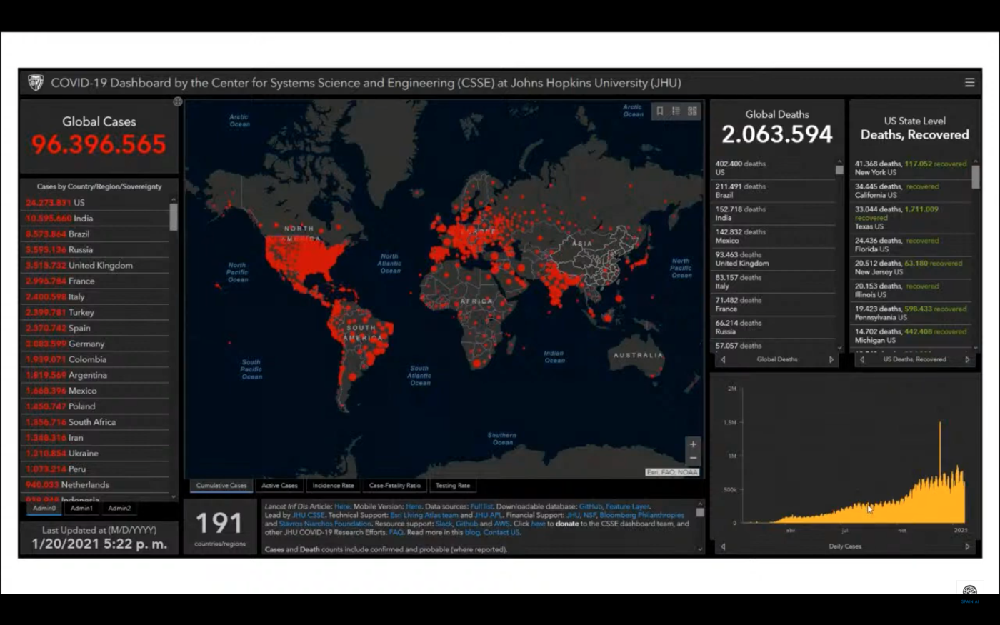
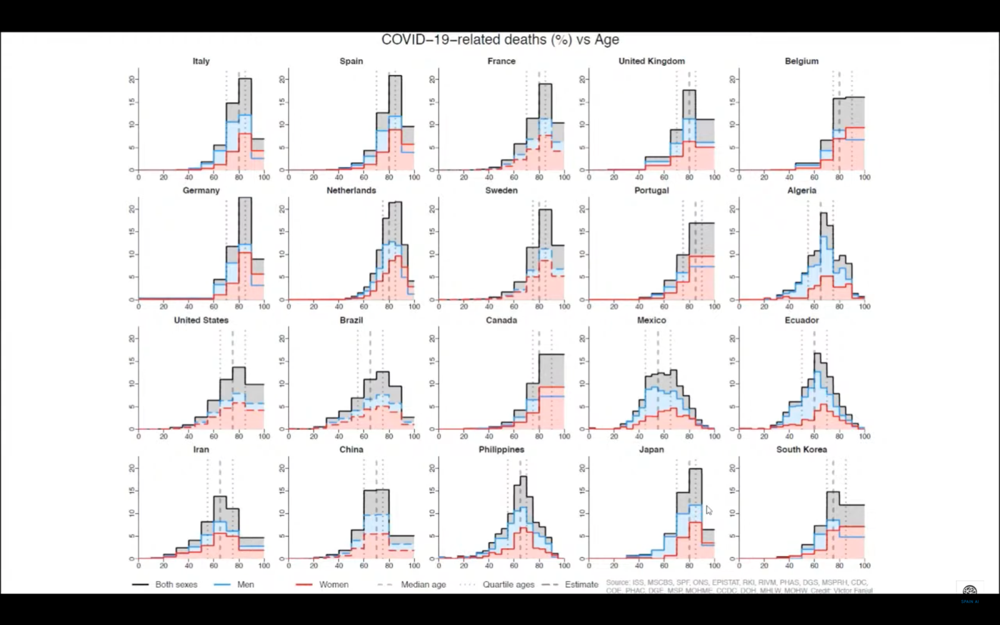
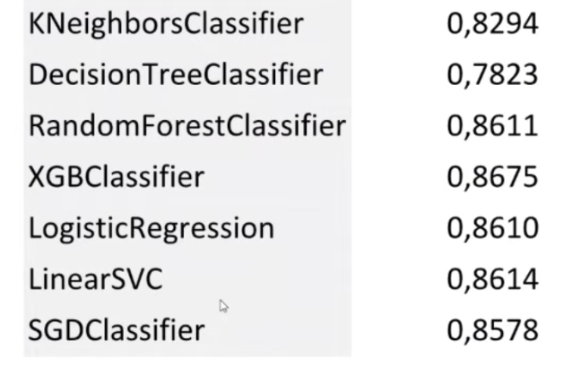
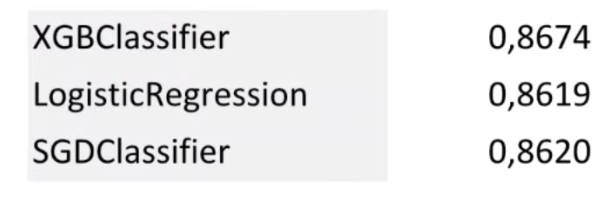
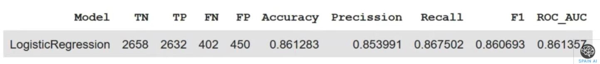
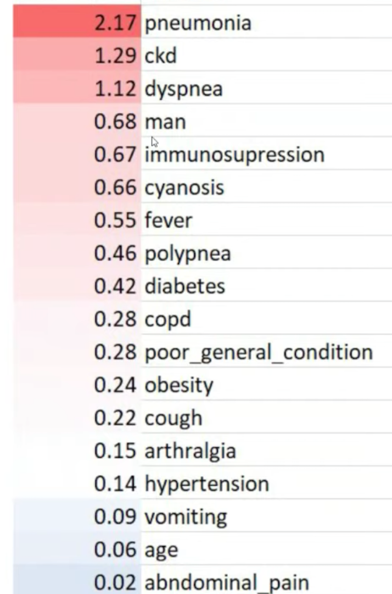
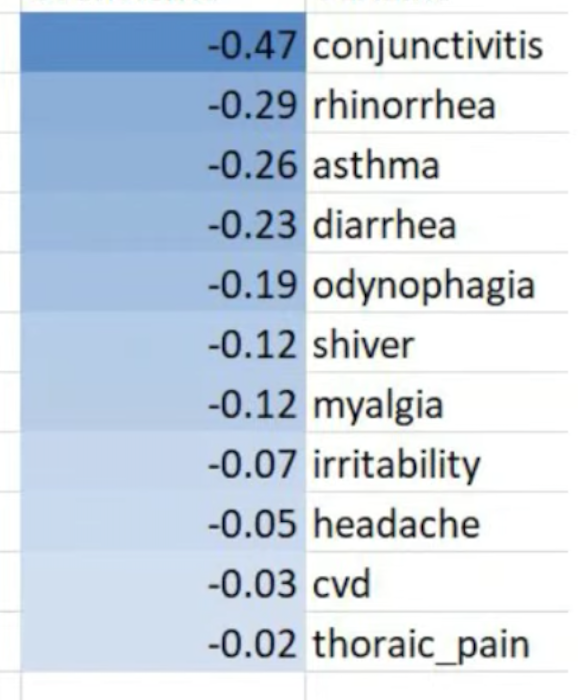
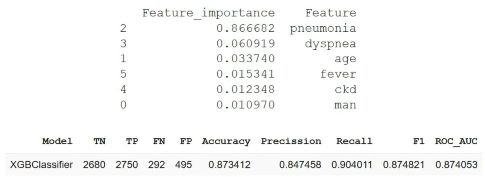

# Caso real · ML para predecir la mortalidad por COVID-19 (México)


**Antes de seguir a la U3.**

Acabas de ver, en la U2, los **fundamentos** (qué es el ML, cuándo NO usarlo, generalización) y el trabajo de **explorar y limpiar los datos**.

Esta página es un **alto en el camino**: un caso **real y reciente** que reúne todo eso en un mismo proyecto. Léelo con calma; cuando termines, la flecha **Next** te llevará a la U3.


Casi todo el curso se apoya en **datos sintéticos** (inventados de forma controlada). Aquí, en cambio, miramos un proyecto hecho con **datos reales y públicos**: es la mejor forma de ver que, en la práctica, **el modelo es la parte fácil; lo difícil son los datos**.


**💡 La idea que te vas a llevar**

La complejidad del Machine Learning **no está solo** en los modelos, sus propiedades y sus hiperparámetros. Está, sobre todo, en la **calidad de los datos** (representatividad, clases desbalanceadas, escalado…) y en la **ingeniería de características** (elegir y construir bien las variables). Este caso lo demuestra de principio a fin.


## 1. El reto: ¿podemos anticipar qué pacientes tienen más riesgo?

El proyecto —desarrollado por **Víctor Fanjul (Savana Medical)**— se planteó un objetivo muy concreto y muy clínico:

> **Estimar la probabilidad de fallecimiento (*exitus*) de un paciente de COVID-19** a partir de un conjunto de características suyas (edad, sexo, síntomas, enfermedades previas, entorno social…).

Un modelo así, si funciona y es fiable, podría ayudar a **priorizar** y a **anticipar** la gravedad. Pero antes de pensar en el modelo, aparecieron los verdaderos retos:

* **¿Dónde conseguir buenos datos?** Necesitábamos información **individual** (de cada paciente, no promedios), **anónima**, **completa** y recogida con una **metodología** común.
* **¿Qué variables usar?** Esto es la **ingeniería de características** (*feature engineering*), y condiciona todo lo demás.


**🩺 Concepto · *Exitus***

*Exitus* es el término clínico para el **fallecimiento** del paciente. Aquí es la **etiqueta** que queremos predecir: un problema de **clasificación** (fallece / no fallece), exactamente como el `evento_cv` de nuestro hilo sintético.


### La fuente de datos: los datos abiertos de México

El investigador encontró que **México**, y en particular la **Ciudad de México**, ofrecía —a través del sistema de vigilancia epidemiológica (**SINAVE**) y del portal de **Datos Abiertos** de la Dirección General de Epidemiología— una de las fuentes **más completas** del mundo para este fin: datos **individuales**, actualizados y recogidos de forma homogénea.

<figure><figcaption>
La materia prima del proyecto: los <strong>datos abiertos</strong> de la Secretaría de Salud de México. Que exista una fuente pública, individual y bien estructurada es lo que hace posible el proyecto.
</figcaption></figure>

## 2. Por qué los datos **agregados** no sirven para el ML

Durante la pandemia todos vimos **tableros** como el de la Universidad Johns Hopkins: casos y muertes por país, mapas, curvas… Información valiosísima para la **comunicación** y la **salud pública**.

<figure><figcaption>
Un tablero epidemiológico clásico: cifras <strong>agregadas</strong> por país (casos, muertes, mapa mundial).
</figcaption></figure>

Pero para **entrenar un modelo que prediga el riesgo de un paciente concreto**, estos datos **no sirven**. Un modelo aprende de **ejemplos individuales** (una fila por paciente, con sus características y su desenlace). Un total nacional de fallecidos no dice nada sobre **quién** tiene más riesgo.

Incluso un gráfico tan informativo como el reparto de fallecidos **por edad** en distintos países nos ayuda a *entender* el fenómeno, pero **no permite predecir** para una persona: sigue siendo una vista agregada.

<figure><figcaption>
Fallecimientos por COVID-19 según la <strong>edad</strong>, país a país. Útil para comprender, pero sigue siendo información <strong>agregada</strong>: no basta para predecir el desenlace de un paciente individual.
</figcaption></figure>


**⚠️ Aviso · Agregado ≠ individual**

Una de las confusiones más frecuentes al empezar. Para hacer ML **necesitas datos por individuo** (una fila = un paciente). Las tablas de totales, medias o porcentajes son para informar, no para entrenar. Es la misma razón por la que nuestro [`pacientes.csv`](https://drive.google.com/file/d/1Ku0j-sAf8Cr3FPT-DGm8v5p4h_2BmV5U/view?usp=drive_link) tiene **una fila por paciente**.


## 3. Ingeniería de características: elegir bien las variables

Con datos individuales sobre la mesa, el paso decisivo fue **seleccionar y construir las características**. Los criterios que guiaron el trabajo:

* Usar datos **no agregados** (nivel individual).
* Combinar información **clínica, social y demográfica**.
* Datos **centralizados, actualizados** y recogidos con una **metodología** común.
* Tener muy presentes las consideraciones **éticas y legales** (datos anónimos, uso responsable).

A partir de ahí se seleccionó una **amplia colección de variables** disponibles: edad, sexo, numerosas **enfermedades previas**, **síntomas**, entorno **demográfico** y **social**…


**💡 Idea clave · La ingeniería de características es donde se gana o se pierde**

Elegir qué variables entran (y cómo se construyen) suele influir **más** en el resultado que el modelo concreto que uses. Un buen conjunto de características con un modelo sencillo casi siempre gana a un modelo sofisticado alimentado con malos datos.


## 4. Preparar los datos: lo que casi nadie cuenta

Antes de entrenar nada, hubo que hacer el trabajo **poco glamuroso** pero decisivo de **limpieza y preparación**. Cuatro decisiones típicas —y muy formativas— de este proyecto:

**Control del sobreajuste con validación cruzada.** Para no engañarse con un buen resultado que no se sostiene, se usó **validación cruzada** (lo veremos a fondo en la U5).

**Clases desbalanceadas.** La mortalidad era del **12,6 %**: hay muchísimos más pacientes que se recuperan que pacientes que fallecen. Un modelo, por pura estadística, **tiende a la clase mayoritaria** (podría "acertar" mucho diciendo siempre "sobrevive"). Para evitarlo se **equilibraron** las clases mediante *down-sampling*: un conjunto con **50 % de fallecimientos y 50 % de recuperaciones**.

**Valores ausentes.** ¿Qué haces si no sabes si un paciente concreto tiene diabetes o no? Aquí se optó por **imputar a 0** (asumir que no consta la enfermedad) y, en algún caso, **excluir la variable** entera. Toda decisión sobre ausentes es también una **decisión clínica**, no solo técnica.

**Escalado de los datos.** Muchos modelos son **sensibles al rango** de los valores (no es lo mismo una edad de 0–100 que un 0/1). Escalar pone a todas las variables en una escala comparable.


**⚠️ Aviso · Las clases desbalanceadas engañan a la exactitud**

Con un 12,6 % de fallecimientos, un modelo tramposo que dijera *"todos sobreviven"* acertaría el **87 %** de las veces… y sería **inútil**. Por eso, cuando las clases están desbalanceadas, la *exactitud* a secas no vale: hay que mirar **sensibilidad, especificidad y las curvas** que veremos en la **U3**.


## 5. Probar varios modelos y elegir con criterio

Con los datos ya preparados, se entrenaron y compararon **varios modelos** (los mismos que iremos viendo en U4 y U5), midiendo su **exactitud de validación**:

<figure><figcaption>
Primer barrido de modelos por <strong>exactitud de validación</strong>. Casi todos rondan el 0,86; el árbol simple se queda algo por detrás y el <em>gradient boosting</em> (XGB) va ligeramente en cabeza.
</figcaption></figure>

Un primer aprendizaje: **casi todos los modelos rondan el 0,86**, y las diferencias son pequeñas. El árbol de decisión aislado (0,78) se queda atrás; el resto están muy igualados. Luego se **afinaron** (ajuste de hiperparámetros) los mejores candidatos:

<figure><figcaption>
Tras el ajuste de hiperparámetros, los mejores candidatos quedan prácticamente <strong>empatados</strong> alrededor de 0,86–0,87.
</figcaption></figure>

Con los modelos casi empatados, la decisión final no se tomó **solo por la métrica**. Se eligió la **regresión logística** por una razón clínica de peso: es **interpretable**. En medicina, poder **explicar por qué** el modelo predice un riesgo alto vale tanto —o más— que un par de décimas de exactitud.

<figure><figcaption>
Métricas del <strong>modelo final</strong> (regresión logística), leídas desde su matriz de confusión: exactitud 0,861, precisión 0,854, sensibilidad (<em>recall</em>) 0,868, F1 0,861 y ROC-AUC 0,861. Todo esto lo aprenderás a leer en la U3.
</figcaption></figure>


**💡 Idea clave · A veces gana lo simple (y lo explicable)**

Igual que en nuestro hilo sintético la **logística** competía de tú a tú con modelos más complejos, aquí ocurre lo mismo: con las métricas empatadas, se prefiere el modelo **interpretable**. Es una decisión de **criterio**, no de fuerza bruta.


## 6. Interpretabilidad: qué dice el modelo sobre el riesgo

La gran ventaja de la regresión logística es que cada variable tiene un **coeficiente** que nos dice **cuánto y en qué sentido** empuja el riesgo. Ordenados, cuentan una **historia clínica** reconocible.

Variables que **aumentan** el riesgo de fallecimiento (coeficiente positivo):

<figure><figcaption>
Factores que <strong>elevan</strong> el riesgo. Encabezan la lista la <strong>neumonía</strong> (2,17), la <strong>enfermedad renal crónica</strong> (1,29) y la <strong>disnea</strong> (1,12); les siguen el sexo masculino, la inmunosupresión, la cianosis, la fiebre, la diabetes…
</figcaption></figure>

Variables que **disminuyen** el riesgo (coeficiente negativo):

<figure><figcaption>
Factores asociados a <strong>menor</strong> riesgo en el modelo. Curiosamente aparecen síntomas "catarrales" leves (rinorrea, conjuntivitis, odinofagia): suelen acompañar a cuadros menos graves.
</figcaption></figure>

La lista **positiva** es clínicamente muy creíble: la **neumonía** como marcador de gravedad, la **enfermedad renal crónica**, la **disnea**, el **sexo masculino** o la **inmunosupresión** son factores de mal pronóstico bien conocidos. Que el modelo los "descubra" solo con datos es una **señal de confianza**.


**⚠️ Aviso · Un coeficiente no es una causa**

Que el asma o la conjuntivitis salgan con signo "protector" **no significa** que protejan de nada. Los modelos capturan **asociaciones** en *estos* datos (a menudo mezcladas con otros factores), no relaciones de causa-efecto. Interpretar coeficientes es útil, pero exige **prudencia clínica**: es justo el tipo de trampa que trabajaremos en la **U11 (sesgo y validación)**.


## 7. Un modelo más simple, pensado para usarse

Un modelo con **decenas de variables** es difícil de usar en la consulta. Por eso se buscó una **versión simplificada**: con **muy pocas características** se conseguía un rendimiento igual de bueno —o mejor—, y mucho más **práctico** para el diagnóstico.

<figure><figcaption>
Un modelo <strong>reducido a un puñado de variables</strong> (neumonía, disnea, edad, fiebre, ERC, sexo) alcanza métricas incluso algo <strong>mejores</strong> (sensibilidad 0,90, ROC-AUC 0,874) y es muchísimo más fácil de aplicar.
</figcaption></figure>

Fíjate en el detalle: la **neumonía** concentra casi toda la importancia. Un modelo con **6 variables** que un médico puede valorar de un vistazo, con una **sensibilidad del 90 %**, es a menudo **más valioso en la práctica** que un modelo enorme y opaco. **Simple y usable** gana a **complejo y perfecto sobre el papel**.

## 8. Las preguntas que de verdad importan

El proyecto termina —y esto es lo más honesto y formativo— **no con una celebración, sino con preguntas**:

* Con estas buenas métricas, ¿puede el investigador **darse por satisfecho**?
* ¿Se puede **desplegar** este modelo con facilidad en un hospital?
* ¿Va a funcionar **fuera de México**, en poblaciones distintas?
* Y aun dentro de México, ¿seguirá siendo válido **para siempre**, con nuevas variantes, vacunas y tratamientos?


**⚠️ "Funciona en el estudio" ≠ "funciona en mi hospital"**

Un modelo entrenado con datos de la Ciudad de México en 2020 puede **no** rendir igual en otra población o en otro momento (cambian los pacientes, los tratamientos, las variantes). Validar en el **propio entorno**, vigilar el **envejecimiento** del modelo (*drift*) y cuidar la **equidad** entre subgrupos no son extras: son parte del trabajo. Lo retomamos en la **U11**.


## Qué llevarte de este caso

* Un proyecto de ML en salud es, sobre todo, un proyecto de **datos**: dónde conseguirlos (**individuales**, no agregados), cómo **elegir las variables** y cómo **prepararlos** (desbalanceo, ausentes, escalado).
* Con los datos bien hechos, **muchos modelos empatan**; se elige por **criterio** (aquí, la **interpretabilidad** de la logística).
* La **evaluación honesta** (U3), la **interpretación prudente** de los coeficientes (U11) y un modelo **simple y usable** valen más que perseguir la última décima.
* Y el final es una lección de humildad: **buenas métricas no bastan**; quedan el despliegue, la **validación externa** y el paso del tiempo.


**Sigue con la flecha _Next_ → a la U3**, donde aprenderás a **leer de verdad** todas esas métricas (sensibilidad, especificidad, ROC, calibración) con las que aquí hemos ido tropezando.


---

> *Caso basado en el trabajo real de **Víctor Fanjul (Savana Medical)** sobre datos abiertos de vigilancia epidemiológica de México (SINAVE · Dirección General de Epidemiología, Secretaría de Salud). Material docente de Jordi Linares-Pellicer (UPV). Las cifras y figuras proceden de dicho estudio y se usan con fines educativos.*
