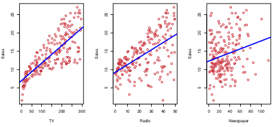
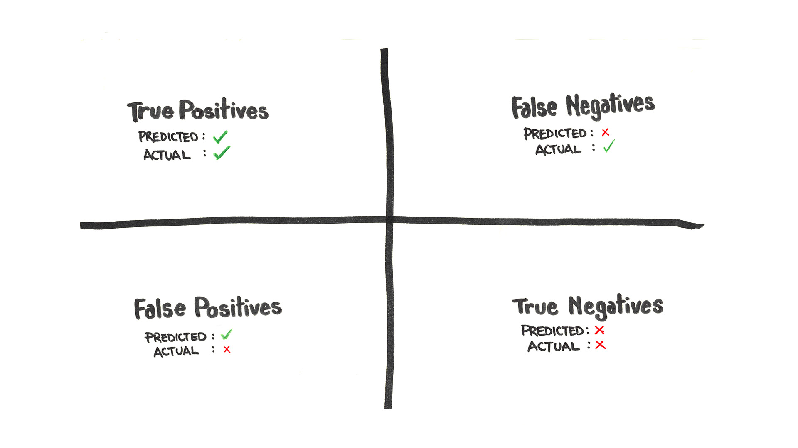
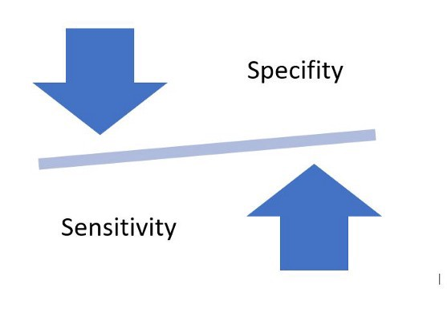
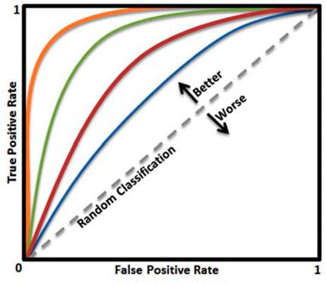

# U3 · Evaluar bien — métricas y validación en clínica

Hay una frase que conviene grabar antes de entrenar el primer modelo: **un modelo sin una métrica honesta es solo una opinión**. En clínica, esa opinión disfrazada de número puede acabar en una decisión sobre una persona.

Podemos construir el predictor más sofisticado del mundo, pero si no sabemos medir si acierta —y sobre todo *cuánto* y *de qué manera* falla— no tenemos nada sobre lo que decidir.

Esta unidad enseña el idioma con el que se evalúa un modelo. La buena noticia es que gran parte de ese idioma **ya lo hablas**: sensibilidad, especificidad, valor predictivo, prevalencia son conceptos que un profesional sanitario usa a diario cuando valora una prueba diagnóstica.

Un modelo de *machine learning* no es más que una "prueba" más, y se juzga con las mismas reglas. Lo que añadimos es entender **qué penaliza cada métrica** y **cómo elegirla según el coste del error**, porque optimizar el número equivocado produce modelos que lucen bien en un póster y hacen daño en la consulta.


**💡 Idea clave**

La métrica no es un detalle técnico del final: es una **decisión clínica que se toma al principio**. Define qué significa "acertar" para *este* problema concreto y *esta* población. Elegirla bien es responsabilidad de quien conoce el contexto clínico, no del algoritmo.


### Objetivos de esta unidad

* Las métricas de **regresión** —MAE, RMSE y R²— leídas sobre `riesgo_cv_10a`, es decir, **en puntos porcentuales de riesgo**.
* Las métricas de **clasificación** en lenguaje clínico: **sensibilidad, especificidad, VPP, VPN**, la **matriz de confusión** (TP/FP/FN/TN) y por qué la **prevalencia** cambia el VPP aunque la prueba no cambie (paradoja del cribado).
* Las **curvas ROC/AUC** y la **curva precisión-recall**, y el **umbral de decisión** como una decisión clínica.
* El **coste asimétrico del error**: por qué un falso negativo oncológico no vale lo mismo que un falso positivo.
* La **calibración**: que una probabilidad del 20 % signifique de verdad un 20 %, y por qué en la práctica importa más que el AUC.
* La **validación honesta**: `train/validación/test`, la **fuga de datos** y un adelanto de la validación cruzada.

Todos los ejemplos usan la cohorte **sintética** [`pacientes.csv`](https://drive.google.com/file/d/1Ku0j-sAf8Cr3FPT-DGm8v5p4h_2BmV5U/view?usp=drive_link) (20 000 pacientes; datos generados por código, **no son pacientes reales**), con sus dos objetivos: `riesgo_cv_10a` (riesgo cardiovascular a 10 años, en %, para **regresión**) y `evento_cv` (0/1, para **clasificación**, con **prevalencia ≈ 19 %**).

## 3.1 Evaluar regresión: cuando la predicción es un número

En un problema de **regresión** el modelo predice un **valor continuo**. En nuestro hilo clínico, ese valor es `riesgo_cv_10a`: un porcentaje de riesgo.

El error es, sencillamente, la diferencia entre el riesgo predicho y el real, medida **en puntos porcentuales**. Si el modelo dice 22 % y el valor real de la cohorte sintética era 18 %, se ha equivocado en **4 puntos**.

La pregunta es cómo resumir miles de esos errores en un único número, y cada forma de hacerlo cuenta una historia distinta.

<figure><figcaption><p>Planteamiento de regresión: predecir una salida continua (aquí, el riesgo cardiovascular a 10 años) a partir de variables clínicas de entrada. El error es la distancia entre la predicción y el valor real.</p></figcaption></figure>

### MAE — Error Absoluto Medio

En riesgo cardiovascular, el MAE responde a una pregunta muy natural: *de media, ¿por cuántos puntos de riesgo nos desviamos?*


**Concepto · MAE (Mean Absolute Error)**

Promedio de las distancias absolutas entre predicción y realidad. Si el MAE es 3, en promedio el modelo se equivoca en **3 puntos porcentuales de riesgo**. Es la métrica más fácil de explicar en clínica porque está en las **mismas unidades** que lo que predecimos y trata todos los errores por igual.


**✅ Fortalezas**

* Intuitiva y directa de comunicar: "de media nos desviamos 3 puntos de riesgo".
* Robusta: un error grande y aislado (un paciente atípico) no la dispara desproporcionadamente.

**⚠️ Debilidades / límites**

* Trata todos los errores por igual: equivocarse 12 puntos en un paciente de alto riesgo pesa, punto a punto, lo mismo que equivocarse 3 en uno de bajo riesgo.
* Por sí sola no avisa de si existen errores grandes puntuales que podrían ser peligrosos.

**Campo de aplicación clínica:** comunicar el **desvío típico** del riesgo estimado a un comité o a un clínico que no quiere fórmulas, sino "cuánto suele fallar esto".

$$
\text{MAE} = \frac{1}{n}\sum_{i=1}^{n}\left| y_i - \hat{y}_i \right|
$$

En todas las fórmulas de esta sección, $$y_i$$ es el valor real, $$\hat{y}_i$$ la predicción del paciente $$i$$, $$\bar{y}$$ la media de los valores reales y $$n$$ el número de pacientes.

### MSE y RMSE — cuando un error grande duele más

Antes del RMSE conviene nombrar el **MSE (error cuadrático medio)**: el promedio de los errores **al cuadrado**. Al elevar al cuadrado penaliza con fuerza los errores grandes, pero queda en "puntos de riesgo al cuadrado", una unidad que **no se puede interpretar** en clínica.

Por eso el MSE se usa como función que muchos modelos **minimizan por dentro** al entrenar, y lo que comunicamos es su raíz, el RMSE.


**Concepto · RMSE (Root Mean Squared Error)**

Como el MAE, pero **elevando los errores al cuadrado** antes de promediar (y sacando luego la raíz). El efecto es que **penaliza mucho más los errores grandes**: equivocarse en 10 puntos de riesgo cuenta más del doble que equivocarse en 5. Vuelve a estar en las unidades del objetivo (puntos de riesgo).


**✅ Fortalezas**

* Si los errores grandes son especialmente peligrosos —por ejemplo, **infraestimar mucho** el riesgo de un paciente que debería entrar en prevención—, el RMSE los castiga y empuja al modelo a evitarlos.
* Sigue estando en puntos de riesgo, así que se puede comunicar.

**⚠️ Debilidades / límites**

* Muy sensible a *outliers*: un puñado de pacientes con errores extremos puede dominar la métrica.
* **Regla práctica:** si **RMSE ≫ MAE**, hay errores grandes dispersos que conviene investigar (¿un subgrupo mal modelado? ¿pacientes con perfiles poco frecuentes en la cohorte?).

**Campo de aplicación clínica:** cuando un error grande en la estimación del riesgo tiene consecuencias graves y quieres que el modelo pague caro por cometerlo.

$$
\text{RMSE} = \sqrt{\frac{1}{n}\sum_{i=1}^{n}\left( y_i - \hat{y}_i \right)^2} = \sqrt{\text{MSE}}
$$


**⚠️ Aviso · Ni el MAE ni el RMSE son "la mejor" siempre**

El contexto lo es todo. Si lo que te importa es el desvío típico del día a día, comunica **MAE**. Si lo que de verdad te preocupa son los fallos grandes que dejan a un paciente sin la prevención que necesitaba, mira el **RMSE**. Y ojo con el **MAPE** (error en porcentaje relativo): se vuelve inestable o enorme cuando el valor real es casi cero —justo los pacientes de **riesgo muy bajo**—, así que en riesgo cardiovascular suele engañar más que ayudar.


### R² — ¿cuánto mejor que no tener modelo?

El MAE y el RMSE miden el error en magnitud; el R² responde a otra pregunta: **¿cuánto mejor es mi modelo que predecir a todos el riesgo medio de la cohorte?**

Es decir, qué proporción de la variabilidad del riesgo entre pacientes logra explicar el modelo.


**Concepto · R² (coeficiente de determinación)**

Toma valores típicamente entre 0 y 1 (puede ser negativo si el modelo es peor que la media). **R² = 1** sería un ajuste perfecto; **R² = 0** significa que el modelo no aporta nada sobre predecir siempre el riesgo medio; **R² negativo** indica que es *peor* que esa media. Es una medida de **calidad relativa**, no del error en puntos de riesgo.


**✅ Fortalezas**

* De un vistazo compara tu modelo con el *baseline* trivial (predecir la media a todo el mundo).
* Adimensional: permite comparar modelos entre sí.

**⚠️ Debilidades / límites**

* No está en unidades clínicas: un R² alto no te dice si el error es aceptable **en los pacientes que importan**.
* Un R² elevado puede venir acompañado de errores inaceptables, o ser fruto de **fuga de datos** (lo veremos en 3.8). Medido sobre el conjunto de *entrenamiento* casi siempre es engañosamente alto.

**Campo de aplicación clínica:** una foto rápida de la calidad relativa, **siempre acompañada** de MAE/RMSE y de un gráfico de predicho *vs.* real.

$$
R^2 = 1 - \frac{\sum_{i=1}^{n}\left( y_i - \hat{y}_i \right)^2}{\sum_{i=1}^{n}\left( y_i - \bar{y} \right)^2}
$$

| Métrica | Qué mide | Penaliza errores grandes | Unidades | Cuándo elegirla |
| ------- | -------- | ------------------------ | -------- | --------------- |
| MAE | Error medio absoluto | No (lineal) | Puntos de riesgo | Comunicar el desvío típico |
| MSE | Error medio al cuadrado | Sí (mucho) | Puntos de riesgo² | Minimización interna; base del RMSE |
| RMSE | Raíz del error cuadrático | Sí (mucho) | Puntos de riesgo | Cuando los fallos grandes son peligrosos |
| R² | Variabilidad explicada | — | Sin unidad (0–1) | Calidad relativa frente a la media |


**💡 Idea clave**

No hay una métrica "mejor": hay una métrica **adecuada a la decisión**. La práctica recomendada es reportar **MAE + RMSE + R²** juntas y, sobre todo, **mirar también las predicciones gráficamente** (predicho *vs.* real), porque un número nunca cuenta toda la historia. En nuestra cohorte sintética, por ejemplo, para `riesgo_cv_10a` un Random Forest alcanza **R² ≈ 0,91** frente a **R² ≈ 0,81** de la regresión lineal, porque el riesgo tiene interacciones entre variables que el bosque captura mejor (el *cómo* de esos modelos es la Unidad 4; aquí solo aprendemos a **leer** sus métricas).


## 3.2 Evaluar clasificación: la matriz de confusión y el lenguaje clínico

Cuando el modelo predice una **categoría** —`evento_cv` sí/no, un lote apto/no apto, un cribado positivo/negativo— el error ya no es una distancia, sino un **acierto o un fallo**.

Y aquí aparece la sutileza más importante de toda la unidad: **no todos los fallos son iguales**. No cuesta lo mismo pasar por alto a un paciente que sí sufrirá un evento que asustar a uno que no lo sufrirá.

Para razonar sobre esto necesitamos una herramienta que un clínico ya conoce bien: **la matriz de confusión**, que en el mundo diagnóstico es la tabla 2×2 de "prueba × enfermedad".


**Concepto · Matriz de confusión**

Tabla que cruza lo que el modelo predijo con lo que era verdad. En un problema binario tiene cuatro celdas: **verdaderos positivos (TP)** y **verdaderos negativos (TN)** —los aciertos— y **falsos positivos (FP)** y **falsos negativos (FN)** —los dos tipos de error—. Casi todas las métricas clínicas de una prueba (sensibilidad, especificidad, VPP, VPN) se derivan de estas cuatro cifras.


<figure><figcaption><p>La matriz de confusión: cruza la predicción del modelo con la verdad clínica en verdaderos/falsos positivos y negativos. Es la base de la que nacen sensibilidad, especificidad y valores predictivos.</p></figcaption></figure>

<figure><figcaption><p>Lectura de la matriz de confusión: los aciertos en la diagonal (TP, TN) y los dos tipos de error fuera de ella (FP, FN).</p></figcaption></figure>

Tomando como "positivo" que el modelo prediga `evento_cv = 1` (el paciente sufrirá un evento cardiovascular):

* **Verdadero positivo (TP) —** <mark style="color:$success;">**acierto útil**</mark>**:** el modelo dice "en riesgo" y el paciente efectivamente sufrió el evento.
* **Verdadero negativo (TN) —** <mark style="color:$success;">**acierto rutinario**</mark>**:** el modelo dice "no en riesgo" y el paciente no sufrió el evento.
* **Falso positivo (FP) —** <mark style="color:$danger;">**falsa alarma**</mark>**:** el modelo dice "en riesgo" a alguien que **no** sufrirá el evento. En clínica: pruebas, seguimiento y ansiedad innecesarios. Es el **error de tipo I**.
* **Falso negativo (FN) —** <mark style="color:$danger;">**fallo silencioso**</mark>**:** el modelo dice "no en riesgo" a alguien que **sí** sufrirá el evento. En clínica: un paciente que se queda sin la prevención que necesitaba. Es el **error de tipo II**.

La clave es que **el coste de cada tipo de error depende de su naturaleza clínica**, no solo de su frecuencia.

Un mismo modelo puede ser excelente o inaceptable según cuál de los dos errores cometa más, porque sus consecuencias pueden ser de órdenes de magnitud distintos. Volveremos sobre esto en 3.6.

### Sensibilidad, especificidad y valores predictivos

Aquí es donde el lenguaje del *machine learning* y el de la clínica son **la misma cosa con dos nombres**. Las cuatro métricas nacen de las cuatro celdas.


**Concepto · Sensibilidad (= *recall*, exhaustividad)**

De **todos los pacientes que sí sufrirán el evento**, ¿a qué porcentaje detecta el modelo? Responde a: *de todo lo que debía encontrar, ¿cuánto se le escapó?* Una **sensibilidad baja significa muchos falsos negativos (FN)**: pacientes en riesgo que pasan desapercibidos.


$$
\text{Sensibilidad} = \text{Recall} = \frac{TP}{TP + FN}
$$


**Concepto · Especificidad**

De **todos los pacientes que NO sufrirán el evento**, ¿a qué porcentaje descarta correctamente el modelo? Una **especificidad baja significa muchos falsos positivos (FP)**: sanos etiquetados como en riesgo, con el coste y la alarma que eso conlleva.


$$
\text{Especificidad} = \frac{TN}{TN + FP}
$$


**Concepto · VPP (valor predictivo positivo = *precisión*)**

De **todos los pacientes a los que el modelo marca como positivos**, ¿qué porcentaje lo era de verdad? Responde a la pregunta que más importa en la consulta: *si esta herramienta me dice "en riesgo", ¿cuánto me lo puedo creer?* Un **VPP bajo significa muchas falsas alarmas**.


$$
\text{VPP} = \text{Precisión} = \frac{TP}{TP + FP}
$$


**Concepto · VPN (valor predictivo negativo)**

De **todos los pacientes a los que el modelo marca como negativos**, ¿qué porcentaje lo era de verdad? Es la fiabilidad del "puede irse tranquilo": *si me dice "no en riesgo", ¿con qué seguridad puedo descartarlo?*


$$
\text{VPN} = \frac{TN}{TN + FN}
$$

<figure><figcaption><p>Sensibilidad frente a especificidad: cada métrica mira un tipo distinto de acierto y error. Cuál priorizar depende del coste clínico de cada error.</p></figcaption></figure>

Conviene tener a mano el **diccionario** entre los dos idiomas, porque las librerías (y los asistentes de IA) suelen usar los términos de *machine learning*:

| Término clínico | Término *machine learning* | Fórmula | Pregunta que responde |
| --------------- | -------------------------- | ------- | --------------------- |
| Sensibilidad | Recall / TPR | TP/(TP+FN) | ¿A cuántos enfermos detecto? |
| Especificidad | TNR | TN/(TN+FP) | ¿A cuántos sanos descarto bien? |
| VPP | Precision | TP/(TP+FP) | Cuando doy positivo, ¿acierto? |
| VPN | — | TN/(TN+FN) | Cuando doy negativo, ¿acierto? |

Hay una **tensión natural** entre sensibilidad y especificidad (y entre VPP y VPN): subir una suele bajar la otra. No se pueden maximizar todas a la vez; hay que decidir cuál pesa más, y esa es una decisión clínica.

El **F1-score** resume el equilibrio entre VPP (precisión) y sensibilidad (recall) en un solo número (su media armónica): solo es alto cuando **ambas** lo son, por lo que es útil con clases desbalanceadas.

$$
F_1 = 2 \cdot \frac{\text{VPP} \cdot \text{Sensibilidad}}{\text{VPP} + \text{Sensibilidad}}
$$


**⚠️ Aviso · La trampa de la *accuracy* con clases desbalanceadas**

La *accuracy* (proporción de aciertos sobre el total) es la métrica más intuitiva... y la más traicionera. En nuestra cohorte sintética, `evento_cv` tiene **prevalencia ≈ 19 %**. Un modelo que diga "**nadie** tendrá un evento" acierta el **81 %** de las veces: una *accuracy* del 81 % que suena bien y es **clínicamente inútil**, porque su sensibilidad es **0 %** (no detecta ni un solo paciente en riesgo). En cualquier problema donde la clase que importa es la minoritaria —eventos, enfermedad, defectos—, mira **sensibilidad, especificidad y valores predictivos**, nunca la *accuracy* a solas.


## 3.3 Prevalencia y la paradoja del cribado: por qué el VPP se hunde

Este es, probablemente, el concepto más importante de la unidad para un profesional sanitario, y el que más malentendidos causa cuando se despliega un modelo.

La idea:

* La **sensibilidad** y la **especificidad** son propiedades **de la prueba** (o del modelo): describen cómo se comporta ante enfermos y ante sanos, y **no cambian con la prevalencia**.
* El **VPP** y el **VPN** **sí dependen de la prevalencia** de la población donde se aplica. La misma prueba, en una población distinta, tiene un VPP distinto.

Veámoslo con números. Imagina una herramienta con **sensibilidad 90 %** y **especificidad 90 %** (fijas). Aplicada a **1 000 pacientes** de nuestra cohorte sintética, con **prevalencia ≈ 19 %** (190 con evento, 810 sin evento):

| | Evento real: Sí (190) | Evento real: No (810) |
| --- | --- | --- |
| **Modelo: en riesgo** | TP = 171 | FP = 81 |
| **Modelo: no en riesgo** | FN = 19 | TN = 729 |

* **VPP** = 171 / (171 + 81) = **≈ 68 %**
* **VPN** = 729 / (729 + 19) = **≈ 97 %**

Ahora aplica **la misma prueba** (sensibilidad 90 %, especificidad 90 %) a una población de cribado poblacional con **prevalencia del 1 %** (10 con evento, 990 sin evento) sobre 1 000 personas:

| | Evento real: Sí (10) | Evento real: No (990) |
| --- | --- | --- |
| **Modelo: en riesgo** | TP = 9 | FP = 99 |
| **Modelo: no en riesgo** | FN = 1 | TN = 891 |

* **VPP** = 9 / (9 + 99) = **≈ 8 %**
* **VPN** = 891 / (891 + 1) = **≈ 99,9 %**

La sensibilidad y la especificidad **no han cambiado** (siguen siendo 90 % y 90 %), pero el **VPP se ha desplomado del 68 % al 8 %** solo por bajar la prevalencia.

Esto es la **paradoja del cribado**: al buscar algo raro en mucha gente sana, la mayoría de las "alarmas" son falsas, aunque la prueba sea buena. Por eso los positivos de un cribado poblacional casi siempre necesitan una **prueba de confirmación**.


**💡 Idea clave**

Cuando alguien te enseñe el **VPP** de un modelo, la primera pregunta debe ser: *¿en qué población?* El VPP **no es una propiedad del modelo**, sino del modelo **más** la prevalencia de quien lo usa. Un modelo entrenado y validado en nuestra cohorte sintética (prevalencia ≈ 19 %) tendrá un VPP **mucho peor** si se despliega en atención primaria sobre población general, aunque su sensibilidad y especificidad se mantengan. Este es un fallo clásico y peligroso al llevar un modelo del "laboratorio" a la práctica.



**Concepto · La prevalencia varía por subgrupos**

La prevalencia también **varía por subgrupos**, y eso mueve el VPP dentro de la misma cohorte. En nuestros datos sintéticos, la proporción de `evento_cv` según tabaquismo es ≈ 14 % en quienes **nunca** fumaron, ≈ 22 % en **exfumadores** y ≈ 28 % en **fumadores activos**. Aplicar el mismo umbral a esos tres grupos da valores predictivos distintos: otra razón para no leer un VPP global sin preguntar "¿de quién?".


## 3.4 El umbral de decisión: mover el punto de corte es una decisión clínica

La mayoría de los clasificadores no devuelven directamente "sí/no", sino una **probabilidad** (por ejemplo, "este paciente tiene un 0,34 de probabilidad de evento").

Somos nosotros quienes fijamos el **umbral** a partir del cual decimos "positivo". Por defecto suele ser 0,5, pero **podemos y debemos moverlo** para alinearlo con el contexto clínico.

Mover el umbral es un dial entre dos males:

* **Umbral bajo** (p. ej. 0,15) → modo *cribado*: capturas casi a todos los pacientes que sí tendrán un evento (**sensibilidad alta**), pero marcas a muchos que no (**más falsos positivos**, especificidad y VPP más bajos).
* **Umbral alto** (p. ej. 0,80) → modo *confirmación*: casi no das falsas alarmas (**especificidad y VPP altos**), pero se te escapan pacientes en riesgo (**más falsos negativos**).


**💡 Idea clave**

No existe un umbral mágico que mejore las dos cosas a la vez: lo que ganas por un lado lo pagas por el otro. **Elegir el umbral es una decisión clínica**, no un valor por defecto de la librería, y depende de cuál de los dos errores cuesta más caro (3.6).


## 3.5 Curvas ROC/AUC y curva precisión-recall

Como el umbral lo eliges tú, tiene sentido preguntarse cómo se comporta el modelo **para todos los umbrales posibles a la vez**. Para eso están las curvas.

La **curva ROC** traza, al recorrer todos los umbrales, la **sensibilidad** (eje vertical, la quieres alta) frente a la **tasa de falsos positivos** = 1 − especificidad (eje horizontal, la quieres baja).

Cada punto de la curva es **un umbral**. Cuanto más se pega la curva a la esquina superior izquierda, mejor: caza muchos eventos con pocas falsas alarmas.

<figure><figcaption><p>Curva ROC: traza la sensibilidad frente a la tasa de falsos positivos (1 − especificidad) al mover el umbral de decisión. Cuanto más se acerca a la esquina superior izquierda, mejor; la diagonal equivale a decidir al azar.</p></figcaption></figure>


**Concepto · AUC (área bajo la curva ROC)**

Resume la curva ROC en un número entre 0,5 y 1. **AUC = 1** es un clasificador perfecto; **AUC = 0,5** equivale a lanzar una moneda. Mide la capacidad del modelo de **ordenar** correctamente a los pacientes: la probabilidad de que, tomando al azar un paciente con evento y uno sin evento, el modelo le asigne más riesgo al que sí lo tuvo. Es muy útil para **comparar modelos** sin comprometerse todavía con un umbral.


En nuestra cohorte sintética, para `evento_cv` la **regresión logística** alcanza **AUC ≈ 0,84** y **gana a Random Forest** (≈ 0,83), porque el riesgo es aproximadamente log-aditivo y ese es justo el terreno de la logística.

Es una gran lección de "**empieza por lo simple**": el modelo más sencillo y más interpretable puede ser también el mejor (lo desarrollamos en la Unidad 4).

<details>

<summary>Intuición clínica de ROC y AUC (para tenerlo por dentro)</summary>

**El modelo no dice "sí/no": da una nota de sospecha.** Por dentro no contesta "en riesgo" o "no en riesgo", sino una probabilidad de 0 a 1: *"a este paciente le veo un 0,72 de tener un evento"*. Cuanta más nota, más sospechoso.

**Para actuar, pones una raya: el umbral.** Eliges un corte —"todo lo que pase de 0,5 lo trato como positivo"— y esa raya la eliges tú. Cambiarla te obliga a **recalcular toda la matriz de confusión** y, con ella, sensibilidad, especificidad y valores predictivos.

**La curva ROC es la foto de *todos* los umbrales.** En vez de discutir qué raya es la buena, las pruebas todas y dibujas el resultado: cada punto mide, para ese umbral, cuántos eventos reales cazas (arriba) y cuántos sanos marcas por error (a la derecha). Una curva pegada a la esquina superior izquierda es un buen modelo; la diagonal punteada es no distinguir nada.

**El AUC es esa curva resumida en un número:** el área bajo ella. La frase que mejor lo aterriza: es la probabilidad de que, si coges al azar un paciente con evento y uno sin evento, el modelo le ponga más nota de sospecha al que sí lo tuvo. Mide si el modelo sabe **ordenar** —los de riesgo arriba, los demás abajo—, con independencia del umbral.

</details>

### Curva precisión-recall: mejor cuando la clase positiva es rara

La ROC tiene un punto ciego: cuando los positivos son escasos, hay **muchísimos** negativos fáciles, y esos verdaderos negativos "inflan" la parte buena de la curva, dando una impresión optimista.

La **curva precisión-recall (PR)** evita ese problema porque solo mira la clase positiva: enfrenta el **VPP (precisión)** al **recall (sensibilidad)** a lo largo de todos los umbrales.


**Concepto · Curva precisión-recall y PR-AUC**

Traza el **VPP (precisión)** frente a la **sensibilidad (recall)** al mover el umbral. Su línea base (un modelo que decide al azar) no es la diagonal 0,5, sino la **prevalencia**: en `evento_cv`, ≈ 0,19. Es la curva preferida cuando la clase positiva es minoritaria, porque refleja de verdad cuántas de tus alarmas son correctas.


**Cuándo usar cada una:**

* **ROC/AUC** → para **comparar modelos** de forma rápida y cuando las clases están razonablemente equilibradas.
* **Precisión-recall** → cuando la clase que importa es **rara** (eventos, enfermedad poco frecuente, un cribado), porque se centra en si tus positivos son fiables y no se deja engañar por la abundancia de negativos. Con la prevalencia ≈ 19 % de `evento_cv` —y más aún en escenarios de cribado poblacional— la curva PR cuenta una historia más honesta sobre la clase minoritaria que la ROC.

| Métrica / curva | Pregunta que responde | Cuándo es tu métrica |
| --------------- | --------------------- | -------------------- |
| Accuracy | ¿% de aciertos global? | Clases equilibradas y errores simétricos |
| Sensibilidad (recall) | ¿A cuántos enfermos detecto? | El falso negativo es caro |
| Especificidad | ¿A cuántos sanos descarto bien? | El falso positivo es caro |
| VPP (precisión) | Cuando doy positivo, ¿acierto? | Quieres fiabilidad de la alarma; depende de la prevalencia |
| F1 | ¿Equilibrio VPP/sensibilidad? | Clases desbalanceadas, buscas balance |
| AUC-ROC | ¿Ordena bien a los pacientes? | Comparar modelos, independiente del umbral |
| PR-AUC | ¿Son fiables mis positivos? | Clase positiva rara (cribado, eventos) |

## 3.6 Coste asimétrico del error: no todos los fallos cuestan lo mismo

Aquí conectamos todo lo anterior con la realidad clínica. El ejemplo más claro es oncológico: **un falso negativo** (no detectar un cáncer que estaba ahí) puede costar la vida; **un falso positivo** (una alarma que lleva a una prueba de confirmación) cuesta ansiedad, tiempo y algún procedimiento, casi siempre reversible.

**Esos dos errores no valen lo mismo**, y por tanto no deben pesar lo mismo al elegir la métrica ni el umbral.

La idea que ordena esta unidad: **decide primero cuál de los dos errores duele más, y a partir de ahí elige la métrica que priorizas y dónde pones el umbral**. Esto es la semilla de la **utilidad clínica**: fijar el punto de corte no donde la *accuracy* es máxima, sino donde el **beneficio clínico esperado** lo es, teniendo en cuenta lo que cuesta cada tipo de error.

Cuando un falso negativo es mucho más grave que un falso positivo, el umbral que maximiza la utilidad **baja** (aceptas más falsas alarmas con tal de no dejar escapar casos), y al revés.


**Concepto · Cuándo preferimos minimizar un tipo de error u otro (datos sintéticos)**

**Caso A — Cribado o triaje de riesgo (minimizar el falso negativo).** Si una herramienta prioriza qué pacientes de nuestra cohorte entran en un programa de prevención cardiovascular, **dejar fuera a alguien que sí tendrá un evento** (FN) puede costar un infarto evitable; una **falsa alarma** (FP) solo cuesta una revisión adicional que un clínico confirma. Aquí aceptamos **más falsos positivos con tal de casi eliminar los falsos negativos**: bajamos el umbral para **maximizar la sensibilidad (recall)**.

**Caso B — Indicar una intervención agresiva o irreversible (minimizar el falso positivo).** Si el modelo desencadena un tratamiento con efectos adversos serios o un procedimiento invasivo, cada **falso positivo** somete a un paciente sano a un daño real. Si además ese daño es grave y el caso no detectado puede recuperarse por otra vía, preferimos **reducir los falsos positivos** aunque se nos escape alguno: subimos el umbral para **maximizar el VPP (precisión) y la especificidad**.

La lección: el mismo error "técnico" (FP o FN) vale cantidades muy distintas según el contexto clínico. Decidir cuál duele más es una decisión que se toma **antes** de elegir la métrica y el umbral.



**💡 Idea clave**

La pregunta que ordena toda la clasificación clínica: **¿qué error me cuesta más caro, el falso positivo o el falso negativo?** La respuesta decide si priorizo sensibilidad, especificidad, VPP o un equilibrio. Ningún algoritmo puede tomar esta decisión por ti: depende del daño clínico. Cuando uses un asistente de IA para construir o afinar el modelo, **dale ese contexto**: explícale qué te duele más y te ayudará a elegir la métrica a optimizar y el umbral adecuado.


## 3.7 Calibración: que un 20 % signifique de verdad un 20 %

Un modelo puede **ordenar** muy bien a los pacientes (AUC alto) y, sin embargo, **mentir en los números**: decir "20 % de riesgo" cuando la frecuencia real de eventos en ese grupo es del 40 %.

Ordenar bien y estar bien calibrado son cosas **distintas**, y en clínica la segunda suele importar más.


**Concepto · Calibración**

Un modelo está **bien calibrado** cuando sus probabilidades coinciden con la realidad: de todos los pacientes a los que asigna "20 % de riesgo", aproximadamente el 20 % acaba teniendo el evento. La herramienta para verlo es la **curva de calibración** (o *reliability diagram*): en el eje horizontal, la probabilidad predicha; en el vertical, la frecuencia observada. El ideal es la **diagonal**. Si la curva va por debajo, el modelo **sobreestima** el riesgo; si va por encima, lo **infraestima**.


**Por qué importa más que el AUC en la práctica clínica:** las decisiones clínicas usan **la probabilidad en sí**, no solo el orden. Las guías fijan umbrales de riesgo (por ejemplo, "ofrecer estatinas si el riesgo a 10 años supera cierto %"), la decisión compartida con el paciente se basa en cifras concretas, y conceptos como el número necesario a tratar dependen de que la probabilidad sea creíble.

Un modelo con AUC excelente pero **mal calibrado** —que dice 20 % cuando es 40 %— llevará a **infratratar** a pacientes que sí lo necesitaban, aunque su "ranking" fuera impecable.


**💡 Idea clave**

El **AUC mide si el modelo sabe ordenar**; la **calibración mide si sus números son de fiar**. Para decidir sobre **un paciente concreto** a partir de su probabilidad, la calibración es a menudo lo que de verdad importa. Reporta **siempre** la curva de calibración junto al AUC, no en lugar de él.


Algunos modelos (por ejemplo, ciertos *ensembles* de árboles) ordenan bien pero salen **mal calibrados** de fábrica; existen técnicas estándar para recalibrarlos (*Platt scaling*, regresión isotónica), que aplicaremos como un paso más del *pipeline* sin entrar en su matemática. Lo esencial ahora es **saber que hay que mirarlo**.

## 3.8 Validación honesta: train/validación/test y la fuga de datos

Tener la métrica adecuada no sirve de nada si la medimos mal. El error medido sobre los **datos de entrenamiento** es siempre optimista: el modelo ya los conoce (los "ha visto en clase").

La estimación honesta se hace sobre datos **reservados**.


**Concepto · Los tres conjuntos: *train* / validación / *test***

* **Entrenamiento (*train*):** el modelo **aprende** de aquí.
* **Validación:** aquí **ajustamos** decisiones —qué modelo, qué umbral, qué recalibración— sin tocar el test.
* **Test:** se usa **una sola vez, al final**, para la estimación honesta del rendimiento. Si lo miras muchas veces y vas ajustando, deja de ser honesto (se "contamina").



**⚠️ Aviso · La fuga de datos (*data leakage*) invalida cualquier métrica**

La **fuga de datos** ocurre cuando información que el modelo **no tendría en el momento real de decidir** —del futuro o de la propia respuesta— se cuela en el entrenamiento. El resultado es un AUC espectacular en el papel que **se evapora en la consulta**. En salud es especialmente peligroso y especialmente fácil de cometer:

* Incluir una variable **medida después del evento** o **consecuencia del propio evento** (p. ej., un tratamiento que solo se administró porque el evento ocurrió).
* **Normalizar o imputar con toda la tabla antes de separar** *train* y *test*: las estadísticas del test se filtran al entrenamiento.
* El **mismo paciente en *train* y en *test*** (registros duplicados, varias visitas del mismo sujeto): el modelo "se lo sabe".
* Un **identificador, centro o fecha** que codifica indirectamente el desenlace.

Si tus métricas parecen demasiado buenas para ser verdad, sospecha de una fuga **antes** que de un modelo genial.


**Adelanto de la validación cruzada (se profundiza en la Unidad 5).** Una sola partición *train/test* da una estimación algo caprichosa (depende de qué pacientes tocaron en cada lado). La **validación cruzada** rota el bloque de validación varias veces y promedia, dando una estimación **más estable** y, además, una idea de su **variabilidad**.

En clínica, un matiz crucial: la partición debe ser **por paciente** (agrupada), para que **ningún paciente aparezca a la vez en entrenamiento y en test**.

Y una disciplina que no debe faltar: **comparar siempre contra un *baseline***. Un **modelo trivial** de referencia —en clasificación, predecir siempre la clase mayoritaria ("ningún evento"); en regresión de `riesgo_cv_10a`, predecir a todos el riesgo medio— y, mejor aún, contra un **estándar clínico** ya establecido (una escala de riesgo validada).

Un MAE de 4 puntos no es "bueno" ni "malo" en abstracto: si el *baseline* ingenuo tiene 4,2, tu modelo apenas aporta; si tiene 12, has logrado mucho. **Si el modelo no bate claramente al baseline, no justifica su uso.**


**⚠️ Aviso · Repaso de los errores de evaluación más caros**

**Evaluar sobre entrenamiento** (optimismo engañoso). **Fuga de datos** (información del futuro o de la respuesta colada en el entrenamiento). **Métrica equivocada** para el coste real del error. **Ignorar la prevalencia** al leer el VPP. **No comparar con un baseline**. **Una sola cifra** sin mirar las predicciones ni la calibración. Evitar estos fallos ya te sitúa por delante de buena parte de los proyectos reales.


## 3.9 Práctica guiada: evaluar un modelo con el asistente

La práctica de esta unidad reutiliza la cohorte **sintética** `pacientes.csv`. Entrenamos un modelo sencillo de riesgo (regresión) y un clasificador de evento (clasificación) con el único objetivo de **evaluarlos a fondo**: no buscamos el mejor modelo todavía —eso es U4 y U5—, sino aprender a leer sus métricas con criterio clínico.

Como en todo el curso, el código lo genera el asistente y nosotros lo revisamos.

**🤖 Prompt para el asistente · Evaluación de regresión del riesgo**

```
Con 'pacientes.csv' (target de regresión: riesgo_cv_10a, en %), en español y por celdas:
1. Separa train/test de forma honesta, por paciente y SIN fuga
   (imputa y escala solo con el train).
2. Entrena un BASELINE (predecir el riesgo medio) y un modelo sencillo.
3. Calcula MAE, RMSE y R² de AMBOS sobre el test y compáralos en una tabla.
4. Dibuja 'predicho vs real' y el histograma de los errores (residuos), en
   PUNTOS DE RIESGO.
5. Explícame la historia conjunta: ¿hay errores grandes dispersos (RMSE >> MAE)?
   ¿el modelo bate al baseline? ¿en qué pacientes se equivoca más?
```

**🤖 Prompt para el asistente · Evaluación de clasificación con coste y calibración**

```
Con 'pacientes.csv' (target de clasificación: evento_cv, prevalencia ≈19%),
en español y por celdas:
1. Separa train/test ESTRATIFICADO y por paciente (sin fuga).
2. Entrena un baseline (clase mayoritaria) y un clasificador sencillo que dé
   PROBABILIDADES.
3. Muestra la MATRIZ DE CONFUSIÓN y calcula sensibilidad, especificidad, VPP y
   VPN, además de accuracy y F1. Comenta la trampa de la accuracy con esta
   prevalencia.
4. Dibuja la curva ROC (con AUC) y la curva precisión-recall (con su línea base
   = prevalencia). Dibuja también la CURVA DE CALIBRACIÓN.
5. Suponiendo que NO detectar un evento (falso negativo) es el error más caro,
   dime qué métrica priorizar y a qué UMBRAL moverías el punto de corte, y
   recalcula la matriz de confusión con ese umbral.
```

Al revisar el código del asistente, comprobamos especialmente lo siguiente.

* Que la partición sea **honesta, por paciente y sin fuga**.
* Que se incluya el **baseline**.
* Que la **matriz de confusión** esté bien orientada (no confundir filas con columnas).
* Que se mire la **calibración** y no solo el AUC.
* Que la métrica destacada en las conclusiones sea la que corresponde al **coste clínico del error**.


**🔬 Práctica en Colab** — [`U03_Metricas_Validacion.ipynb`](https://colab.research.google.com/drive/1YG0YK4XwBZHaAcetkIJcUnkaOqdL15fM)

Métricas clínicas, ROC/PR, calibración y coste del error, todo sobre la cohorte **sintética** `pacientes.csv`. Su **primera celda genera los datos sintéticos**, así que no hay que descargar nada: se abre y se ejecuta.

[Abrir en Colab](https://colab.research.google.com/drive/1YG0YK4XwBZHaAcetkIJcUnkaOqdL15fM)


## Qué llevarte

* **La métrica se elige al principio, no al final**, y es una decisión clínica: define qué significa "acertar" para este problema y esta población.
* **Sensibilidad y especificidad describen la prueba; VPP y VPN describen la prueba en una población.** La **prevalencia** hunde o eleva el VPP sin tocar la prueba: pregunta siempre *"¿en qué población?"*.
* **No todos los errores cuestan lo mismo.** Decide qué duele más —el falso positivo o el falso negativo— y a partir de ahí elige métrica y **umbral**; el punto de corte es una decisión de utilidad clínica.
* **Ordenar bien (AUC) no es estar bien calibrado.** Si vas a decidir con la probabilidad, mira la **curva de calibración**: que un 20 % signifique de verdad un 20 %.
* **Sin validación honesta, ninguna métrica vale.** Datos no vistos, partición por paciente, comparación con un *baseline* y **cero fuga de datos**.


**Concepto · Glosario rápido de la unidad**

**MAE/RMSE/R²**: métricas de regresión (desvío medio absoluto / que penaliza los errores grandes / variabilidad explicada), leídas en **puntos de riesgo**. **Matriz de confusión**: TP, TN, FP, FN. **Sensibilidad (=recall)**: a cuántos enfermos detecto. **Especificidad**: a cuántos sanos descarto bien. **VPP (=precisión)** / **VPN**: fiabilidad del positivo / del negativo, **dependen de la prevalencia**. **Umbral**: el corte de probabilidad que fijamos; moverlo cambia todo. **AUC-ROC**: capacidad de ordenar a cualquier umbral. **PR-AUC**: fiabilidad de la clase positiva cuando es rara. **Calibración**: que las probabilidades coincidan con la realidad. **Fuga de datos**: información imposible en el momento real que infla las métricas. **Baseline**: modelo trivial de referencia.


***

Con el lenguaje para evaluar ya en la mano —y, sobre todo, con el criterio clínico para elegir la métrica adecuada—, estamos listos para entrenar modelos "de verdad".

La **Unidad 4** abre las técnicas supervisadas con las tres primeras familias: **regresión lineal**, **regresión logística** (el modelo clínico por excelencia, cuyos coeficientes se leen como *odds ratio*) y **Naïve Bayes**. Cada modelo llegará con su intuición, sus fortalezas, sus límites... y siempre con su evaluación honesta usando lo aprendido aquí.
