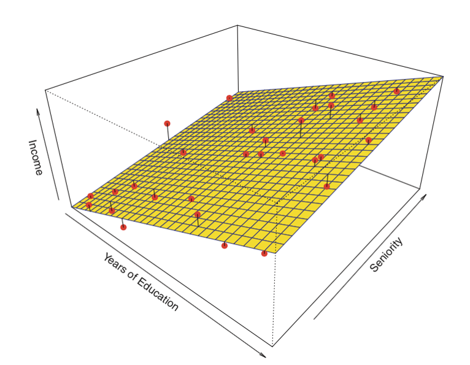
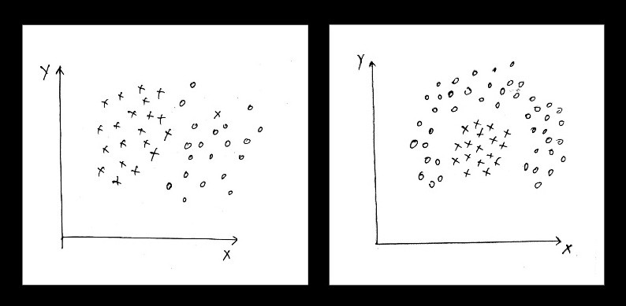
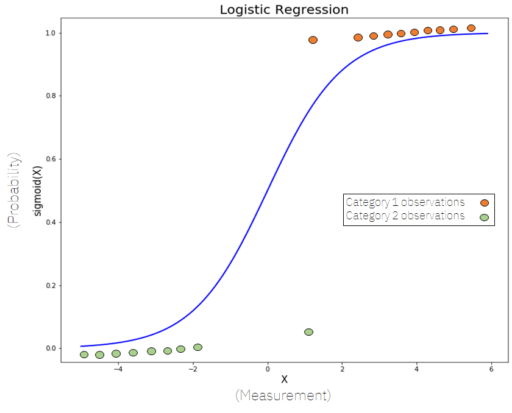
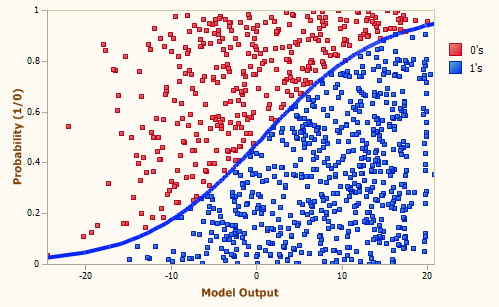
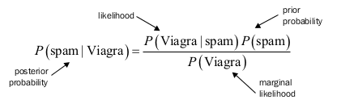

# U4 · Modelos supervisados I — lineal, logística, Naïve Bayes

Con los datos ya limpios (U2) y el idioma para evaluar en la mano (U3), entramos por fin en las técnicas. Y lo hacemos por la puerta que un profesional sanitario reconocerá enseguida, porque muchas de las herramientas de riesgo que usáis a diario nacen justamente de aquí.

Empezamos por las tres familias más simples y fundamentales del aprendizaje supervisado. No las tratamos como un mero calentamiento: son extraordinariamente útiles, a menudo el **mejor punto de partida** para cualquier problema clínico y, con más frecuencia de la que se cree, también el **modelo final**.

Son la **regresión lineal** (predecir un número, como un riesgo o una constante analítica), la **regresión logística** (clasificar devolviendo una **probabilidad**, el modelo que sostiene los *scores* clínicos que ya conocéis) y **Naïve Bayes** (clasificación probabilística rapidísima, ideal para **texto**, como una nota clínica).

Fieles al método del curso, presentamos cada una por su **intuición, fortalezas, debilidades y campo de aplicación clínica**, sin entrar en la matemática, y pasamos de inmediato al ejemplo ejecutable en Colab —cuyo código genera el asistente y nosotros revisamos y evaluamos con las métricas de U3.

### Objetivos de esta unidad

* La **regresión lineal** como predictor de un valor continuo (`riesgo_cv_10a`) y, sobre todo, la lectura **interpretable de sus coeficientes**: "cada +10 mmHg de tensión sube el riesgo en tantos puntos".
* La **regresión logística** con el protagonismo que merece: por qué es el **caballo de batalla de la epidemiología clínica**, cómo devuelve una **probabilidad** de `evento_cv` y por qué sus coeficientes se leen como **odds ratio** —el lenguaje natural del riesgo en medicina.
* Por qué la logística es **interpretable y calibrable**, y por eso domina en los *scores* de riesgo (Framingham, SCORE…); y por qué en nuestros datos **iguala o supera** a modelos mucho más complejos.
* **Naïve Bayes** como clasificador probabilístico de **texto clínico**: qué significa el "ingenuo", por qué su suposición casi nunca es cierta y por qué, aun así, funciona sorprendentemente bien con palabras.
* La distinción **regresión vs. clasificación** con criterio operativo, y la **regla de oro**: empezar por el modelo más simple que pueda funcionar.


**💡 Idea clave**

Una regla de oro de la práctica, que en salud vale doble: **empieza siempre por el modelo más simple que pueda funcionar**. Estos tres modelos son rápidos de entrenar, fáciles de **interpretar** —algo irrenunciable cuando una predicción roza a una persona— y dan un *baseline* honesto contra el que medir cualquier cosa más sofisticada. Muchas veces, son además el modelo definitivo. Lo complejo solo se justifica si mejora de verdad, y esa mejora hay que **demostrarla** con las métricas de U3.


## 4.1 Regresión lineal: predecir un valor continuo

La regresión lineal es el modelo de *machine learning* más simple que existe y, pese a ello, uno de los más usados en biomedicina. Su idea es directa: buscar la **recta** (o, con varias variables, el **plano/hiperplano**) que mejor se ajusta a los datos observados, para luego usarla y predecir valores nuevos.

En nuestro hilo clínico, la salida es `riesgo_cv_10a`: el modelo aprende, a partir de la cohorte **sintética** `pacientes.csv` (20 000 pacientes generados por código, **no reales**), a estimar el riesgo cardiovascular a 10 años de un paciente a partir de su edad, tensión, glucemia, colesterol, HDL, tabaquismo y demás variables.

<figure><figcaption><p>Regresión lineal con dos variables de entrada: el modelo ajusta un plano a la nube de puntos. Con una sola variable de entrada sería una recta; con muchas variables clínicas, un hiperplano que no podemos dibujar pero sí interpretar.</p></figcaption></figure>


**Concepto · Regresión lineal**

Modelo que asume una relación **lineal** entre las variables de entrada y la salida: cada variable contribuye con un **peso** (coeficiente), y la predicción es la suma ponderada de todas ellas. Entrenar consiste en encontrar los pesos que minimizan el error sobre el histórico. Aplicado a `riesgo_cv_10a`, la salida es un porcentaje de riesgo.


Su gran virtud, además de la simplicidad, es la **interpretabilidad**, y aquí es donde un clínico saca partido inmediato. El peso de cada variable dice **cuánto y en qué sentido** influye, en las mismas unidades del problema.


**💡 Idea clave**

Una afirmación del tipo *"manteniendo lo demás constante, cada +10 mmHg de tensión sistólica sube el riesgo estimado en X puntos porcentuales a 10 años"* la entrega un modelo lineal de forma natural, y es exactamente el lenguaje con el que se razona el riesgo en la consulta y en un comité. El signo también informa: variables **protectoras** como el HDL o la actividad física aparecen con **coeficiente negativo** (empujan el riesgo hacia abajo), mientras que la edad, la glucemia o el tabaquismo activo lo empujan hacia arriba. Esa lectura, transparente y auditable, es un valor en sí misma —a veces más útil que ganar unas décimas de precisión con un modelo opaco.


Su límite es la otra cara de la misma moneda: si la relación real **no es lineal**, el modelo se queda corto (infraajuste / *underfitting*).

En riesgo cardiovascular esto ocurre —el efecto de la edad se acelera, y algunas variables **interaccionan** (la tensión no pesa igual en un diabético que en uno que no lo es)—, y forzar una recta sobre una realidad curva da predicciones pobres. Conviene comprobarlo siempre.

<figure><figcaption><p>La regresión lineal funciona bien cuando la relación es aproximadamente lineal (izquierda); ante relaciones claramente no lineales (derecha) se queda corta. En clínica, muchas relaciones dosis-respuesta o dependientes de la edad son curvas.</p></figcaption></figure>

**✅ Fortalezas**

* Muy simple y rápida de entrenar; apenas hay nada que ajustar.
* **Máxima interpretabilidad**: un coeficiente por variable, con signo y magnitud clínicamente legibles.
* Excelente *baseline*: fija el listón que los modelos potentes (U5) deberán superar.
* Funciona bien cuando la relación es aproximadamente lineal.

**⚠️ Límites y debilidades**

* Asume linealidad: falla ante relaciones curvas o umbrales biológicos.
* No captura **interacciones** entre variables sin ayuda (habría que construirlas a mano).
* Sensible a *outliers* (los vimos en U2): un valor analítico extremo mal depurado puede condicionar la recta. Conviene **verificar y filtrar** los atípicos.
* A menudo conviene **normalizar** o transformar variables para que los coeficientes sean comparables.


**🩺 Aplicación clínica · Estimar el riesgo cardiovascular como primer modelo**

Para estimar `riesgo_cv_10a` a partir de las variables del paciente, la regresión lineal es el **primer modelo a probar**. No será el más preciso —en nuestra cohorte sintética, un Random Forest alcanza R² ≈ 0,91 frente a R² ≈ 0,81 de la lineal, precisamente porque **captura interacciones** que la recta no ve—, pero su lectura es valiosísima: revela el **signo y la magnitud** del efecto de cada palanca (la tensión y la glucemia suben el riesgo; el HDL y la actividad física lo bajan) y fija el *baseline* honesto que cualquier modelo complejo tendrá que batir de forma demostrable. Interpretabilidad primero; potencia, solo si compensa.


## 4.2 Regresión logística: el caballo de batalla de la epidemiología clínica

Si en todo el curso hay un modelo que un profesional sanitario debe conocer al dedillo, es este. A pesar de su nombre, la regresión logística **clasifica**, no predice números: es la técnica que sostiene buena parte de la **epidemiología clínica** y de las tablas de riesgo que usáis a diario. Merece protagonismo, y se lo damos.

La idea parte de la regresión lineal y la transforma con una función en forma de S —la ***sigmoide***— que convierte cualquier valor en un número entre 0 y 1, interpretable como la **probabilidad** de pertenecer a la clase positiva.

En nuestro hilo, esa clase es `evento_cv` (que ocurra o no un evento cardiovascular; prevalencia ≈ 19 % en la cohorte sintética). El modelo no dice solo "sí/no": dice *"este paciente tiene un 12 % de probabilidad de evento"*, y esa cifra es oro clínico. Si la probabilidad supera un umbral (por defecto 0,5, pero **negociable**), asignamos la clase positiva.

<figure><figcaption><p>Regresión logística: en lugar de ajustar una recta, ajusta una curva sigmoide que transforma la combinación de variables clínicas en una <strong>probabilidad</strong> entre 0 y 1 —por ejemplo, la probabilidad de un evento cardiovascular.</p></figcaption></figure>


**Concepto · Regresión logística**

Modelo de clasificación que estima la **probabilidad** de que una instancia pertenezca a una clase, aplicando una función sigmoide a una combinación lineal de las variables. Hereda de la lineal la **interpretabilidad** y añade una salida **probabilística**. Sus coeficientes, al exponenciarse, se leen como **odds ratio**.


**Por qué la epidemiología la adora: los coeficientes son *odds ratio*.** Aquí está el corazón del asunto. En la regresión lineal, un coeficiente se lee "en puntos de la salida". En la logística, cada coeficiente —una vez transformado— se lee como un **odds ratio (OR)**, es decir, una **razón de probabilidades (razón de momios)**: en cuánto se multiplican las *odds* de sufrir el evento cuando esa variable aumenta una unidad (o pasa de "ausente" a "presente"), manteniendo lo demás constante.


**Concepto · Cómo leer un odds ratio (OR)**

Un OR de 1 significa "no cambia el riesgo"; mayor que 1, "lo aumenta"; menor que 1, "lo protege". Por ejemplo, un OR de 2,0 para el tabaquismo activo significa que fumar **duplica las *odds*** de evento frente a no fumar. Este es, literalmente, **el idioma con el que la medicina comunica el riesgo**: factores de riesgo, factores protectores, "el doble de probabilidad de…".


Que el modelo hable ese idioma de fábrica —sin traducción ni cajas negras— es la razón de que la regresión logística sea el **caballo de batalla** de los estudios de cohortes, los casos-control y los *scores* de riesgo.

Su salida probabilística es, además, una ventaja enorme en la práctica clínica: no solo dice "sí/no", sino **"con qué confianza"**. Esto permite **mover el umbral** de decisión para equilibrar falsos positivos y falsos negativos según el **coste del error** —exactamente la decisión que estudiamos en U3— y es la base de la **curva ROC**.

Y como devuelve probabilidades, tiene sentido preguntarse si están **bien calibradas**: que un "20 %" signifique de verdad un 20 % de eventos observados. La logística es de los pocos modelos que suele salir **bien calibrado de serie**, y por eso es tan apreciada cuando la probabilidad se va a **comunicar a un paciente** o a alimentar una tabla de riesgo.

<figure><figcaption><p>La frontera de decisión de la regresión logística sobre los datos: en lugar de una línea tajante, asigna a cada paciente una <strong>probabilidad</strong> que crece de forma suave al aproximarse a la zona de mayor riesgo.</p></figcaption></figure>

**Por eso domina en los *scores* clínicos.** Herramientas ampliamente usadas como **Framingham** o **SCORE** para el riesgo cardiovascular descansan, en su núcleo, en modelos de este tipo. La razón no es que sean los más potentes en abstracto, sino que reúnen justo lo que la clínica exige: son **interpretables** (cada factor tiene su peso legible como OR), **calibrables** (la probabilidad se puede ajustar a la población diana) y **transparentes** (auditables, defendibles ante un comité, reproducibles).

Un modelo que decide sobre personas necesita poder **explicarse**, y la logística explica.

**Y —lección importante— aquí iguala o supera a lo complejo.** En nuestra cohorte sintética, la regresión logística alcanza **AUC ≈ 0,84** clasificando `evento_cv` y **gana a un Random Forest** (≈ 0,83), un modelo mucho más sofisticado.


**💡 Idea clave**

¿Por qué gana la logística aquí? Porque el riesgo, en estos datos, es aproximadamente **log-aditivo**: los factores contribuyen de forma acumulativa en la escala en la que la logística trabaja, que es precisamente la forma que la logística modela de manera natural. Es la gran ilustración de la regla de oro: **no siempre gana el modelo más complejo**; cuando la estructura del problema encaja con un modelo simple, este es más preciso, más barato y —crucial en salud— más explicable. (Contrasta con la regresión de `riesgo_cv_10a` de la sección anterior, donde sí ganaba el modelo complejo por las interacciones: la lección es que hay que **probar y medir**, no presuponer.)


**✅ Fortalezas**

* Devuelve **probabilidades**, no solo etiquetas: base de decisiones clínicas graduables.
* **Interpretable en el idioma del riesgo**: coeficientes legibles como **odds ratio**.
* Suele estar **bien calibrada**, lo que importa cuando la probabilidad se comunica o se usa como riesgo.
* Rápida, robusta y excelente *baseline* de clasificación; permite **ajustar el umbral** según el coste del error.
* Cuando el riesgo es aproximadamente aditivo (frecuente en factores de riesgo), **iguala o bate** a modelos complejos.

**⚠️ Límites y debilidades**

* Frontera de decisión **lineal**: no captura por sí sola interacciones o umbrales complejos.
* Sensible a variables **irrelevantes** y a la **colinealidad** (variables muy correlacionadas distorsionan los coeficientes y su lectura como OR).
* En problemas con relaciones muy no lineales, los *ensembles* (U5) la superan.
* Como toda interpretación epidemiológica, **asociación no es causalidad**: un OR describe asociación en estos datos, no un mecanismo.


**🩺 Aplicación clínica · Cribar el riesgo de evento cardiovascular**

Para decidir si un paciente entra en un circuito de **cribado o prevención**, la regresión logística da una **probabilidad** de `evento_cv` por caso, no una etiqueta rígida. El equipo fija entonces el **umbral** según su capacidad y el coste del error: si **no detectar** un evento (falso negativo) es lo más caro —y en prevención cardiovascular suele serlo—, se **baja el umbral** para capturar a más pacientes de riesgo, asumiendo más falsas alarmas que una segunda valoración filtrará.

Además, los coeficientes cuentan una historia coherente con la clínica: en la cohorte sintética, el gradiente de eventos por tabaquismo es **nunca ≈ 14 % → ex ≈ 22 % → activo ≈ 28 %**, y el HDL y la actividad física reducen el riesgo. Esa flexibilidad del umbral, conectada con las métricas de U3, es justo lo que un servicio necesita para diseñar su estrategia.


## 4.3 Naïve Bayes: clasificación probabilística de texto clínico

Naïve Bayes es un clasificador basado en el **teorema de Bayes**, que relaciona la probabilidad de una clase dada la evidencia con la probabilidad de la evidencia dada la clase.

Es especialmente popular para clasificar **texto** —y en salud el texto está por todas partes: notas de evolución, informes, motivos de consulta— porque es rapidísimo y funciona sorprendentemente bien.

<figure><figcaption><p>El teorema de Bayes, corazón de Naïve Bayes: combina la probabilidad <strong>previa</strong> de una clase con la <strong>verosimilitud</strong> de la evidencia (aquí, las palabras de un texto) para obtener la probabilidad <strong>posterior</strong>. El clásico ejemplo de "spam / no spam" es solo una ilustración; nuestro uso será clasificar <strong>texto clínico</strong> por especialidad o prioridad.</p></figcaption></figure>


**Concepto · Naïve Bayes**

Clasificador probabilístico que aplica el teorema de Bayes asumiendo —de forma "ingenua" (*naïve*)— que las variables (por ejemplo, las palabras de un texto) son **independientes** entre sí dada la clase. Esa simplificación, aunque rara vez cierta, hace el cálculo **muy rápido** y, en la práctica, da buenos resultados, sobre todo con texto.


**El "ingenuo", explicado.** El adjetivo viene de su suposición de que todas las variables son **independientes** unas de otras —algo que casi nunca se cumple del todo—. En un texto, "dolor" y "torácico" claramente no son independientes: aparecen juntos mucho más de lo que el azar predeciría. Naïve Bayes lo ignora deliberadamente y trata cada palabra por separado.


**💡 Idea clave**

Lo notable es que, **pese a esa simplificación falsa**, el modelo clasifica bien en muchísimos casos. ¿Por qué funciona en texto? Porque para **acertar la clase** no necesita estimar la probabilidad exacta, solo **ordenar** correctamente las clases: aunque cuente doble la evidencia de palabras correlacionadas, el "ganador" suele seguir siendo el mismo. Es el ejemplo perfecto de que un modelo "incorrecto" en sus supuestos puede ser **muy útil** en la práctica.


**Ejemplo clínico: clasificar notas.** Con el fichero **sintético** `notas_clinicas.csv` (columnas `texto, especialidad, prioridad, centro_id`), Naïve Bayes puede aprender a **clasificar la especialidad** o la **prioridad** de una nota a partir únicamente de su **texto**.

El modelo aprende qué palabras se asocian a cada clase —términos como "torácico", "disnea" o "ECG" empujarán hacia cardiología; "cefalea", "parestesia" o "focalidad" hacia neurología— y asigna la nota a la clase más probable, con una probabilidad por clase. Es un primer **triaje automático** de texto libre, rápido de montar y fácil de explicar, ideal como *baseline* antes de plantear modelos de lenguaje más pesados (que veremos en U9).

**✅ Fortalezas**

* **Extremadamente rápido** de entrenar y de predecir, incluso con muchísimas palabras.
* Funciona muy bien con **texto** y con miles de variables (una por término).
* Necesita **pocos datos** para empezar a dar resultados razonables.
* Da **probabilidades por clase** y es fácil de interpretar a alto nivel.

**⚠️ Límites y debilidades**

* La suposición de **independencia** rara vez se cumple (en texto clínico, casi nunca).
* Sus probabilidades suelen estar **mal calibradas**: útiles para ordenar y elegir clase, poco fiables como "riesgo" literal.
* Le perjudican las variables muy **correlacionadas** y redundantes.
* Suele **perder** frente a modelos más expresivos cuando hay datos abundantes.


**⚠️ Aviso · No confundas "clasificar texto" con "estimar riesgo"**

Naïve Bayes es excelente para **enrutar** una nota clínica (¿a qué especialidad?, ¿qué prioridad?), pero sus probabilidades están **mal calibradas**: un "0,8" suyo no significa "80 % de probabilidad real". Para decisiones que exijan una **probabilidad fiable** de un desenlace clínico, la **regresión logística** —bien calibrada— es la herramienta adecuada, no Naïve Bayes. Cada modelo, en su sitio.


## 4.4 Regresión vs. clasificación: qué enfoque elegir

La distinción la introdujimos en U2; aquí la cerramos con criterio operativo.

La pregunta clave es **qué tipo de salida** necesita la decisión clínica.

| Si la pregunta clínica es...                    | Es un problema de...       | Modelo de partida (U4) |
| ----------------------------------------------- | -------------------------- | ---------------------- |
| ¿Qué riesgo cardiovascular a 10 años tiene?     | Regresión                  | Regresión lineal       |
| ¿Este paciente tendrá un evento cardiovascular? | Clasificación binaria      | Regresión logística    |
| ¿Cuál es la probabilidad de reingreso?          | Clasificación (probabilid.)| Regresión logística    |
| ¿A qué especialidad corresponde esta nota?      | Clasificación multiclase   | Naïve Bayes            |
| ¿Qué prioridad tiene este motivo de consulta?   | Clasificación multiclase   | Naïve Bayes            |


**💡 Idea clave**

A veces un mismo problema admite **ambos enfoques**. "¿Es un paciente de alto riesgo?" se puede plantear como **clasificación** (sí/no) o derivarse de una **regresión** (estimar `riesgo_cv_10a` y compararlo con un umbral clínico). La elección depende de **qué decisión alimenta** y de **qué métrica importa** (U3). Probar ambos y comparar honestamente es buena práctica —y, cuando la salida que de verdad se necesita es una **probabilidad**, la logística suele ser la respuesta.


## 4.5 Práctica guiada: tres modelos sobre la cohorte

La práctica de esta unidad entrena los tres modelos sobre nuestros datos **sintéticos**. Como siempre, **el código lo genera el asistente** y nosotros lo revisamos y lo evaluamos con las métricas de U3.

Recuerda el flujo honesto: partición por paciente, sin fuga de datos, y *baseline* presente.

**🤖 Prompt para el asistente · Regresión lineal del riesgo cardiovascular**

```
Con 'pacientes.csv' (target de regresión: riesgo_cv_10a, en %), en español y por
celdas:
1. Prepara las features (codifica sexo, tabaquismo y actividad_fisica; usa edad,
   imc, tensión, glucemia, colesterol, hdl y antecedentes) SIN fuga de datos:
   imputa y escala usando SOLO el train.
2. Entrena una RegresiónLineal y compárala con el baseline de predecir el riesgo
   medio.
3. Reporta MAE, RMSE y R² en test, en PUNTOS DE RIESGO, y MUESTRA los
   coeficientes: ¿qué variable pesa más y en qué sentido? Interpreta el efecto de
   +10 mmHg de tensión sistólica en puntos de riesgo, y comprueba que HDL y
   actividad física salen como protectores (coeficiente negativo).
```

**🤖 Prompt para el asistente · Regresión logística de evento cardiovascular (odds ratio + calibración)**

```
Con 'pacientes.csv' (target de clasificación: evento_cv, prevalencia ≈19%), en
español y por celdas:
1. Separa train/test ESTRATIFICADO y por paciente (sin fuga).
2. Entrena una RegresiónLogística que devuelva PROBABILIDADES y un baseline de
   clase mayoritaria.
3. Muestra la matriz de confusión y calcula sensibilidad, especificidad, VPP y
   VPN; dibuja la curva ROC (con AUC) y la CURVA DE CALIBRACIÓN.
4. Convierte los coeficientes en ODDS RATIO (exponencial) y muéstralos ordenados:
   interpreta el OR del tabaquismo activo y el del HDL en lenguaje clínico
   ("multiplica/divide las odds de evento por…").
5. Suponiendo que un falso negativo es el error más caro, dime a qué UMBRAL
   moverías el corte y recalcula la matriz de confusión con ese umbral.
```

_Aquí el valor no es solo el AUC: son los **odds ratio** y la **calibración**, que hablan el idioma del riesgo clínico._

**🤖 Prompt para el asistente · Naïve Bayes sobre texto clínico**

```
Con 'notas_clinicas.csv' (columnas texto, especialidad, prioridad, centro_id),
en español y por celdas:
1. Vectoriza el 'texto' (bag-of-words / TF-IDF) SIN fuga: ajusta el vectorizador
   solo con el train.
2. Entrena un Naïve Bayes para predecir 'especialidad' (multiclase) y compáralo
   con un baseline de clase mayoritaria.
3. Reporta accuracy y F1-macro, y muestra la matriz de confusión por especialidad.
4. Enséñame las palabras más asociadas a cada clase y comenta por qué, pese a la
   suposición de independencia entre palabras, el modelo clasifica bien.
```

Al revisar el código del asistente comprobamos lo de siempre —y algo propio de esta unidad.

* Que la **partición** sea honesta y por paciente.
* Que haya *baseline*.
* Que la **métrica destacada** corresponda al **coste del error**.
* Que en la logística se muestren los **odds ratio** y la **calibración** (no solo el AUC).
* Que en Naïve Bayes el vectorizador se ajuste **solo con el train**.

Y disfrutamos de una gran ventaja de estos modelos: sus resultados son **explicables**, algo que agradeceremos de veras cuando lleguen los modelos más potentes y opacos de la U5.


**🔬 Práctica en Colab** — `U04_Supervisados_I.ipynb`

Regresión lineal de `riesgo_cv_10a`, regresión **logística** de `evento_cv` (con coeficientes leídos como *odds ratio* y su curva de calibración) y **Naïve Bayes** sobre el texto de `notas_clinicas.csv`, todo sobre datos **sintéticos**. Su **primera celda genera los datos sintéticos**, así que no hay que descargar nada: se abre y se ejecuta.

[Abrir en Colab](PENDIENTE_DRIVE)


## Qué llevarte

* **Empieza por lo simple.** La regla de oro vale doble en salud: estos tres modelos son rápidos, interpretables y un *baseline* honesto; a menudo, el modelo final. Lo complejo hay que **demostrarlo**.
* **La regresión lineal se lee por sus coeficientes.** "Cada +10 mmHg sube el riesgo en X puntos" es su gran aportación; su techo es que **asume linealidad** y no ve interacciones.
* **La regresión logística es el caballo de batalla clínico.** Devuelve una **probabilidad**, sus coeficientes son **odds ratio** —el idioma del riesgo—, suele estar **bien calibrada** y por eso domina en los *scores* (Framingham, SCORE). En nuestros datos, **iguala o supera** a lo complejo (AUC ≈ 0,84) porque el riesgo es aproximadamente log-aditivo.
* **Naïve Bayes clasifica texto rapidísimo.** Ideal para enrutar notas por especialidad o prioridad; el "ingenuo" (independencia de palabras) casi nunca es cierto, pero funciona. Ojo: sus probabilidades están **mal calibradas** —para riesgo, usa la logística.
* **Regresión vs. clasificación: decide qué salida necesitas.** Y cuando lo que hace falta es una probabilidad fiable, la logística suele ser la respuesta.

***

Estos tres modelos cubren muchísimos casos clínicos reales, pero comparten un techo: sus fronteras son esencialmente **lineales**.

Cuando los datos exigen fronteras más ricas —interacciones, umbrales, relaciones no lineales—, entran en juego las **máquinas de vectores soporte**, los **árboles de decisión** y, sobre todo, los métodos ***ensemble*** (Random Forest, *boosting*), los reyes del dato tabular. Ese es el terreno de la **Unidad 5**, donde además aprenderemos a **elegir con criterio** entre todos ellos —con validación cruzada, búsqueda de hiperparámetros y una mirada a la interpretabilidad (SHAP)— sin perder nunca de vista la evaluación honesta de U3.
