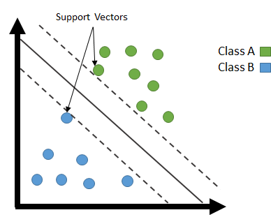
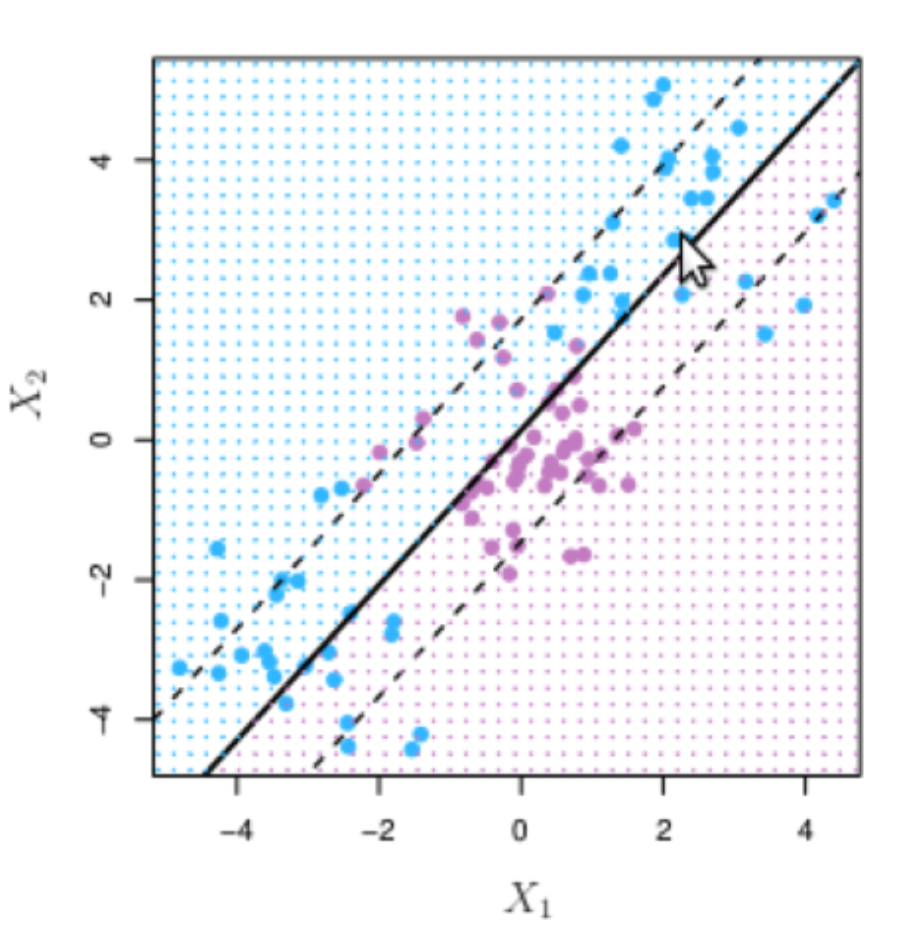
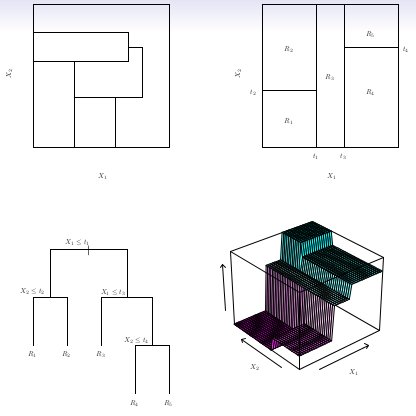
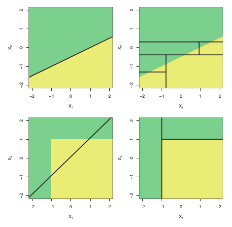
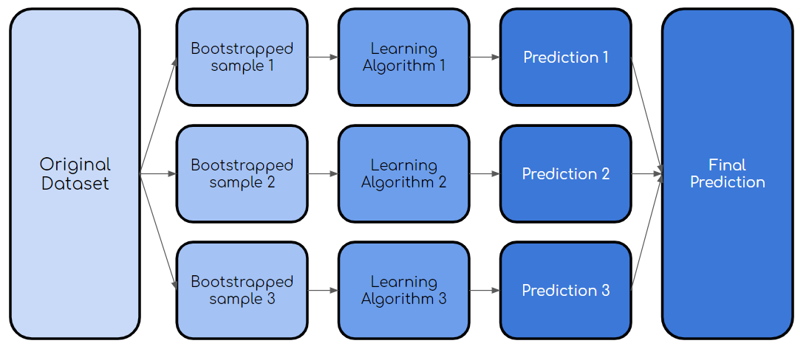
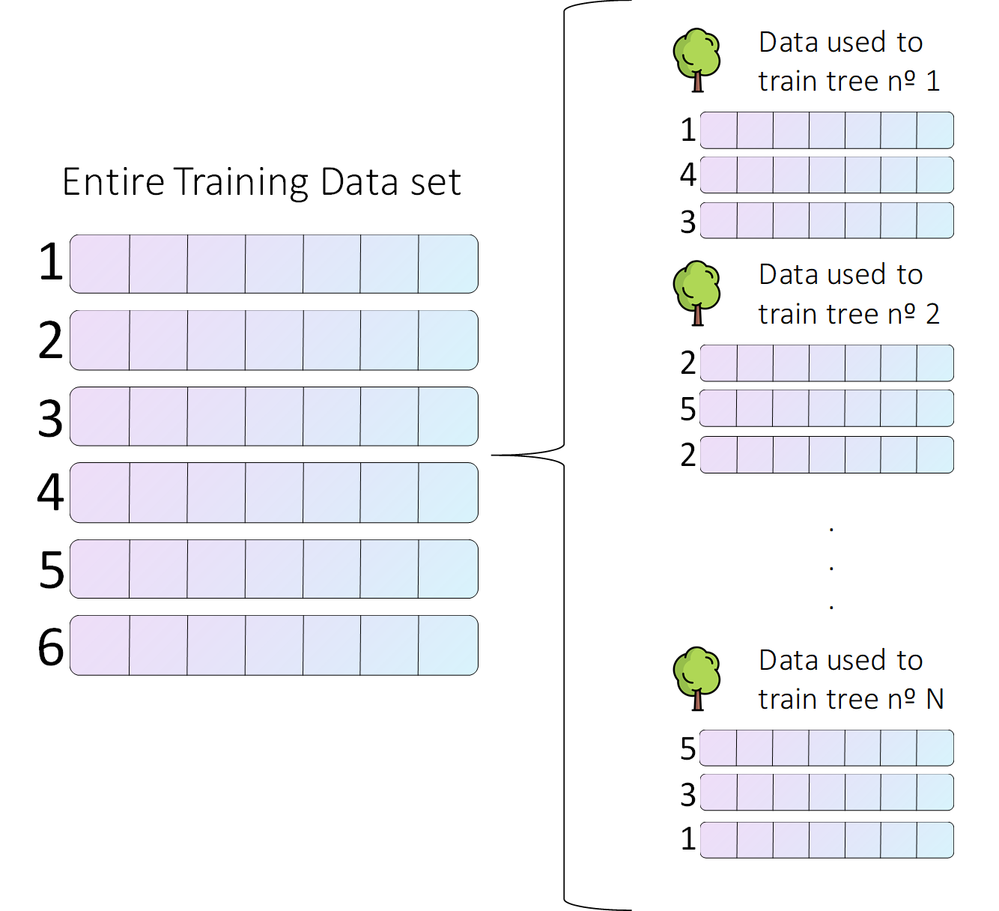
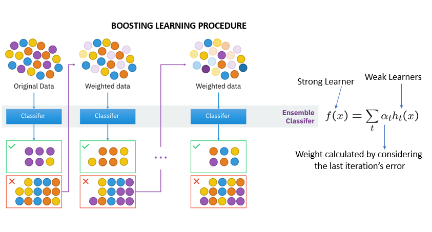

# U5 · Supervisados II — SVM, árboles, ensembles y cómo elegir bien


**🔒 Unidad en preparación (todavía no disponible).** Esta unidad forma parte del temario, pero **aún no está cerrada**: su contenido puede cambiar. Por ahora, el curso publicado llega hasta la **U3**; las siguientes se irán liberando en las próximas semanas.



Los modelos de la Unidad 4 —regresión lineal, logística y Naïve Bayes— son sencillos, rápidos y, sobre todo, **interpretables**: sus coeficientes se leen casi como un *odds ratio*.

Pero comparten una limitación de fondo: sus fronteras de decisión son esencialmente **lineales**. Cuando la relación entre las variables clínicas y el desenlace tiene curvas, escalones o interacciones —y en medicina las tiene a menudo— hacen falta familias capaces de doblar esa frontera.

Esta unidad tiene **dos mitades muy distintas**, y la segunda es, con diferencia, la más importante de todo el curso.

En la **primera mitad** presentamos las familias que rompen la barrera lineal: las **máquinas de vectores soporte (SVM)**, los **árboles de decisión** —tan intuitivos que se leen como un protocolo clínico— y la idea más potente del bloque, los **ensembles**: combinar muchos modelos débiles en uno robusto (*bagging* y **Random Forest**; **boosting** con LightGBM o HistGradientBoosting). De cada uno veremos su intuición, sus fortalezas y sus límites en clave clínica.

En la **segunda mitad** —el verdadero corazón del curso— dejamos de coleccionar modelos y aprendemos lo que de verdad marca la diferencia entre un proyecto serio y un póster bonito: **cómo elegir bien, sin autoengañarse**.

La **validación cruzada** para estimar el rendimiento con honestidad; la **búsqueda de hiperparámetros** y su trampa (sobreajustar la propia validación); la **selección del mejor modelo por la métrica clínica adecuada** —la de la Unidad 3, no la *accuracy*—; y la **explicabilidad con SHAP**, que responde a la pregunta que más pesa en la consulta: *"¿por qué el modelo predice esto para **este** paciente?"*.


**💡 Idea clave**

Esta unidad demuestra una verdad incómoda y liberadora a la vez: **no existe un modelo universalmente mejor**. En nuestra propia cohorte sintética, la humilde **regresión logística iguala o supera** a un Random Forest para predecir `evento_cv`, mientras que para estimar `riesgo_cv_10a` el Random Forest gana con holgura. El mejor modelo **no se adivina ni se elige por moda: se mide**. Y medir bien es una habilidad clínica, no algorítmica.


### Objetivos de esta unidad

* Entender la **intuición** de tres familias no lineales —**SVM**, **árboles** y **ensembles** (Random Forest y boosting)— con sus pros y contras **clínicos**, sin matemática profunda.
* Ver por qué, en **datos tabulares clínicos** (una tabla de pacientes como [`pacientes.csv`](https://drive.google.com/file/d/1Ku0j-sAf8Cr3FPT-DGm8v5p4h_2BmV5U/view?usp=drive_link)), los ensembles de árboles suelen ser el rival a batir... y por qué no siempre ganan.
* Dominar la **validación cruzada (k-fold)** como forma honesta de estimar el rendimiento, con el matiz clínico de la **partición por paciente**.
* Distinguir **parámetro aprendido** de **hiperparámetro**, y saber buscarlos con **GridSearchCV** o **RandomizedSearchCV** sin caer en **sobreajustar la validación**.
* **Seleccionar el mejor modelo** comparando candidatos con la **métrica clínica adecuada** (AUC, PR, calibración) y no con la *accuracy*.
* Explicar una predicción individual con **SHAP** y entender por qué es tan valioso —y tan vendible— en clínica.

Como en todo el curso, todos los ejemplos se apoyan en la cohorte **sintética** `pacientes.csv` (20 000 pacientes generados por código, **no son pacientes reales**), con sus dos objetivos: `riesgo_cv_10a` (riesgo cardiovascular a 10 años, en %, para **regresión**) y `evento_cv` (0/1, para **clasificación**, con **prevalencia ≈ 19 %**).

## 5.1 Máquinas de vectores soporte (SVM)

La SVM aborda la clasificación con una idea geométrica elegante. De entre todas las fronteras posibles que separan dos grupos de pacientes —digamos, quienes sufrirán un evento cardiovascular y quienes no—, no elige una cualquiera: busca la que deja el **margen más ancho** posible entre ambas clases.

Los pacientes que quedan justo sobre ese margen —los casos límite, los más difíciles de clasificar— son los **vectores soporte** y dan nombre al método. La intuición clínica es sensata: una frontera con margen amplio es más **robusta**, tolera mejor a un paciente nuevo ligeramente distinto de los del entrenamiento.

<figure><figcaption><p>La SVM no busca cualquier frontera entre dos grupos de pacientes, sino la de <strong>margen máximo</strong>. Los casos límite que tocan ese margen —los más difíciles— son los "vectores soporte" y sostienen la decisión.</p></figcaption></figure>


**Concepto · Máquina de vectores soporte (SVM)**

Clasificador que busca el hiperplano que separa las clases dejando el **margen máximo** entre ellas. Mediante el llamado *truco del kernel* puede construir fronteras **no lineales** sin calcular explícitamente nuevas variables, lo que la hace potente en espacios complejos y de muchas dimensiones.


En el mundo real, los pacientes rara vez se separan con una línea recta. La SVM lo resuelve de dos maneras complementarias.

Primero, con un **margen blando**: permite que algunos pacientes caigan del lado equivocado a cambio de una frontera más estable y menos caprichosa. Cuánta indulgencia concede lo gobierna un hiperparámetro llamado **C** (C bajo = margen ancho y tolerante; C alto = margen estrecho que intenta no equivocarse con nadie, a riesgo de sobreajustar).

Segundo, con el **truco del kernel**. Si en el espacio original de variables clínicas las clases no se separan con una recta, la SVM las proyecta mentalmente a un espacio de **más dimensiones**, donde nuevas coordenadas se construyen como combinaciones (polinómicas u otras) de las variables que ya teníamos. En ese espacio ampliado sí puede aparecer un hiperplano que separe bien. Y al "volver" al espacio original, ese plano recto se ve como una **superficie curva**: la linealidad en muchas dimensiones se traduce en fronteras no lineales en las nuestras.

<figure><figcaption><p>El <strong>truco del kernel</strong>: datos de pacientes que no se separan con una recta en su espacio original pueden volverse separables al proyectarlos a una dimensión superior. La frontera recta de arriba se ve curva al regresar a las variables clínicas de partida.</p></figcaption></figure>

La elección del **kernel** (lineal, polinómico o RBF) y de sus parámetros —como **gamma** en el RBF— regula la flexibilidad de la frontera. Demasiada flexibilidad conduce al **sobreajuste** que ya conocemos (el modelo memoriza a los pacientes del entrenamiento); demasiada poca, al **infraajuste** (una frontera tan rígida que no captura la señal real).

Encontrar el punto medio es, de nuevo, cuestión de **medir**, no de intuir: por eso los hiperparámetros de la SVM (C, el tipo de kernel y gamma) casi siempre hay que **buscarlos**, un problema que abordamos en la segunda mitad de la unidad.

**✅ Fortalezas**

* Eficaz en espacios de **alta dimensión** (muchas variables clínicas).
* Construye **fronteras no lineales** vía kernels sin fabricar variables a mano.
* **Robusta** cuando existe un margen razonablemente claro entre grupos de pacientes.
* Buen rendimiento con datasets de tamaño **mediano**.

**⚠️ Debilidades / límites**

* **Lenta y costosa** en cohortes muy grandes.
* **Difícil de interpretar**, sobre todo con kernels no lineales: mala noticia en un entorno donde hay que justificar decisiones.
* **Sensible a la escala**: obliga a **normalizar** las variables (una glucemia en cientos y un IMC en decenas no pueden convivir sin estandarizar).
* Requiere **ajustar C, el kernel y gamma** con cuidado; no da bien "de fábrica".


**Campo de aplicación clínica**

La SVM brilla cuando hay **muchas variables** y **relativamente pocos pacientes** —un escenario frecuente en investigación biosanitaria, por ejemplo con datos de expresión génica o firmas de biomarcadores— y cuando se busca una frontera robusta más que una explicación. Para una tabla clínica al estilo de `pacientes.csv`, con miles de filas y pocas columnas interpretables, suele quedar por detrás de los ensembles de árboles tanto en rendimiento como en explicabilidad.


## 5.2 Árboles de decisión

Un árbol de decisión predice mediante una **secuencia de preguntas anidadas** sobre las variables: *"¿la glucemia supera 126 mg/dL?"*, y según la respuesta, *"¿el paciente fuma de forma activa?"*, y así sucesivamente, dividiendo la población en grupos cada vez más homogéneos hasta llegar a una **hoja** que emite la predicción.

Es, con casi total seguridad, el modelo más **intuitivo** de todo el curso, y por una razón que a un profesional sanitario le resultará familiar: **un árbol de decisión se lee exactamente como un protocolo o un algoritmo clínico de decisiones**. Cada nodo es una pregunta, cada rama una respuesta, cada hoja una conducta. La diferencia es que aquí el árbol **no lo escribe un comité de expertos**: lo aprende solo a partir de los datos.

<figure><figcaption><p>Un árbol de decisión divide el espacio de variables clínicas en regiones mediante <strong>cortes sucesivos</strong>. Se lee como un protocolo: cada nodo es una pregunta, cada hoja una predicción. La diferencia es que lo <em>aprende</em> de los datos, no lo dicta un comité.</p></figcaption></figure>


**Concepto · Árbol de decisión**

Modelo que aprende una jerarquía de **reglas** (cortes sobre las variables) que dividen a los pacientes en grupos homogéneos respecto al desenlace. Es un modelo de **"caja blanca"**: totalmente interpretable, se puede dibujar y explicar. Sirve tanto para **clasificación** (`evento_cv`) como para **regresión** (`riesgo_cv_10a`).


¿Cómo decide el árbol qué pregunta hacer en cada nodo? Con un método **voraz** (*greedy*). No puede explorar el número astronómico de árboles posibles, así que en cada paso elige el **corte que más mejora localmente** la separación, sin garantía de que el árbol global sea el óptimo.

Para medir esa mejora usa una noción de **"pureza"**: en cada nodo se tantean muchas preguntas posibles (¿qué variable?, ¿en qué valor de corte?) y se elige la que deja los grupos resultantes **más homogéneos** —es decir, con menos mezcla de pacientes con y sin evento—. Ese "grado de mezcla" se cuantifica con la **entropía** o el **índice de Gini**: el corte ganador es el que más reduce el desorden, y por tanto el que más **clasifica**.

$$
\text{Gini} = 1 - \sum_{k} p_k^{2}
$$

donde $$p_k$$ es la proporción de pacientes de la clase $$k$$ en el nodo. Un nodo con solo eventos (o solo no-eventos) tiene Gini = 0 (pureza total); un nodo mitad y mitad tiene el Gini máximo. No hace falta calcularlo a mano —el algoritmo lo hace—, pero conviene retener la idea: **el árbol crece buscando pureza**.

Su gran **fortaleza** es la **interpretabilidad total**: cualquier clínico puede seguir el camino desde la raíz hasta la hoja y entender por qué el modelo dice lo que dice.

Su gran **debilidad** es la tendencia al **sobreajuste**: un árbol sin restricciones sigue dividiendo hasta **memorizar** el entrenamiento, creando fronteras escalonadas muy frágiles que no generalizan. Se controla limitando su **profundidad**, exigiendo un **mínimo de pacientes por hoja** o **podándolo** después.


**⚠️ Aviso**

Incluso bien regulado, **un árbol individual rara vez es el mejor modelo**: es demasiado inestable. Ahí es donde entran los ensembles.


<figure><figcaption><p>Árboles frente a modelos lineales: el árbol traza fronteras <strong>rectangulares escalonadas</strong>; la logística, una frontera suave. Según la forma real de los datos clínicos, conviene uno u otro —una idea que recuperaremos en la lección de oro de esta unidad.</p></figcaption></figure>

**✅ Fortalezas**

* **Máxima interpretabilidad** (caja blanca): se lee como un protocolo clínico.
* **No requiere normalizar** ni apenas preparar los datos.
* Captura **no linealidades e interacciones** entre variables de forma natural.
* Maneja variables **numéricas y categóricas** sin trucos.

**⚠️ Debilidades / límites**

* **Fuerte tendencia al sobreajuste** si no se limita su crecimiento.
* **Inestable**: un pequeño cambio en los datos puede reordenar todo el árbol.
* Un árbol solo suele ser **poco preciso** comparado con un ensemble.
* Fronteras **escalonadas** poco naturales cuando el fenómeno real es suave.


**Campo de aplicación clínica**

El árbol individual vale sobre todo como **herramienta de comunicación y exploración**: para descubrir qué variables y qué puntos de corte separan mejor a los pacientes, o para presentar una regla sencilla y auditable a un comité. Cuando lo que se busca es **rendimiento**, casi siempre se usa como **ladrillo** de un ensemble (los que vienen ahora) en lugar de en solitario.


## 5.3 Métodos ensemble: la unión hace la fuerza

Aquí está la idea más potente de la primera mitad. Si un árbol individual es débil e inestable, ¿y si combinamos **muchos**?

Un **ensemble** agrega las predicciones de numerosos modelos base para obtener uno mucho más **robusto y preciso** que cualquiera de sus componentes por separado. La intuición es la misma que la de un **tribunal clínico** o una segunda opinión: si varios evaluadores razonablemente competentes y **diversos** votan, sus errores individuales tienden a cancelarse y el diagnóstico colectivo es mejor que el de cualquiera en solitario.


**Concepto · Ensemble (conjunto)**

Técnica que combina varios modelos base para producir una **predicción agregada**. La intuición: si los errores individuales son **diversos** (no todos se equivocan en lo mismo), al promediarlos se cancelan, reduciendo la varianza o el sesgo del modelo final. Un ensemble puede combinar modelos del mismo tipo (muchos árboles) o de tipos distintos.


Hay dos grandes estrategias para construir un ensemble, y conviene entender la diferencia porque atacan **males distintos**: el ***bagging*** (árboles **en paralelo**, para reducir la **varianza**, es decir, la inestabilidad) y el ***boosting*** (árboles **en secuencia**, para reducir el **sesgo**, es decir, el error sistemático).

### Bagging y Random Forest: reducir la varianza

El **bagging** entrena muchos árboles **en paralelo**, cada uno sobre una **muestra aleatoria distinta** de los pacientes (extraída con reemplazo, lo que se llama *bootstrap*), y luego **promedia** sus predicciones.

Como cada árbol ha visto una versión ligeramente diferente de la cohorte, sus errores caprichosos son distintos y, al promediarlos, la **inestabilidad se cancela**. El resultado es mucho más robusto que un árbol solo.

<figure><figcaption><p><strong>Bagging</strong>: se entrenan múltiples árboles sobre muestras aleatorias distintas de los pacientes (<em>bootstrap</em>) y se agregan sus predicciones. Al promediar modelos diversos, la inestabilidad de cada árbol individual se cancela.</p></figcaption></figure>

El **Random Forest** ("bosque aleatorio") añade un ingrediente que lo hace especialmente potente: además de dar a cada árbol una muestra distinta de pacientes, en **cada corte** le permite considerar solo un **subconjunto aleatorio de variables**.

Esto obliga a los árboles a ser aún **más diversos** —no todos se apoyan en las mismas dos o tres variables dominantes— y mejora el resultado del conjunto. Es uno de los modelos más usados del mundo precisamente porque **funciona bien casi de fábrica**, con poca preparación y poco ajuste.

<figure><figcaption><p><strong>Random Forest</strong>: combina el <em>bagging</em> con árboles de decisión y una <strong>selección aleatoria de variables</strong> en cada corte. La predicción final —la clase o el riesgo de un paciente— agrega la de todos los árboles del bosque.</p></figcaption></figure>


**Concepto · Hiperparámetros del Random Forest**

Los principales son el **número de árboles** (más árboles = más estable, con rendimientos decrecientes), la **profundidad máxima** de cada árbol, el **mínimo de pacientes por hoja** y el **número de variables candidatas por corte**. Conviene la costumbre de **preguntar al asistente de IA** qué hiperparámetros tiene cualquier técnica nueva y cuáles merece la pena explorar en el contexto del problema clínico concreto.


### Boosting (LightGBM, HistGradientBoosting): reducir el sesgo

El **boosting** cambia la estrategia por completo: en lugar de árboles independientes en paralelo, los construye **en secuencia**, y cada nuevo árbol se especializa en **corregir los errores** que cometió el conjunto anterior.

El primer árbol hace una predicción tosca; el segundo se centra en los pacientes que el primero clasificó peor; el tercero, en los que aún fallan los dos anteriores; y así sucesivamente. El modelo va **afinando progresivamente**, y en datos tabulares alcanza una precisión sobresaliente.

<figure><figcaption><p><strong>Boosting</strong>: los árboles se entrenan <strong>en secuencia</strong>, cada uno centrándose en los pacientes que el conjunto anterior clasificó peor. Así se reduce el error sistemático (el sesgo) del modelo final.</p></figcaption></figure>

Las implementaciones modernas de boosting son rápidas y escalables. Las más habituales son **LightGBM** y **XGBoost** (potentísimas, aunque requieren instalar una librería aparte) y, dentro de la propia `scikit-learn`, **HistGradientBoosting**, que da un rendimiento muy competitivo **sin instalar nada extra** —una comodidad nada menor cuando se trabaja en Colab con un asistente de IA—.

A cambio de su precisión, el boosting es el modelo que **más agradece un buen ajuste de hiperparámetros** (número de árboles, tasa de aprendizaje, profundidad) y el que más fácilmente **sobreajusta** si se le deja crecer sin freno.

**✅ Fortalezas**

* **Boosting**: máxima precisión sobre datos **tabulares** cuando hay señal no lineal o interacciones.
* **Random Forest**: robusto, estable y **fácil de usar** con poco ajuste.
* Ambos capturan **no linealidades e interacciones** por sí solos, sin ingeniería manual.
* Aportan una **importancia de variables** "de fábrica", útil como primera lectura.

**⚠️ Debilidades / límites**

* **Menos interpretables** que un árbol o un modelo lineal: son cajas más opacas (lo mitiga SHAP, en 5.7).
* El boosting **exige ajustar hiperparámetros** para dar su mejor versión.
* Mayor **coste de cómputo y memoria** que los modelos de la Unidad 4.
* **Riesgo de sobreajuste** si no se regulan.
* Algunos ensembles de árboles salen **mal calibrados de fábrica** (lo vimos en U3): ordenan bien, pero sus probabilidades no son de fiar sin recalibrar.


**Campo de aplicación clínica**

Para una **tabla de pacientes** como `pacientes.csv` —variables clínicas estructuradas, miles de filas—, los ensembles de árboles son el **rival natural a batir** en cuanto se sospecha que hay interacciones (por ejemplo, que el efecto de la glucemia sobre el riesgo depende del IMC y del tabaquismo). El Random Forest es una excelente **primera apuesta robusta**; el boosting, el candidato "serio" cuando se busca exprimir el máximo rendimiento.



Un ensemble puede combinar **tipos distintos** de modelo. En la práctica clínica avanzada es común usar métodos de árboles para la parte **tabular** (analíticas, constantes, antecedentes) y **redes neuronales** para la información **no estructurada** del mismo caso (una imagen radiológica, una señal de ECG, una nota clínica). Cada familia hace lo que mejor sabe y se combinan sus salidas. Las redes las veremos en la Unidad 8.


### Un mapa de las familias en clave clínica

Antes de pasar a la segunda mitad, conviene una foto de conjunto. Ninguna de estas familias es "la buena": cada una tiene su terreno.

| Familia | Interpretabilidad | Rendimiento en tabla clínica | Ajuste que exige | Cuándo brilla en clínica |
| ------- | ----------------- | ---------------------------- | ---------------- | ------------------------ |
| Lineal / logística (U4) | **Muy alta** (odds ratio) | Bueno si el riesgo es aproximadamente log-aditivo | Bajo | Baseline obligatorio; riesgo "sumable" |
| SVM | Baja (con kernel) | Medio-alto; mejor con muchas variables | Medio-alto (C, kernel, gamma) | Muchas variables y pocos pacientes; investigación |
| Árbol de decisión | **Máxima** (protocolo) | Bajo en solitario | Bajo-medio (profundidad, poda) | Comunicar y explorar reglas; ladrillo de ensembles |
| Random Forest | Media | Alto y **estable** | Bajo | Primera apuesta robusta con interacciones |
| Boosting (LightGBM / HGB) | Media-baja | **El más alto** habitualmente | Alto | Exprimir el máximo en datos tabulares |


**💡 Idea clave**

Para una tabla de datos clínicos, una **estrategia de trabajo** sensata es: empezar por un **baseline lineal o logístico** (U4), y de ahí pasar a un **Random Forest** (robusto, poco ajuste) y a un **boosting** (máximo rendimiento, más ajuste) como modelos serios. Pero —y aquí empieza el corazón de la unidad— **cuál de ellos gana no se decide por reputación, sino midiéndolos bien**. A veces gana el más simple. Verlo con datos es lo que separa a un profesional con criterio de quien sigue la moda.


***

## El corazón del curso: cómo elegir bien sin autoengañarse

Hasta aquí hemos coleccionado modelos. Pero tener muchos modelos no sirve de nada si no sabemos **elegir el bueno con honestidad**.

Esta segunda mitad es la más importante del curso, porque contiene los mecanismos que evitan el error más caro de todos: **creer que tenemos un gran modelo cuando en realidad nos estamos engañando**. Cuatro piezas: validación cruzada, búsqueda de hiperparámetros, selección por la métrica adecuada y explicabilidad.

## 5.4 Validación cruzada (k-fold): una estimación más honesta

En la Unidad 3 vimos que el rendimiento hay que medirlo sobre datos **reservados** (`test`), nunca sobre los de entrenamiento. Pero una **única** partición *train/test* tiene un problema sutil: la cifra que obtienes **depende de qué pacientes tocaron por azar en cada lado**.

Con suerte, en el test caen casos fáciles y tu modelo "luce"; con mala suerte, caen los difíciles y parece peor de lo que es. Esa estimación es **caprichosa**.

La **validación cruzada** (*k-fold cross-validation*) resuelve esto de forma elegante. Divide los datos en **k** partes (*folds*) iguales —típicamente 5 o 10—. Entrena el modelo **k** veces: cada vez usa k−1 partes para entrenar y la parte restante para evaluar, rotando cuál se reserva.

Al final tienes **k estimaciones** del rendimiento, que se **promedian**. Ese promedio es mucho **más estable** que una sola cifra, y su **dispersión** (la desviación entre los *folds*) te dice además **cuánto te puedes fiar**: si el AUC oscila entre 0,70 y 0,88 según el *fold*, tu modelo es inestable; si va de 0,83 a 0,85, es sólido.


**Concepto · Validación cruzada (k-fold)**

Procedimiento que divide los datos en **k** partes, entrena el modelo **k** veces reservando cada vez una parte distinta para evaluar, y **promedia** las k estimaciones. Da una medida del rendimiento **más honesta y estable** que un solo *train/test*, y además informa de su **variabilidad**. Es el estándar para comparar modelos y para buscar hiperparámetros.


En clínica hay dos matices que **no son opcionales**, y que recuperamos de la Unidad 3:

* **Partición estratificada.** Con `evento_cv` al ≈ 19 % de prevalencia, cada *fold* debe conservar esa proporción de eventos; si no, algún *fold* podría quedarse casi sin casos positivos y la métrica se volvería ruido.
* **Partición por paciente (agrupada).** Si un mismo paciente aparece en varias filas (varias visitas, varias muestras), **todas** sus filas deben caer en el **mismo** *fold*. De lo contrario, el modelo "ve" al paciente en el entrenamiento y lo reconoce en la evaluación: una **fuga de datos** encubierta que infla las métricas.


**⚠️ Aviso · La validación cruzada estima, no entrena tu modelo final**

La CV sirve para **estimar el rendimiento** y **comparar** opciones con honestidad. Una vez elegido el mejor enfoque, el modelo que se despliega se **reentrena** con todos los datos disponibles (salvo el test final, que sigue intacto). Y el **test** de la Unidad 3 no desaparece con la CV: la buena práctica es **reservar un test que no se toca en absoluto durante toda la búsqueda**, y usarlo **una sola vez al final** para la estimación honesta definitiva. Si usas los mismos datos para buscar y para juzgar, la cifra final mentirá.


## 5.5 Búsqueda de hiperparámetros: parámetro aprendido vs hiperparámetro

Cada familia de modelos de esta unidad tiene "mandos" que hay que fijar **antes** de entrenar: la C y el kernel de una SVM, la profundidad de un árbol, el número de árboles de un Random Forest, la tasa de aprendizaje de un boosting. Estos mandos son los **hiperparámetros**, y no deben confundirse con los **parámetros** que el modelo aprende solo.


**Concepto · Parámetro aprendido vs hiperparámetro**

Un **parámetro** es un valor que el modelo **aprende de los datos** durante el entrenamiento —por ejemplo, los coeficientes de una regresión logística, esos que se leen como *odds ratio*—. Un **hiperparámetro** es una decisión de **configuración** que fijamos **nosotros antes** de entrenar y que el modelo no ajusta por sí mismo (la profundidad de un árbol, la C de una SVM, la tasa de aprendizaje de un boosting). Los parámetros se **aprenden**; los hiperparámetros se **eligen** —y elegirlos bien puede catapultar el rendimiento—.


El problema es que encontrar buenos hiperparámetros es casi una **búsqueda a ciegas**: hay poca heurística que la guíe, los valores por defecto rara vez son los mejores para *tu* problema, y —lo peor— los hiperparámetros **se afectan mutuamente**, así que no se pueden ajustar uno a uno de forma independiente.

Esto obliga a **reentrenar el modelo (idealmente con validación cruzada) por cada combinación** de valores y comparar. Hay dos formas sistemáticas de hacerlo:

* **GridSearchCV (búsqueda en rejilla).** Defines una lista de valores para cada hiperparámetro y prueba **todas las combinaciones** posibles, cada una evaluada con validación cruzada. Es **exhaustiva** —no se deja ninguna combinación de la rejilla— pero **explota combinatoriamente**: con 4 hiperparámetros y 5 valores cada uno son 625 modelos, cada uno entrenado k veces. Práctica cuando el espacio es pequeño.
* **RandomizedSearchCV (búsqueda aleatoria).** En lugar de probarlas todas, prueba un **número fijo de combinaciones al azar** dentro de rangos que tú defines. Sorprendentemente, suele **encontrar una configuración casi tan buena que la rejilla en una fracción del tiempo**, porque no malgasta esfuerzo explorando exhaustivamente zonas poco prometedoras. Es la opción recomendada cuando hay **muchos** hiperparámetros o el modelo es **caro** de entrenar (como el boosting).


**⚠️ Aviso · El riesgo de "sobreajustar la validación"**

Aquí acecha un autoengaño peligroso. Si pruebas **cientos** de combinaciones y te quedas con la que dio la **mejor cifra de validación**, esa cifra estará **optimistamente sesgada**: con suficientes intentos, alguna combinación acierta "de chiripa" en *esos* datos de validación concretos. Es **sobreajustar la validación**: el modelo no es tan bueno como sugiere el número que lo eligió.

La defensa es doble: (1) **reservar un test final que no participa en la búsqueda** y usarlo una sola vez, y (2) cuando la comparación es delicada, usar **validación cruzada anidada** (una CV externa para juzgar y otra interna para buscar). Si tu métrica de validación mejora sin parar cuanto más buscas pero el test no la acompaña, estás sobreajustando la validación, no mejorando el modelo.


## 5.6 Seleccionar el mejor modelo: por la métrica clínica adecuada

Ya sabemos estimar bien (CV) y afinar (búsqueda de hiperparámetros). Falta la decisión que lo corona: **cuál de los candidatos elegimos**.

Y aquí se comete uno de los errores más frecuentes: **comparar por *accuracy***. Como vimos en la Unidad 3, con `evento_cv` al 19 % de prevalencia, un modelo que diga "nadie tendrá un evento" acierta el 81 %... y es **clínicamente inútil** (sensibilidad 0 %). La selección debe hacerse con la **métrica que corresponde al coste clínico del error**:

* Para **clasificación** (`evento_cv`): comparar por **AUC-ROC** (capacidad de ordenar), por **PR-AUC** si la clase positiva es rara, y —crucial en clínica— revisar la **calibración**, no solo el ranking. Un modelo con gran AUC pero mal calibrado puede llevar a infratratar.
* Para **regresión** (`riesgo_cv_10a`): comparar por **MAE/RMSE** en puntos de riesgo y **R²**, mirando siempre el gráfico predicho *vs.* real.

Y todo ello **frente a un baseline** y, mejor aún, frente a un **estándar clínico** ya validado. Un modelo que no bate claramente al baseline no justifica su uso.

Aquí llega la **lección de oro** de la unidad, y se ve mejor con nuestra propia cohorte sintética que con mil palabras. Comparemos los modelos de la Unidad 4 con los de esta, en las **dos tareas**:

**Clasificación de `evento_cv` (comparadas por AUC):**

| Modelo | AUC en `evento_cv` | Lectura |
| ------ | ------------------ | ------- |
| Baseline (clase mayoritaria) | ≈ 0,50 | No ordena nada |
| **Regresión logística (U4)** | **≈ 0,84** | **Gana o iguala: el riesgo es casi log-aditivo** |
| Random Forest | ≈ 0,83 | Muy competitivo, pero no supera a la logística |
| Boosting (LightGBM / HGB) | En el entorno de los anteriores | No aporta ventaja clara aquí |

**Regresión de `riesgo_cv_10a` (comparadas por R²):**

| Modelo | R² en `riesgo_cv_10a` | Lectura |
| ------ | --------------------- | ------- |
| Regresión lineal (U4) | ≈ 0,81 | Buen baseline, pero se deja señal |
| **Random Forest** | **≈ 0,91** | **Gana con holgura: captura interacciones** |

Léelas juntas y aparece la moraleja completa. Para **clasificar** `evento_cv`, la **regresión logística —el modelo más simple e interpretable— iguala o supera** al Random Forest (AUC ≈ 0,84 frente a ≈ 0,83), porque en estos datos el riesgo se comporta de forma aproximadamente **log-aditiva**, que es justo el terreno natural de la logística. Es la mejor ilustración posible del principio "**empieza por lo simple**": el modelo humilde puede ser también el mejor, y encima llega con explicabilidad de regalo.

Pero para **estimar el `riesgo_cv_10a`** como número, el **Random Forest gana con claridad** (R² ≈ 0,91 frente a ≈ 0,81 de la lineal), porque en esa tarea **sí** hay interacciones entre variables —el efecto conjunto de glucemia, IMC y tabaquismo no es una simple suma— y el bosque las captura mejor que una recta.


**💡 Idea clave · La moraleja central del curso**

**No hay un modelo universalmente mejor.** El mismo dataset da ganadores distintos según la **tarea**: la logística vence en la clasificación de `evento_cv`; el Random Forest, en la regresión de `riesgo_cv_10a`. La reputación de un modelo (*"el boosting siempre gana en tabular"*) es una **hipótesis razonable, no una verdad**. La única forma honesta de elegir es **medir cada candidato con la métrica clínica adecuada, con validación cruzada, contra un baseline**. Ese hábito —desconfiar de la moda y comprobar con datos— es probablemente lo más valioso que te llevas de todo el curso.


## 5.7 Explicabilidad: importancia de variables y SHAP

Al ganar potencia perdemos transparencia. Un boosting con cientos de árboles es una **caja difícil de leer**, y en clínica un modelo que nadie entiende es un modelo que **no se puede aprobar, auditar ni defender** ante un paciente. Por eso la **explicabilidad** deja de ser un lujo y se vuelve un requisito. Hay dos niveles, de menor a mayor detalle:

* **Importancia de variables (global).** Los ensembles de árboles indican, de fábrica, **qué variables pesan más en sus predicciones en conjunto**. Da una visión general —*"la edad, la glucemia y el tabaquismo son los principales motores del riesgo cardiovascular en esta cohorte"*—, útil para negocio y para una primera validación de que el modelo "mira lo que debe".
* **SHAP (local, paciente a paciente).** Va mucho más allá: explica **cada predicción individual**, atribuyendo a **cada variable** cuánto empujó la predicción de *ese* paciente hacia arriba o hacia abajo. Permite responder a la pregunta que de verdad importa en la consulta: *"¿por qué el modelo predice un riesgo alto para **este** paciente **hoy**?"*.


**Concepto · SHAP**

Método de explicabilidad que reparte de forma **justa** la "responsabilidad" de una predicción entre las variables de entrada, con una base sólida en la teoría de juegos (los valores de Shapley). Sirve tanto para explicar el **comportamiento global** del modelo (promediando) como **cada predicción concreta**: para un paciente dado, cuantifica cuántos puntos de riesgo suma su glucemia, cuántos resta su HDL alto, cuántos aporta su tabaquismo activo, etc.


Por qué SHAP es **tan vendible en clínica** conviene decirlo sin rodeos: convierte una caja negra en algo que **se parece a un razonamiento clínico**. En lugar de "el modelo dice riesgo 0,71 y confíe", SHAP produce una explicación del tipo *"para este paciente, el riesgo sube sobre todo por su tabaquismo activo y su glucemia elevada, y baja algo por su HDL protector y su actividad física alta"*.

Eso es exactamente lo que un facultativo necesita para **confiar, discutir con el paciente y documentar** la decisión —y lo que un comité o un auditor necesita para **aprobar** el sistema—. Enlaza directamente con la **interpretabilidad clínica** que hace fuertes a la logística y a los árboles: SHAP le devuelve al boosting buena parte de la transparencia que había perdido.


**⚠️ Aviso · La explicabilidad no es opcional en salud**

Un modelo potente que nadie entiende es difícil de **aprobar, auditar y depurar** —y, en un entorno clínico, muy difícil de **justificar** ante un paciente o ante un tribunal—. Antes de llevar un boosting a una decisión asistencial conviene tener su explicabilidad resuelta: **importancia global** para la visión de conjunto y **SHAP** para los casos que disparen decisiones costosas. La explicabilidad, además, ayuda a **detectar fugas de datos** y sesgos: si SHAP muestra que la predicción se apoya en una variable que no debería importar, es una señal de alarma. Retomaremos el gobierno del modelo en la Unidad 11.


## 5.8 Práctica guiada: comparar, elegir y explicar

La práctica de esta unidad recorre **de principio a fin** la segunda mitad, que es donde está el aprendizaje de más valor. Sobre la cohorte **sintética** `pacientes.csv`, pone a competir a los modelos de la Unidad 4 (lineal / logística) frente a los de esta (SVM, Random Forest, boosting) en **las dos tareas**, y lo hace con el método honesto: **validación cruzada** para estimar, **búsqueda de hiperparámetros** (GridSearchCV / RandomizedSearchCV) para afinar, **selección por la métrica clínica adecuada** para decidir, y **SHAP** para explicar la predicción de un paciente concreto.

Como en todo el curso, el código lo genera el asistente y nosotros lo **revisamos con criterio clínico**.

**🤖 Prompt para el asistente · Comparar y elegir modelo (clasificación)**

```
Con 'pacientes.csv' (target de clasificación: evento_cv, prevalencia ≈19%),
en español y por celdas:
1. Prepara los datos SIN fuga: separa un test que NO se toca hasta el final;
   escala solo con el train (necesario para la SVM, no para los árboles).
2. Compara con VALIDACIÓN CRUZADA estratificada (y por paciente si procede):
   baseline (clase mayoritaria), RegresiónLogística, SVM, RandomForest y
   boosting (LightGBM o HistGradientBoosting). Métrica principal: AUC-ROC;
   añade PR-AUC. Muestra media y desviación entre folds.
3. Para el mejor candidato, ajusta hiperparámetros con RandomizedSearchCV
   (recuérdame qué es un hiperparámetro frente a un parámetro aprendido).
4. Evalúa SOLO al final sobre el test: matriz de confusión, sensibilidad,
   especificidad, VPP/VPN y CURVA DE CALIBRACIÓN. Comenta si merece la pena
   frente a la logística simple.
5. Con SHAP, explícame la predicción de UN paciente concreto: qué factores le
   suben y cuáles le bajan el riesgo.
```

**🤖 Prompt para el asistente · Comparar y elegir modelo (regresión)**

```
Con 'pacientes.csv' (target de regresión: riesgo_cv_10a, en %), en español:
1. Igual que antes, sin fuga y con test reservado.
2. Compara con validación cruzada: baseline (media), RegresiónLineal,
   RandomForest y boosting. Métricas: MAE, RMSE y R² (en puntos de riesgo).
3. Ajusta hiperparámetros del mejor con GridSearch o RandomizedSearch.
4. Dibuja predicho vs real en el test y comenta dónde falla más.
5. Muestra importancia global de variables y un resumen SHAP.
```

Al revisar el código del asistente, comprobamos especialmente: que la **partición sea honesta** (test reservado, sin fuga, por paciente); que se **compare con validación cruzada** y no con un solo *split*; que la **métrica destacada** sea la que corresponde al coste clínico (AUC/PR/calibración, no *accuracy*); que la **búsqueda de hiperparámetros** no contamine el test; y que la conclusión **no dé por ganador a un modelo por moda**, sino por número.

El desenlace que esperamos ver con datos propios es precisamente la **lección de oro**: la logística compite de tú a tú (o gana) en la clasificación de `evento_cv`, mientras que el Random Forest se impone en la regresión de `riesgo_cv_10a` —y SHAP nos devuelve la explicabilidad que el ensemble parecía haber perdido—.


**🔬 Práctica en Colab** — [`U05_Supervisados_II.ipynb`](https://colab.research.google.com/drive/1P-4mHFE11kJX6zgT-Ajm4KQR4Y4_vjy3)

Recorrido completo del corazón de la unidad sobre la cohorte **sintética** `pacientes.csv`: comparación de familias (SVM, árboles, Random Forest, boosting), **validación cruzada**, **búsqueda de hiperparámetros** (GridSearchCV / RandomizedSearchCV), **selección del mejor modelo por la métrica clínica** y **explicabilidad con SHAP** de un paciente concreto. Su **primera celda genera los datos sintéticos**, así que no hay que descargar nada: se abre y se ejecuta.

[Abrir en Colab](https://colab.research.google.com/drive/1P-4mHFE11kJX6zgT-Ajm4KQR4Y4_vjy3)


## Qué llevarte

* **Tres familias no lineales, tres terrenos.** La **SVM** busca el margen máximo y usa kernels para curvar la frontera (normaliza y ajusta C/gamma). El **árbol** es una caja blanca que se lee como un protocolo clínico, pero solo es propenso al sobreajuste. Los **ensembles** —**Random Forest** (robusto) y **boosting** (máximo rendimiento)— combinan muchos árboles y dominan a menudo el dato tabular.
* **La validación cruzada da la cifra honesta.** Un solo *train/test* es caprichoso; la CV promedia varias rotaciones y, además, te dice cuánto fiarte. En clínica: **estratificada y por paciente**, siempre.
* **Hiperparámetro no es lo mismo que parámetro.** Los parámetros se **aprenden**; los hiperparámetros se **eligen** (GridSearchCV / RandomizedSearchCV) —y ojo con **sobreajustar la validación**: reserva un test que no participe en la búsqueda—.
* **El mejor modelo se mide, no se adivina.** Compáralos con la **métrica clínica adecuada** (AUC/PR/calibración, no *accuracy*) y contra un baseline. La moraleja de oro: en estos datos la **logística iguala o gana** a Random Forest en `evento_cv`, pero el Random Forest **gana** en la regresión de `riesgo_cv_10a`. **No hay modelo universalmente mejor.**
* **SHAP recupera la confianza.** Explica la predicción de **un paciente concreto** —qué le sube y qué le baja el riesgo—, lo que hace auditable, defendible y "vendible" incluso a un modelo potente pero opaco.

***

Con esto cerramos el aprendizaje **supervisado**: en toda esta parte teníamos la respuesta correcta en la cohorte (el evento, el riesgo) y aprendíamos a predecirla —y, sobre todo, a **elegir y evaluar** con honestidad—. Pero muchísimo valor clínico se esconde en datos **sin etiquetar**: agrupar pacientes en **fenotipos** que nadie había definido de antemano, o detectar **anomalías** que se salen de todo patrón. Ese es el territorio del **aprendizaje no supervisado**, la **Unidad 6**.
