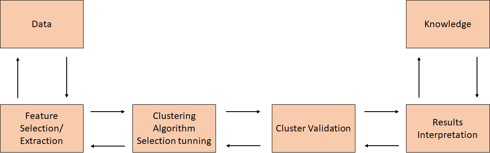
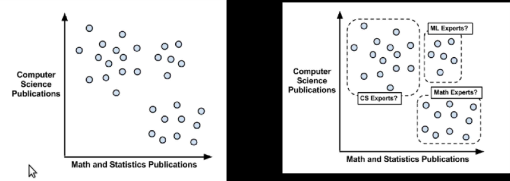
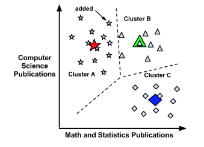
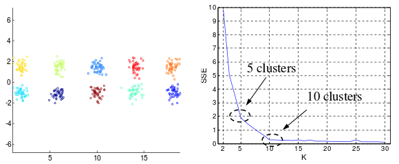
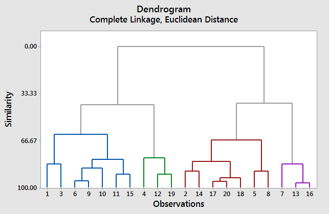

# U6 · Aprendizaje no supervisado — fenotipado y anomalías

Hasta ahora hemos trabajado con datos **etiquetados**: la cohorte nos daba la respuesta correcta —el `evento_cv`, el `riesgo_cv_10a`— y aprendíamos a predecirla, y sobre todo a **elegir y evaluar** modelos con honestidad.

Pero muchísimo valor clínico se esconde en datos que **no tienen etiqueta**, y que aun así guardan una estructura muy rica.

El aprendizaje **no supervisado** busca esa estructura sin que nadie le diga cuál es la respuesta: agrupa pacientes o centros parecidos (**clustering**), comprime y visualiza muchas variables (**reducción de dimensionalidad**) y detecta lo que se sale de lo normal (**anomalías**).

En clínica esto se traduce en tres cosas muy concretas que ya anticipamos en la U2: **fenotipar** —descubrir subgrupos de pacientes que nadie había definido de antemano—, **segmentar centros** por su perfil de actividad, y **levantar alertas** ante casos atípicos, ya sean errores de registro o pacientes clínicamente excepcionales.

<figure><figcaption><p>El proceso general del aprendizaje no supervisado: a partir de datos <strong>sin etiquetar</strong>, se busca estructura —grupos, patrones, casos raros— sin una respuesta de referencia contra la que medir el acierto.</p></figcaption></figure>


**💡 Idea clave**

La diferencia esencial con lo anterior es de fondo: en supervisado medimos el acierto contra una verdad conocida (el desenlace del paciente); en no supervisado **no hay verdad de referencia**.

Eso hace el problema más abierto y convierte la **interpretación clínica** —y el conocimiento del contexto— en la pieza decisiva para validar los resultados. Aquí el criterio del profesional no es un complemento: es lo único que separa un hallazgo real de un espejismo estadístico.


### Objetivos de esta unidad

* Entender la **intuición** del **clustering** (k-means y jerárquico) y saber usarlo para **fenotipar pacientes** y para **segmentar centros**, sin matemática profunda.
* Interiorizar que en no supervisado **no hay "respuesta correcta"**: los grupos se **interpretan clínicamente**, y un clúster nítido puede no significar nada.
* Comprender el **PCA** como forma de **resumir muchas variables en pocas** para *visualizar* cohortes y patrones invisibles en alta dimensión.
* Conocer la **detección de anomalías** (Isolation Forest) y su doble lectura clínica: **error de dato** (enlaza con el control de calidad de la U2) o **paciente excepcional** que merece una mirada.
* Reconocer el **riesgo de sobre-interpretar**: "leer" significado clínico donde solo hay ruido es el error más caro de esta unidad.
* Ver cómo un **agente con ejecución de código** convierte una técnica suelta en un **estudio**, y por qué aquí el criterio humano manda más que nunca.

Como en todo el curso, los ejemplos se apoyan en datos **sintéticos** —[`pacientes.csv`](https://drive.google.com/file/d/1Ku0j-sAf8Cr3FPT-DGm8v5p4h_2BmV5U/view?usp=drive_link) (20 000 pacientes generados por código, **no son pacientes reales**), [`centros.csv`](https://drive.google.com/file/d/1rxxkSTg-hsyiLlC6ppGpKAoMjmBrolM-/view?usp=drive_link) y [`wearable.csv`](https://drive.google.com/file/d/1az7oq8Rzkts0u37ijWVaRTvUnmpbNU7o/view?usp=drive_link)—. La regla de siempre: cuando presentemos datos, recordamos que son sintéticos y de uso exclusivamente didáctico.

## 6.1 Clustering: agrupar sin etiquetas (fenotipar)

El *clustering* divide un conjunto de datos en grupos (**clústeres**) de modo que los elementos de un mismo grupo se parezcan entre sí y se diferencien de los demás. La "similitud" se mide normalmente como **cercanía** en el espacio de variables: dos pacientes con edad, IMC, tensión, glucemia y perfil lipídico parecidos quedan cerca; dos muy distintos, lejos.

Es una de las herramientas de segmentación más usadas, y en medicina tiene un nombre propio: **fenotipado**.

<figure><figcaption><p>Un ejemplo de clustering: a partir de sujetos sin etiqueta, el algoritmo descubre <strong>subgrupos naturales</strong> por proximidad. En clínica, la base del <em>fenotipado</em>: agrupar pacientes con un perfil parecido sin decirle al algoritmo qué buscar.</p></figcaption></figure>


**Concepto · Clustering (fenotipado)**

Conjunto de técnicas no supervisadas que **agrupan instancias por similitud, sin etiquetas previas**. El objetivo es que la cohesión dentro de cada grupo sea alta y la separación entre grupos también. Aplicado a pacientes, permite descubrir **fenotipos** —subgrupos con un perfil clínico común— que no estaban definidos de antemano.


La idea de fondo, y lo que la hace tan atractiva en investigación biosanitaria, es esta: en lugar de partir de una definición cerrada ("diabético con obesidad") y contar cuántos pacientes la cumplen, dejamos que **los propios datos sugieran** los subgrupos. A veces confirman categorías que ya conocíamos; a veces insinúan matices que ninguna guía había nombrado.

### k-means: el método más popular

k-means es el algoritmo de clustering más extendido, por su simplicidad. Se le indica **cuántos grupos (k)** buscar —es un hiperparámetro, como los de la U5— y el método sitúa k centros, asigna cada paciente al centro más cercano, recalcula cada centro como la **media** de sus pacientes, y repite hasta estabilizarse. Es rápido y funciona bien cuando los grupos son aproximadamente esféricos y de tamaño similar.

<figure><figcaption><p>k-means en acción: asigna cada punto al <strong>centro más cercano</strong> y recalcula los centros como la media de su grupo, iterando hasta converger. Cada centro final resume el "perfil medio" de un fenotipo candidato.</p></figcaption></figure>

Su principal dificultad es que **hay que elegir k de antemano**, y en fenotipado casi nunca es obvio cuántos subgrupos "hay". Una ayuda habitual es el **método del codo**: probar varios valores de k y buscar el punto a partir del cual añadir más grupos apenas mejora la compacidad. También se usa el **coeficiente de silueta**, que mide cómo de bien encaja cada paciente en su grupo frente a los vecinos.


**⚠️ Aviso**

Conviene decirlo claro: estas métricas **orientan, no deciden**. La k final se apoya siempre en el **sentido clínico** —cuántos fenotipos son *accionables* e interpretables, ni uno solo ni cincuenta—.


<figure><figcaption><p>Elegir cuántos grupos buscar es difícil. El "método del codo" señala el valor a partir del cual añadir más clústeres ya no mejora de forma apreciable; la decisión final, sin embargo, la marca la <strong>interpretabilidad clínica</strong>.</p></figcaption></figure>

**✅ Fortalezas**

* Simple, rápido y escalable a cohortes grandes.
* Resultados fáciles de interpretar: cada grupo tiene un "perfil medio" legible.
* Excelente punto de partida para explorar posibles fenotipos.

**⚠️ Debilidades / límites**

* Hay que **fijar k de antemano**, y en clínica rara vez es evidente.
* Asume grupos **esféricos y de tamaño similar**; los fenotipos reales no siempre lo son.
* **Muy sensible a la escala**: una glucemia en cientos y un IMC en decenas no pueden convivir sin **estandarizar** (si no, la variable de números grandes domina la "distancia"). También le afectan los **outliers**, que conviene revisar antes.
* Devuelve *siempre* k grupos, **haya o no estructura real** —volveremos sobre este peligro—.

### Clustering jerárquico (y una nota sobre DBSCAN)

No todos los problemas encajan con k-means. El **clustering jerárquico** construye un **árbol de agrupaciones** (un *dendrograma*) sin fijar k de antemano: empieza con cada paciente por separado y va uniendo los más parecidos, nivel a nivel, hasta agrupar a toda la cohorte.

Después uno "corta" el árbol a la altura que tenga sentido clínico, y esa altura determina cuántos fenotipos se obtienen. Es especialmente útil para **explorar** la estructura antes de comprometerse con un número de grupos.

<figure><figcaption><p>Clustering jerárquico: el <strong>dendrograma</strong> muestra cómo se van agrupando los pacientes a distintos niveles de similitud. Cortar más arriba da pocos fenotipos amplios; más abajo, muchos subgrupos finos. Dónde cortar es una decisión clínica.</p></figcaption></figure>

Existe un tercer enfoque que conviene tener en el radar: **DBSCAN**, que agrupa por **densidad**. Encuentra zonas densas de puntos, maneja grupos de **formas arbitrarias** y —muy útil— marca como **ruido** los puntos aislados que no pertenecen a ningún grupo. Ese último rasgo lo conecta directamente con la detección de anomalías que veremos en 6.3.

| Método | ¿Hay que fijar k? | Formas de grupo | ¿Marca ruido? | Cuándo usarlo en clínica |
| ---------- | --------------- | --------------- | ----------- | ------------------------------------- |
| k-means | Sí | Esféricas | No | Fenotipado rápido, grupos compactos |
| Jerárquico | No | Variadas | No | Explorar estructura, ver el dendrograma |
| DBSCAN | No | Arbitrarias | Sí | Densidad variable, aislar casos raros |


**🩺 Aplicación clínica · Fenotipar pacientes con `pacientes.csv` (sin usar la etiqueta)**

El ejemplo canónico de esta unidad. Tomamos `pacientes.csv` y aplicamos clustering usando **solo las variables clínicas** —edad, IMC, tensión, glucemia, colesterol, HDL, tabaquismo, actividad física, antecedentes—, dejando **deliberadamente fuera** `evento_cv` y `riesgo_cv_10a`. El algoritmo no sabe qué es "riesgo": solo agrupa por parecido. Lo que emerge son **fenotipos candidatos** —quizá un grupo "joven, activo, perfil lipídico favorable"; quizá otro "fumador activo con perfil metabólico desfavorable"—.

Aquí está lo esencial: **no hay una respuesta correcta**. El algoritmo no "descubre" fenotipos verdaderos; propone particiones que **nosotros interpretamos**. Un truco honesto y muy revelador: una vez formados los grupos *sin* la etiqueta, podemos **mirar después** cómo se reparte el `evento_cv` que habíamos apartado. Si un fenotipo concentra muchos más eventos que otro —recordemos el gradiente por tabaquismo que ya conocemos: *nunca ≈ 14 %, ex ≈ 22 %, activo ≈ 28 %*, y que el HDL y la actividad física protegen—, ese grupo cobra sentido clínico. Pero ojo: eso **valida** la interpretación, no convierte el ejercicio en supervisado.



**🩺 Aplicación clínica · Segmentar centros con `centros.csv`**

La misma idea, cambiando de sujeto. Sobre `centros.csv`, agrupamos los centros por su **perfil de actividad**: número de **camas**, número de **servicios** (`n_servicios`), **urgencias diarias medias** (`urgencias_dia_media`) y **proporción de mayores de 65** (`ratio_mayores65`). El clustering, sin ninguna etiqueta, revela perfiles naturales —por ejemplo, "centro pequeño, pocos servicios, baja presión de urgencias" frente a "hospital grande, muchos servicios, alta actividad y población envejecida"—.

Esa segmentación es útil para **planificar recursos, comparar centros parecidos entre sí** (benchmarking justo, no comparar un ambulatorio con un hospital terciario) y **diseñar políticas por perfil** en lugar de una talla única. Y como siempre: los grupos que salgan hay que **leerlos con conocimiento del mapa asistencial**, no darlos por buenos porque el algoritmo los dibujó separados.



**⚠️ Aviso · No leer significado donde solo hay ruido (el error más caro)**

k-means **siempre** devuelve k grupos, aunque los datos sean puro azar. Un dendrograma **siempre** se puede cortar. Por eso el peligro nº 1 del fenotipado es la **sobre-interpretación**: mirar un clúster, ponerle una etiqueta clínica sugerente ("el fenotipo inflamatorio") y creer que hemos *descubierto* una realidad, cuando quizá solo hemos partido una nube continua por una línea arbitraria.

Defensas concretas: (1) desconfía de grupos que **no se sostienen** al cambiar la semilla, el número de variables o el algoritmo —un fenotipo real es **estable**—; (2) exige que el grupo tenga un **perfil interpretable** y, a ser posible, que se replique en **otra cohorte**; (3) recuerda que una silueta alta indica grupos *compactos*, no grupos *clínicamente reales*. Un subgrupo estadísticamente nítido que ningún clínico sabe nombrar es, casi siempre, una señal de alarma, no un hallazgo.


## 6.2 Reducción de dimensionalidad (PCA)

Un paciente descrito por una docena de variables vive en un espacio de doce dimensiones que **no podemos ver**. Y, como avisamos en la U2 con la *maldición de la dimensionalidad*, tantas variables no solo dificultan la visualización: también pueden empeorar algunos modelos. El **PCA** (Análisis de Componentes Principales) ataca ambos problemas a la vez.


**Concepto · PCA (Análisis de Componentes Principales)**

Técnica que transforma muchas variables correlacionadas en un número menor de variables **no correlacionadas** —las *componentes principales*—, ordenadas por la cantidad de información (varianza) que retienen. Las primeras componentes concentran lo esencial del dato; las últimas, casi solo ruido. Se usa para **visualizar, comprimir y reducir ruido**.


La intuición clínica es la de **resumir sin perder lo importante**. Igual que un buen informe de alta condensa una historia compleja en unos pocos datos clave, el PCA condensa decenas de variables en dos o tres "ejes" que capturan la mayor parte de la variabilidad entre pacientes.

Esos ejes no son variables originales, sino **combinaciones** de ellas (por ejemplo, una componente podría mezclar glucemia, IMC y perímetro en un "eje metabólico"), y su gran valor es que permiten **dibujar** la cohorte.

* **Visualizar cohortes.** Proyectar los pacientes sobre 2 o 3 componentes permite **ver** en un gráfico plano una estructura que en doce dimensiones era invisible: si hay agrupaciones, si un fenotipo se separa del resto, si un caso está aislado.
* **Acelerar y mejorar otros modelos.** Alimentar un modelo con unas pocas componentes en vez de decenas de variables puede reducir el sobreajuste y el coste —especialmente útil en datos con **muchas variables y pocos pacientes**, tan típicos de la investigación biosanitaria (datos "ómicos")—.
* **Combinar con clustering.** Es habitual **reducir con PCA y luego agrupar**, o al revés: fenotipar primero y usar el PCA para **pintar** los grupos y comprobar visualmente si se separan.

**✅ Fortalezas**

* Permite **ver** en 2D/3D fenómenos de muchas dimensiones.
* Reduce ruido y puede mejorar y acelerar modelos posteriores.
* Se combina de forma natural con el fenotipado.

**⚠️ Debilidades / límites**

* Las componentes son **combinaciones** de variables: menos interpretables que las originales (¿qué "es" clínicamente la componente 2?).
* También es **sensible a la escala**: hay que **estandarizar** antes.
* Es una técnica **lineal**: si la estructura real es muy curva, puede no capturarla bien (existen alternativas no lineales para visualizar, que aquí solo mencionamos).


**💡 Idea clave**

El PCA no sustituye al juicio: es una **lente**. Su mejor uso en esta unidad es **ver** —proyectar una cohorte a un plano para descubrir si tiene agrupaciones, o para comprobar de un vistazo si los fenotipos que ha propuesto el clustering se separan de verdad—. Que dos grupos se vean apartados en el plano de PCA es un buen indicio; que se solapen, una señal para dudar de que sean fenotipos distintos.


## 6.3 Detección de anomalías

Detectar lo que se sale de lo normal es uno de los usos más rentables del no supervisado, porque las **anomalías** —errores de registro, eventos raros, casos excepcionales— suelen ser **escasas y carecer de etiquetas suficientes** para un enfoque supervisado. La idea es sencilla y poderosa: **aprender cómo es "lo normal" y señalar lo que se desvía**.


**Concepto · Detección de anomalías**

Identificación de **instancias que se apartan significativamente del patrón mayoritario**. Al ser las anomalías raras y a menudo no etiquetadas, se aborda habitualmente con métodos no supervisados que **modelan la normalidad** y miden cuánto se aleja cada caso de ella.


Un método muy usado es el **Isolation Forest**, que funciona con un giro elegante: en lugar de modelar lo normal con detalle, **aísla** los puntos. Construye árboles que van partiendo los datos al azar; las anomalías, al ser distintas, quedan **separadas del resto con muy pocos cortes** —caen pronto, en los primeros nodos del árbol—, mientras que un punto normal, rodeado de muchos parecidos, necesita muchas más divisiones para quedar solo.

Cuanto antes se aísla un caso, más anómalo es. También sirven enfoques basados en densidad (recordemos que DBSCAN marca como ruido lo aislado) o en la distancia a los centros de los clústeres de 6.1.

Lo interesante en clínica es que una anomalía admite **dos lecturas muy distintas**, y distinguirlas es justo el trabajo del profesional:

* **Error de dato.** El caso es raro porque está **mal registrado**. Aquí enlazamos directamente con el **control de calidad de la U2**: allí cazábamos a mano imposibles evidentes (una `edad` de 250, una `ta_sistolica` negativa). La detección de anomalías es la versión **automática y multivariante** de aquello: puede marcar a un paciente cuya *combinación* de valores es rarísima **aunque cada valor por separado sea plausible** —algo que un filtro de rangos simple no vería—.
* **Paciente clínicamente excepcional.** El caso es raro porque **de verdad** es atípico: un perfil poco frecuente, una presentación inusual, un valor extremo pero real. Lejos de ser basura, puede ser el paciente **más interesante** —el que merece una segunda mirada—.


**🩺 Aplicación clínica · Episodios anómalos en `wearable.csv`**

`wearable.csv` recoge, por sujeto y día, la **frecuencia cardiaca en reposo** (`fc_reposo`), los **pasos** y las **horas de sueño**. La detección de anomalías aprende el comportamiento habitual de cada persona y **marca los días raros**: por ejemplo, una `fc_reposo` muy por encima de lo normal para ese sujeto.

Y aquí reaparece la doble lectura, ahora sobre una señal real: ese pico puede ser un **artefacto del sensor** (mala colocación, mal contacto) —un error de dato a descartar— o un **evento clínico auténtico**: fiebre, una infección incipiente, una arritmia, el efecto de un fármaco. El modelo **no sabe** cuál de las dos cosas es; solo dice "esto no encaja con lo normal de esta persona". Quién decide si es ruido o señal —y si merece una llamada— es el equipo clínico.


**✅ Fortalezas**

* No necesita **etiquetas** de "anomalía" (que casi nunca tenemos en cantidad).
* Es **multivariante**: detecta combinaciones raras que un umbral por variable no ve.
* Rápido y escalable; buen complemento del EDA de la U2.

**⚠️ Debilidades / límites**

* Marca lo **raro**, no lo **malo**: rareza no es enfermedad ni error por sí sola.
* **Sensible a cómo se define "lo normal"**: si la referencia está sesgada, marcará mal.
* Requiere fijar cuántos casos considerar anómalos (un umbral), decisión que conviene calibrar con criterio.


**⚠️ Aviso · Validar sin etiquetas es el verdadero reto (human-in-the-loop)**

Como no hay verdad de referencia, **decidir si una "anomalía" es realmente un problema exige revisión humana y conocimiento clínico**. La práctica correcta no es que el sistema decida solo, sino que **priorice** los casos más sospechosos para que una persona los revise. Es un caso de manual de *human-in-the-loop*: el algoritmo pone el foco, el clínico juzga. Retomaremos este patrón —y el gobierno de estos sistemas en salud— en la **U11**.


## 6.4 Explorar lo no supervisado con un agente (contexto + bucle)

El aprendizaje no supervisado es, por naturaleza, **abierto**: no hay una etiqueta que diga "has acertado", así que el **criterio** y la **interpretación** pesan más que en ninguna otra parte del curso. Y es justo aquí donde las capacidades **agénticas** de los modelos actuales —y más aún un asistente con **ejecución de código**— cambian las reglas del juego.

Hasta ahora le pedíamos al asistente "hazme un k-means". Pero a un agente podemos darle **mucho más que datos**: el **contexto clínico** del problema. Qué significa cada variable, qué decisión va a alimentar la segmentación, qué restricciones hay, qué consideramos un resultado *útil*.

Con ese contexto, el agente **aterriza** el problema y, en lugar de ejecutar una técnica suelta, **articula un estudio completo**: prueba varios algoritmos (k-means, jerárquico, DBSCAN) y varios valores de *k*, estandariza y reduce con PCA, valida con métricas internas (como el **coeficiente de silueta**), **nombra los grupos en lenguaje clínico** y señala los casos anómalos.


**💡 Idea clave**

La diferencia ya no está en el código —lo escribe el agente— sino en **cuánto contexto le das**. Un buen *prompt* de exploración no supervisada incluye el **significado de cada variable clínica**, el **objetivo** (fenotipar para qué) y **qué hace que un resultado sea bueno** (accionable, interpretable, estable). Con eso, el agente convierte una técnica aislada en un **estudio de fenotipado**.


**🤖 Prompt para el asistente (agente con ejecución de código) · Fenotipar pacientes**

```
Actúa como científico de datos clínicos senior. Te paso 'pacientes.csv'
(datos SINTÉTICOS) con variables demográficas, constantes y analítica:
edad, sexo, imc, ta_sistolica, ta_diastolica, glucemia, colesterol_total,
hdl, tabaquismo, actividad_fisica, antecedentes_familiares.

CONTEXTO: quiero DESCUBRIR FENOTIPOS de paciente (subgrupos con perfil
clínico parecido) para explorar cohortes. USA SOLO las variables clínicas;
NO uses 'evento_cv' ni 'riesgo_cv_10a' para agrupar (son la etiqueta que
quiero reservar para validar después).

OBJETIVO: una segmentación útil y bien explicada. Hazlo por celdas, en español:
1. EDA breve + estandarización justificada (imprescindible para las distancias).
2. Compara k-means (con método del codo y coeficiente de SILUETA), clustering
   jerárquico y DBSCAN; elige el que dé fenotipos más nítidos y ACCIONABLES.
3. Visualiza con PCA (2D) para ver si los grupos se separan de verdad.
4. NOMBRA cada fenotipo en lenguaje clínico (su perfil medio) y describe qué
   lo caracteriza.
5. SOLO AL FINAL, cruza cada fenotipo con 'evento_cv' (que apartamos) para ver
   si alguno concentra más eventos: eso VALIDA la interpretación, no la sustituye.
6. Marca pacientes anómalos (Isolation Forest) y explica por qué lo son.

Al terminar, EVALÚA críticamente la segmentación: ¿son grupos estables e
interpretables o artefactos? Si no convence, PROPÓN Y EJECUTA una segunda
versión (otras variables, otra escala o algoritmo). Itera 2-3 veces.
```


**El bucle de auto-mejora aplicado a lo no supervisado**

La última instrucción —"evalúa la calidad y, si no convence, ejecuta una versión mejorada"— es lo que convierte la exploración en un **bucle**: el agente ejecuta, mira los resultados (silueta baja, grupos que se solapan en el PCA, fenotipos que no se dejan nombrar) y **genera y prueba una versión mejor**, iterando. Es el ciclo *Planificar → Actuar → Observar* que ya usamos en la U2, ahora aplicado a un terreno donde —precisamente— **no hay una métrica única** y la iteración guiada por criterio aporta muchísimo. Lo abordamos en profundidad en la **U10**.



**⚠️ Aviso · El agente propone; el clínico valida**

Sin etiquetas de referencia, la **decisión final es humana**. Un fenotipo estadísticamente nítido puede **no tener sentido clínico** —y eso solo lo juzga quien conoce a los pacientes—. El agente acelera y enriquece la exploración a una velocidad imposible a mano; **no sustituye al criterio**. En salud, además, cualquier subgrupo que vaya a informar una decisión asistencial debe pasar por validación clínica antes de usarse.


## 6.5 Más allá: embeddings y autoencoders (introducción conceptual)

Todo lo anterior trabaja sobre **tablas numéricas** de pacientes o centros. Pero cuando los datos son más complejos —texto de una **nota clínica**, una **imagen**, una **señal** como un ECG, el comportamiento de un paciente a lo largo del tiempo— o queremos captar similitudes más sutiles, las **redes neuronales** aportan una herramienta que se ha vuelto central: los **embeddings**.


**Concepto · Embedding**

Representar cada elemento (un paciente, una nota clínica, una imagen) como un **vector** en un espacio de muchas dimensiones, construido de modo que la **cercanía signifique similitud**: los elementos parecidos quedan cerca y los distintos, lejos. Es llevar el significado a la geometría: *"estar cerca en el espacio" = "parecerse"*.


¿De dónde salen esos vectores? Una de las formas clásicas de obtenerlos es el **autoencoder**.


**Concepto · Autoencoder**

Red neuronal que aprende a **comprimir** un dato hasta un vector pequeño (un "cuello de botella") y luego **reconstruirlo** lo más fielmente posible. Al forzar el paso por ese cuello de botella, la red se queda con la **esencia** del dato. Ese vector comprimido es su *embedding* —y es, en el fondo, un primo no lineal del PCA de 6.2—.


Con esos embeddings, las tres tareas de esta unidad dan un salto:

* **Fenotipado** → agrupar en el espacio de embeddings suele funcionar mucho mejor que sobre los datos crudos de alta dimensión, porque los embeddings ya han ordenado las similitudes. Es la vía para fenotipar a partir de **imágenes o texto clínico**, no solo de tablas.
* **Detección de anomalías** → si el autoencoder **reconstruye mal** un caso (error de reconstrucción alto), es que no se parece a nada de lo aprendido: es una **anomalía**. Una técnica muy usada para detectar señales o imágenes atípicas.
* **Similitud y recomendación** → aprendiendo embeddings de pacientes se puede buscar *"pacientes parecidos a este"* —útil para apoyar decisiones o para investigación—, del mismo modo que un servicio de música recomienda por cercanía en el espacio.


**🩺 Aplicación clínica**

Embeddings de **notas clínicas** o de **imágenes** abren la puerta a fenotipar sobre datos no estructurados, a buscar casos similares y a detectar anomalías difíciles de definir con reglas fijas —una lesión atípica, una señal fuera de patrón—. Es solo una **introducción conceptual**: el *deep learning* lo vemos en la **U8**. Pero el puente importa: las mismas tareas no supervisadas (agrupar, detectar lo raro, buscar parecidos) **escalan a datos complejos** cuando una red aprende **buenas representaciones**.


## 6.6 Práctica guiada: fenotipar, ver cohortes y detectar anomalías

La práctica de esta unidad recorre las cuatro herramientas del bloque sobre datos **sintéticos**, cada una con una explicación antes de cada paso. Como en todo el curso, el código lo genera el asistente y nosotros lo **revisamos e interpretamos con criterio clínico** —que aquí, sin etiquetas, es más decisivo que nunca—.

* **Clustering — fenotipar pacientes.** Sobre `pacientes.csv`, y usando **solo las variables clínicas** (sin `evento_cv` ni `riesgo_cv_10a`), se estandariza, se elige *k* con el **método del codo** y la **silueta**, se comparan k-means y jerárquico, y se **nombran los fenotipos**. Al final —y solo al final— se cruza cada grupo con el `evento_cv` reservado para ver si la interpretación se sostiene.
* **Clustering — segmentar centros.** Sobre `centros.csv`, se agrupan los centros por **camas, servicios, urgencias diarias y proporción de mayores de 65**, y se interpretan los perfiles resultantes (para benchmarking y planificación).
* **PCA — ver la cohorte.** Se proyecta a 2–3 componentes para **visualizar** la estructura y comprobar si los fenotipos se separan de verdad, mirando la **varianza explicada**.
* **Detección de anomalías — Isolation Forest sobre `wearable.csv`.** El modelo aprende lo normal de cada sujeto y marca los **días anómalos** (por ejemplo, `fc_reposo` disparada), con la doble lectura —error de sensor o evento real— y la lógica **human-in-the-loop**.


**🔬 Práctica en Colab** — [`U06_No_Supervisado.ipynb`](https://colab.research.google.com/drive/1JlWxl0hzVbrte3E4Z0FXQVfPfQVDYDid)

Recorrido completo del aprendizaje no supervisado sobre datos **sintéticos**: **fenotipado** de `pacientes.csv` (clustering sin usar la etiqueta), **segmentación de centros** con `centros.csv`, **PCA** para visualizar cohortes y **detección de anomalías** con Isolation Forest sobre `wearable.csv`. Incluye la validación honesta de los fenotipos (cruce *a posteriori* con el `evento_cv` reservado) y la advertencia contra la sobre-interpretación.

Su **primera celda genera los datos sintéticos**, así que no hay que descargar nada: se abre y se ejecuta.

[Abrir en Colab](https://colab.research.google.com/drive/1JlWxl0hzVbrte3E4Z0FXQVfPfQVDYDid)


## Qué llevarte

* **Sin etiqueta, la interpretación clínica manda.** En no supervisado no hay "respuesta correcta": el clustering *propone* fenotipos y la detección de anomalías *marca* casos raros, pero **quién decide qué significan es el profesional**. El criterio no es un añadido; es el núcleo.
* **Fenotipar es agrupar por parecido.** Con **k-means** o **clustering jerárquico** sobre `pacientes.csv` (usando solo las variables clínicas) se descubren subgrupos; la misma idea segmenta **centros** por su perfil de actividad. Estandariza siempre antes de medir distancias.
* **Cuidado con leer significado en el ruido.** k-means siempre da k grupos y un dendrograma siempre se corta. Un fenotipo solo es creíble si es **estable, interpretable** y, a ser posible, **replicable** en otra cohorte. Un clúster que nadie sabe nombrar es una alarma, no un hallazgo.
* **El PCA es una lente para ver.** Resume muchas variables en pocas componentes para **visualizar** cohortes y comprobar de un vistazo si los fenotipos se separan de verdad.
* **Las anomalías tienen doble cara.** Un caso raro puede ser un **error de dato** (enlaza con la calidad de la U2) o un **paciente excepcional** que merece atención. El Isolation Forest **prioriza** los sospechosos; el clínico decide —*human-in-the-loop*—.

***

Tanto el aprendizaje supervisado como el no supervisado han tratado los datos como una tabla "plana": cada fila, un paciente o un centro independiente. Pero una parte enorme de la información clínica tiene una dimensión que hemos dejado para su sitio: el **tiempo**. Los ingresos en urgencias, la ocupación, la demanda asistencial son **series temporales**, y predecirlas bien exige técnicas y cuidados propios —empezando por no dejar que el futuro se cuele en el pasado—. Ese es el territorio de la **U7**.
