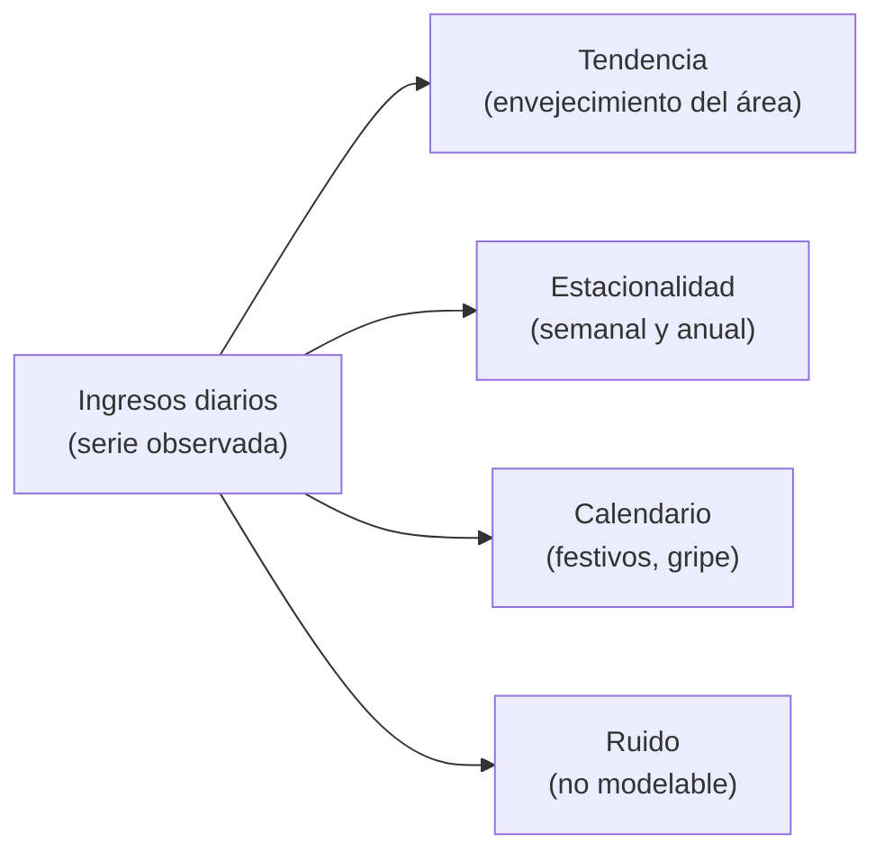
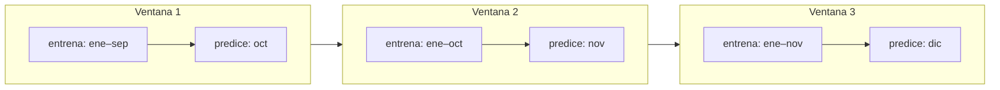

# U7 · Series temporales en salud


**🔒 Unidad en preparación (todavía no disponible).** Esta unidad forma parte del temario, pero **aún no está cerrada**: su contenido puede cambiar. Por ahora, el curso publicado llega hasta la **U3**; las siguientes se irán liberando en las próximas semanas.



Un hospital vive en el tiempo. Los ingresos diarios en urgencias, la ocupación de camas, las llamadas al 112, los positivos de gripe de la red centinela, la frecuencia cardiaca que registra un reloj noche tras noche: todo eso son **series temporales**, secuencias de valores donde el orden importa.

Predecir bien esas series —cuántos pacientes llegarán mañana, cuántas camas harán falta la semana que viene, cuándo despegará la ola de gripe— es la base de la planificación de recursos, de los turnos de personal y de la vigilancia epidemiológica.

En esta unidad el hilo conductor será [`urgencias_diarias.csv`](https://drive.google.com/file/d/1EpQ9Lcb-f-iDqBOA3f3sT_pGLBp2G56u/view?usp=drive_link), una serie **sintética** de ingresos diarios en un servicio de urgencias, con cuatro columnas de contexto: `fecha, ingresos, festivo, temporada_gripe, temperatura`. Es sintética, pero está construida con los patrones que cualquier profesional de urgencias reconocería al vuelo:

* Un **ritmo semanal** muy marcado: pico los **lunes** (todo lo que se ha ido aguantando el fin de semana) y actividad elevada también el propio **fin de semana**, cuando la atención primaria está cerrada y urgencias es la única puerta abierta.
* Una **estacionalidad anual**: los inviernos cargan mucho más que los veranos, sobre todo por patología respiratoria.
* La **temporada de gripe**, que se monta encima del invierno pero no cae exactamente igual cada año.
* Los **festivos**, que se comportan como pequeños domingos: menos alternativas asistenciales, más presión sobre urgencias.

El tiempo, sin embargo, introduce reglas propias. Si se ignoran, producen modelos que parecen excelentes en la evaluación y fallan estrepitosamente cuando se usan de verdad. Esta unidad va, sobre todo, de no caer en esa trampa.


**💡 Idea clave**

La regla número uno de las series temporales: **nunca uses el futuro para predecir el pasado**. Todo en esta unidad —cómo validar, cómo preparar los datos, qué método elegir— gira en torno a respetar el orden del tiempo. Es la versión temporal de la fuga de datos que ya conocimos, y es la causa más frecuente de pronósticos que deslumbran en el papel y decepcionan en el hospital.


## 7.1 Por qué las series temporales son especiales

En [`pacientes.csv`](https://drive.google.com/file/d/1Ku0j-sAf8Cr3FPT-DGm8v5p4h_2BmV5U/view?usp=drive_link) podíamos barajar las filas sin perder nada: cada paciente era una observación independiente. En `urgencias_diarias.csv` ocurre lo contrario: si barajas las fechas, destruyes la información.

Los ingresos de hoy están relacionados con los de ayer, con los del lunes pasado y con los del mismo mes del año anterior. Esa dependencia entre observaciones cercanas es exactamente lo que queremos aprovechar para predecir… y también lo que nos obliga a tratar los datos con un cuidado especial.


**Concepto · Serie temporal**

Secuencia de valores de una variable medidos a intervalos regulares (diarios, semanales…). Su rasgo distintivo es que las observaciones **no son independientes**: el valor de hoy depende del de ayer y de los patrones que se repiten. El orden de las filas es, en sí mismo, información.


### Descomponer la serie: tendencia, estacionalidad y ruido

Entender una serie pasa por **descomponerla** en sus ingredientes, y es lo primero que haremos en cualquier análisis:

* **Tendencia**: la dirección de fondo a largo plazo. En nuestra serie, un área de salud que envejece o crece empuja los ingresos suavemente al alza año tras año.
* **Estacionalidad**: patrones que se repiten a intervalos fijos. Aquí conviven dos: la **semanal** (lunes y fines de semana arriba) y la **anual** (invierno muy por encima del verano).
* **Eventos de calendario**: festivos y temporada de gripe. Se parecen a la estacionalidad, pero no caen siempre en la misma fecha, así que conviene dárselos al modelo como información aparte.
* **Ruido**: la variación aleatoria que ningún modelo debería intentar ajustar. El día que coinciden tres accidentes de tráfico no es un patrón; perseguirlo es sobreajuste puro.



En el notebook de esta unidad verás la serie sintética descompuesta en estas piezas, y es un pequeño espectáculo: de un dibujo aparentemente caótico emergen, limpias, la subida de fondo, la "forma de semana" y la joroba invernal.

Antes de elegir ningún modelo, descomponer ya te dice qué hay que capturar.


**🏥 En la clínica · Muchas series a la vez**

Un servicio de urgencias es una serie, pero un sistema de salud son miles: ingresos por hospital y por servicio, ocupación por unidad, demanda de cada centro de salud, consumo de cada fármaco de farmacia hospitalaria. Cada una tiene su tendencia y su estacionalidad propias (traumatología no se parece a neumología; un hospital de costa turística no se parece a uno de interior). Esa escala condiciona la elección de método, y la retomaremos con la idea de **modelo global**.


## 7.2 Validación temporal: la regla que lo cambia todo

Aquí está el corazón de la unidad. Cuando evaluábamos modelos sobre `pacientes.csv`, partíamos los datos **al azar** en entrenamiento y test, y era correcto: los pacientes son observaciones independientes. Con una serie temporal, **eso está prohibido**. Barajar las fechas mezcla futuro y pasado, y produce una fuga de información devastadora.

¿Por qué es una trampa exactamente? Piensa qué pasa si el test contiene días de febrero y el entrenamiento días de marzo del mismo año: el modelo ha "vivido" cómo evolucionó la ola invernal **después** de las fechas que le pides predecir.

Peor aún: con un split aleatorio, casi cada día del test tiene a sus vecinos (el día anterior y el posterior) dentro del entrenamiento, así que al modelo le basta interpolar entre ellos para clavar la cifra. Las métricas salen brillantes, el jefe de servicio se ilusiona… y el primer mes real el modelo se estrella, porque en la vida real **nadie te da el día de después**.


**Concepto · Backtesting (validación temporal)**

Forma de evaluar modelos de series respetando el tiempo: se entrena con los datos hasta una fecha, se predice el periodo siguiente y se compara con lo que realmente ocurrió, avanzando la ventana progresivamente. Simula cómo se habría comportado el modelo si lo hubiéramos usado de verdad en el pasado.


La técnica correcta es la **validación hacia delante** (*walk-forward*): entrenar con todo lo anterior a una fecha, predecir el tramo siguiente, medir el error, avanzar la fecha y repetir. Así el modelo se examina siempre igual que trabajará: prediciendo el futuro solo con el pasado.




**⚠️ Aviso: las fugas temporales, las más traicioneras**

**Partición aleatoria**: usar un `train_test_split` al azar sobre la serie. El test queda salpicado de fechas anteriores a parte del entrenamiento. Prohibido, siempre.

**Estadísticas calculadas sobre toda la serie**: normalizar los datos o construir variables (medias, máximos, "ingresos típicos de este mes") usando también el periodo de test. Esas cifras "han visto" el futuro.

**Variables que no existirían en el momento de predecir**: es la fuga más sutil en salud. Para predecir los ingresos de mañana puedes usar la **previsión** meteorológica de mañana (la conoces hoy), pero no la temperatura **observada** de mañana. Puedes usar el indicador de temporada de gripe que publica la red de vigilancia, pero con el **retraso real** con el que se publica, no con el valor consolidado semanas después. La pregunta-filtro es siempre la misma: *¿tendría yo este dato en la mañana en que hago la predicción?* Si la respuesta es no, esa columna no puede entrar.


Este cuidado no es un tecnicismo: es la diferencia entre un pronóstico honesto y un autoengaño con buena presentación.

Cuando le pidas a tu asistente de IA un modelo de forecasting, la primera exigencia debe ser esta —y si te propone una partición aleatoria, recházala.

## 7.3 Métodos clásicos: la media móvil y la familia ARIMA

Antes de buscar sofisticación conviene saber que los métodos clásicos de *forecasting* son robustos, rápidos, explicables y, muchas veces, difíciles de batir. Son siempre el primer *baseline*: el listón que cualquier modelo más complejo tiene que superar para ganarse el puesto.

El punto de partida es la **media móvil**: predecir mañana como el promedio de los últimos días. Su prima más útil en series con ritmo semanal es el **baseline estacional**: "el lunes que viene ingresarán tantos como el lunes pasado". Suena casi ingenuo, pero en una serie tan semanal como la de urgencias es un rival sorprendentemente serio.

Un escalón por encima está **ARIMA**, el método estadístico clásico. Sin fórmulas, sus tres piezas responden a tres preguntas de sentido común:

* **AR (autorregresivo)** — "los ingresos de hoy dependen de los de los últimos días". Usa los valores recientes como pista principal.
* **I (integrado)** — para modelar bien conviene quitar la tendencia; se consigue trabajando con el **cambio** de un día a otro (`hoy − ayer`) en lugar del nivel.
* **MA (media móvil de errores)** — corrige la predicción mirando los últimos errores que cometió: si lleva unos días quedándose corto, se ajusta.

Su límite es justo lo que más nos importa: ARIMA solo mira días **recientes y consecutivos**, así que capta el nivel y la tendencia pero **aplana el patrón semanal** —precisamente los lunes que necesitamos clavar—.

Ahí entra **SARIMA**, que es ARIMA más estacionalidad: aplica la misma lógica también "de semana en semana", mirando el mismo día de la semana anterior (periodo 7 para una serie diaria; sería 12 en datos mensuales). Para una serie con un latido semanal tan fuerte como la de urgencias, la parte estacional no es opcional: un ARIMA que la ignora puede llegar a **perder contra el simple baseline estacional**, y no te sorprendas si lo ves ocurrir en la práctica.


**Concepto · ARIMA / SARIMA**

Familia de modelos estadísticos que predicen una serie a partir de su propio pasado: valores recientes, cambios día a día y errores previos. **SARIMA** añade la pieza estacional (repetir esa lógica con el mismo día de semanas anteriores). Elegir sus parámetros es parte oficio y parte automático: herramientas como `auto_arima` —o tu asistente de IA— los buscan probando combinaciones.


**✅ Fortalezas**

* Robustos, rápidos y muy explicables: se puede contar qué hace cada pieza
* Funcionan con pocos datos (un par de años de histórico dan para mucho)
* Modelan tendencia y estacionalidad de forma explícita
* Baseline fuerte y respetado: décadas de uso, también en salud pública

**⚠️ Debilidades y límites**

* Modelan **una serie cada vez**: no escalan con comodidad a cientos de servicios y centros
* Incorporan mal las variables externas (festivos, gripe, temperatura entran con calzador)
* Menos flexibles ante relaciones complejas entre variables
* Piden series razonablemente estables; los cambios bruscos de régimen los descolocan

**Campo de aplicación clínica.** Series únicas, agregadas y bien entendidas: los ingresos totales de un hospital, la ocupación global de camas, la demanda de un servicio concreto. Y la **vigilancia epidemiológica clásica**, que lleva décadas usando esta familia para modelar lo esperado y detectar lo inesperado.

## 7.4 ML con features de calendario: la serie convertida en tabla

La alternativa moderna es una idea muy potente: **convertir el problema de series en un problema tabular** y aplicarle los modelos que ya conoces (Random Forest, *gradient boosting*). Un modelo de árboles no entiende "el tiempo" por sí solo: hay que dárselo masticado en forma de columnas.

¿Cómo se aplana una serie? Cada fila pasa a ser **un día que queremos predecir**, y las columnas son pistas construidas a partir del pasado y del calendario:

* ***Lags*** (valores pasados): `ingresos_ayer`, `ingresos_hace_7_dias` (el mismo día de la semana anterior)…
* **Medias recientes**: media de los últimos 7 y 28 días, para que el modelo "sepa por dónde va" la serie.
* **Calendario**: día de la semana, mes, festivo.
* **Contexto conocido de antemano**: temporada de gripe según la red de vigilancia, previsión de temperatura.

Un trocito ilustrativo de cómo quedaría la tabla (cifras inventadas para ver la forma):

| fecha | ingresos\_ayer | ingresos\_hace\_7d | media\_7d | dia\_semana | festivo | gripe | **ingresos (objetivo)** |
| ----- | -------------- | ------------------ | --------- | ----------- | ------- | ----- | ----------------------- |
| dom   | 132            | 141                | 128       | 6           | 0       | 1     | 144                     |
| lun   | 144            | 156                | 131       | 0           | 0       | 1     | **161**                 |
| …     | …              | …                  | …         | …           | …       | …     | …                       |

Con la serie ya aplanada, el modelo aprende la relación `ingresos ≈ f(lags, calendario, gripe, temperatura…)` exactamente igual que aprendía a predecir riesgo con `pacientes.csv`.

Y aquí brilla lo que a los clásicos se les atraganta: las **variables externas** entran de fábrica. Si la columna `festivo` vale 1, el modelo ya ha aprendido el empujón típico de un festivo; si `temporada_gripe` está activa, ajusta el nivel entero hacia arriba.


**Concepto · Modelo global**

Un único modelo entrenado sobre **muchas series a la vez** (todos los servicios, todos los centros de una red), que aprende los patrones compartidos: casi todas las urgencias tienen pico de lunes y joroba invernal. Escala muchísimo mejor que ajustar un modelo por serie, y las series con poco histórico se benefician de lo aprendido en las demás. Un modelo global con buenas *features* de calendario suele **competir de tú a tú con los métodos clásicos**, y ganarles cuando hay variables externas ricas.



**⚠️ Aviso: lo nunca visto no se puede promediar**

Un modelo de árboles predice, en el fondo, **promediando días parecidos del pasado**. Eso funciona de maravilla con patrones que se repiten (semanas, inviernos, festivos), pero no puede devolver un valor más alto que cualquiera que haya visto entrenar. Ante un régimen genuinamente nuevo —piensa en marzo de 2020—, ningún modelo entrenado con la normalidad anterior verá venir la ola. La respuesta no es un modelo mágico: es **vigilar el error del modelo en producción, reentrenar con frecuencia y mantener el criterio clínico al mando** cuando el mundo cambia.


**✅ Fortalezas**

* Incorpora variables externas con naturalidad (festivos, gripe, temperatura, campañas)
* Escala a muchas series con un solo modelo global
* Captura relaciones complejas e interacciones (festivo + invierno + gripe)
* Reutiliza todo lo que ya sabes de modelos tabulares

**⚠️ Debilidades y límites**

* Exige construir bien las *features* (y sin fugas: solo información disponible en el momento de predecir)
* Necesita más histórico que un clásico para lucirse
* No extrapola a niveles nunca vistos; los cambios de régimen piden reentrenar
* Menos transparente que un SARIMA, aunque las *features* ayudan a explicarlo

**Campo de aplicación clínica.** Redes con muchas series y buen histórico: predicción de demanda por servicio y por centro, ocupación de camas a varios días vista, consumo de farmacia, llamadas a emergencias. En resumen: donde haya calendario, contexto y escala.

Como mapa rápido de elección:

| Enfoque                    | Escala a muchas series | Variables externas          | Esfuerzo | Cuándo                                          |
| -------------------------- | ---------------------- | --------------------------- | -------- | ----------------------------------------------- |
| Baseline estacional        | Trivial                | No                          | Mínimo   | El listón a batir, siempre                      |
| ARIMA / SARIMA             | Regular                | Limitado                    | Bajo     | Una serie agregada, explicable y estable        |
| ML con features (global)   | Buena                  | Sí, de fábrica              | Medio    | Muchas series, calendario y contexto ricos      |

## 7.5 Del pronóstico a la decisión clínica

¿Y para qué sirve todo esto en un hospital? Tres usos concretos:

* **Planificación de recursos.** Si el pronóstico dice que el lunes llegarán bastantes más pacientes que el miércoles —y lo dice con fundamento—, los turnos de personal, los boxes abiertos y los ingresos programados pueden anticiparse en lugar de improvisarse. La predicción de ocupación a 7–14 días permite decidir cuándo programar cirugía electiva sin colapsar las camas.
* **Vigilancia epidemiológica.** Aquí el pronóstico cambia de papel: no se usa para acertar, sino como **regla de normalidad**. El modelo dice cuántos ingresos "tocarían" hoy dados el día de la semana, el mes y el calendario; si la realidad se separa de lo esperado de forma sostenida, eso es una **señal de alerta** —el arranque de la gripe, un brote, una ola de calor—. El exceso sobre lo previsto es, en sí mismo, el indicador.
* **Señal fisiológica.** Las series no viven solo en la gestión: [`wearable.csv`](https://drive.google.com/file/d/1az7oq8Rzkts0u37ijWVaRTvUnmpbNU7o/view?usp=drive_link), otro de nuestros datasets sintéticos, contiene series **por paciente** (frecuencia cardiaca en reposo, pasos y horas de sueño, día a día). Una FC en reposo que sube de forma sostenida durante varios días puede preceder a una descompensación o una infección. Cambia la escala —del hospital al individuo—, pero los principios son idénticos: el orden importa y el futuro no se toca.

## 7.6 Práctica en Colab


**🔬 Práctica en Colab** — [`U07_Series_Temporales.ipynb`](https://colab.research.google.com/drive/1PWP-WLyNPgAEk4b4WmbdeqQn2r_bQ7co) · [Abrir en Colab](https://colab.research.google.com/drive/1PWP-WLyNPgAEk4b4WmbdeqQn2r_bQ7co)

La primera celda **genera la serie sintética de urgencias** (no hay que descargar nada). El notebook visualiza y **descompone** la serie (tendencia, estacionalidad semanal y anual, gripe, festivos), reserva las últimas semanas como futuro con una **partición estrictamente temporal**, y compara sobre ese mismo test el baseline estacional, un SARIMA semanal y un modelo de ML con *features* de calendario, con su tabla de errores y una gráfica de "predicción vs real" por modelo. Todas las gráficas de esta unidad viven allí: es donde se ve, literalmente, lo que aquí hemos contado.


**🤖 Prompt para el asistente · Forecasting con validación temporal**

```
Con la serie diaria de ingresos en urgencias (urgencias_diarias.csv: fecha,
ingresos, festivo, temporada_gripe, temperatura), en español y por celdas:
1. Visualiza y descompón la serie (tendencia / estacionalidad / resto).
2. Separa de forma TEMPORAL: reserva las últimas 8 semanas como test (nada de
   train_test_split aleatorio) y explícame por qué eso sería una trampa aquí.
3. Compara sobre ese test: baseline estacional ("como el mismo día de la semana
   pasada"), SARIMA semanal y un gradient boosting con features de calendario
   (día de semana, mes, festivo, temporada_gripe) y lags de 1 y 7 días.
4. Reporta MAE y MAPE en una tabla y dibuja "predicción vs real" de cada modelo.
5. Comenta qué patrón capta cada uno y cuál usarías para planificar turnos.
```

*Si el asistente propone una partición aleatoria, recházala: es el error clásico de las series temporales, y detectarlo es exactamente el criterio que este curso quiere darte.*

## 7.7 Qué llevarte

* En una serie temporal **el orden es información**: los ingresos de hoy dependen de ayer, del lunes pasado y del invierno anterior. Descomponer (tendencia, estacionalidad, calendario, ruido) es siempre el primer paso.
* **Validación temporal o nada**: entrenar con el pasado, predecir el futuro, avanzar la ventana (*walk-forward / backtesting*). Un split aleatorio infla las métricas y garantiza el desengaño.
* La pregunta-filtro contra las fugas: *¿tendría este dato en el momento de predecir?* Previsión meteorológica sí; temperatura observada de mañana, no.
* **Clásicos** (media móvil, ARIMA/SARIMA): baseline sólido y explicable para series agregadas. **ML con features de calendario**: la opción escalable cuando hay muchas series y contexto (festivos, gripe), y un modelo global bien alimentado compite con lo clásico.
* El pronóstico no solo predice: como **regla de normalidad**, convierte la desviación de lo esperado en señal de vigilancia epidemiológica.

Hasta aquí, el aprendizaje automático sobre tablas y series: datos con filas y columnas. En la siguiente unidad entramos en la familia que ha protagonizado la última década y que en medicina brilla justo donde la tabla no llega —la imagen, el texto y la señal—: las redes neuronales y el *deep learning*.
