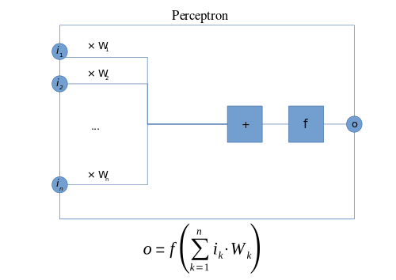
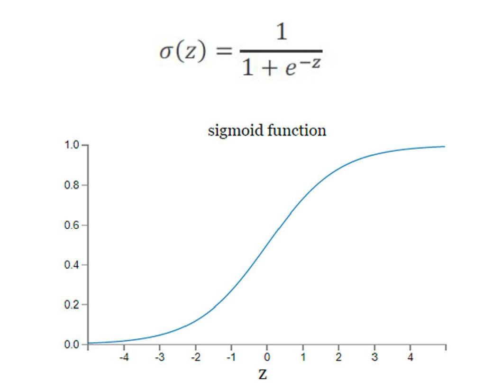
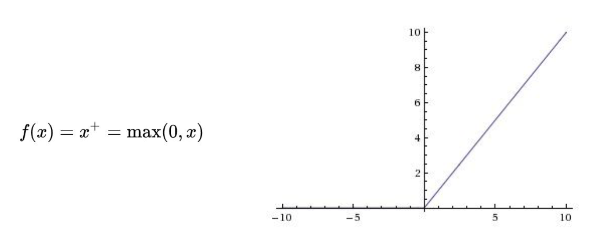
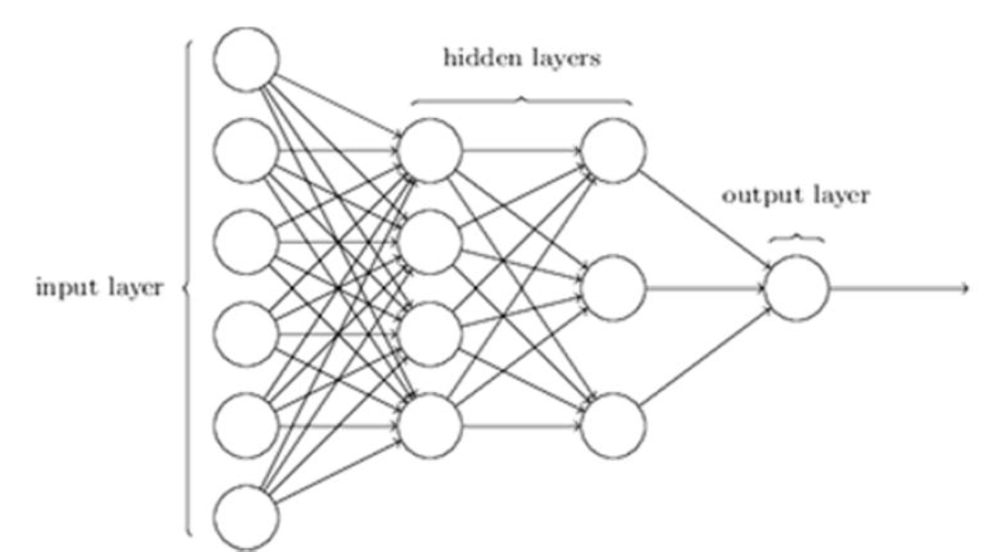
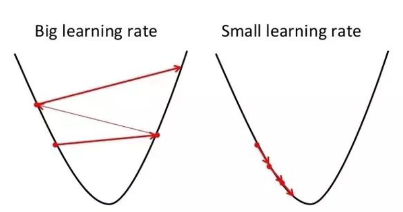
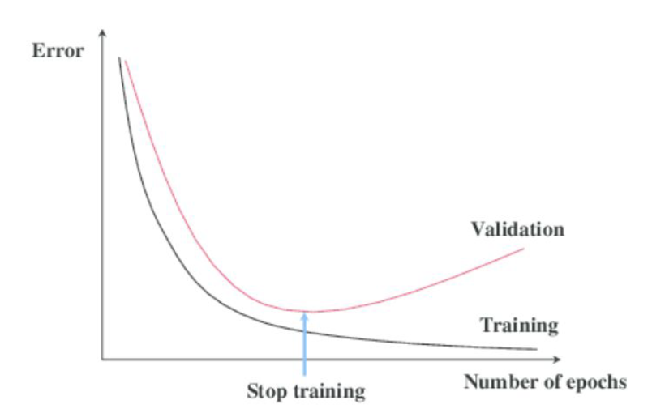

# U8 · Redes neuronales, imagen y señal — CNN y ViT

Hasta aquí, todo nuestro aprendizaje automático ha vivido en **tablas y series**: filas y columnas de [`pacientes.csv`](https://drive.google.com/file/d/1Ku0j-sAf8Cr3FPT-DGm8v5p4h_2BmV5U/view?usp=drive_link), la secuencia diaria de [`urgencias_diarias.csv`](https://drive.google.com/file/d/1EpQ9Lcb-f-iDqBOA3f3sT_pGLBp2G56u/view?usp=drive_link). Y para esos datos hemos visto que los modelos "clásicos" —una regresión logística, un buen *gradient boosting*— son difíciles de batir.

Pero la medicina no cabe entera en una tabla. Una **radiografía de tórax**, una **imagen dermatoscópica** de un lunar, un **fondo de ojo**, una **preparación histológica**, el trazado de un **electrocardiograma**: nada de eso son columnas. Son píxeles y muestras de señal, datos "crudos" con una estructura espacial o temporal riquísima que un modelo tabular no sabe leer.

Esta es la unidad que sube más el nivel del curso, porque entramos en la familia que ha protagonizado la última década de la Inteligencia Artificial: las **redes neuronales** y el **deep learning**. Son la tecnología detrás del reconocimiento de imágenes, la traducción automática, los grandes modelos de lenguaje y toda la revolución generativa. Y en medicina brillan justo donde la tabla no llega: en la **imagen** y en la **señal**.

Vamos a construir la **intuición** —qué es una neurona, cómo aprende una red, qué es una convolución, qué es la "atención"— sin una sola fórmula, y a llevarla a las arquitecturas que de verdad se usan hoy en imagen médica: las **CNN**, el **transfer learning** y los **Vision Transformers (ViT)**.

Y, sobre todo, pondremos las redes en su contexto de 2026, que es lo que hace este curso posible: **casi nadie las entrena desde cero; las usamos ya entrenadas**.


**💡 Idea clave**

Las redes brillan con datos **no tabulares** —imagen, señal, texto, audio—, donde hay una estructura (espacial o temporal) que explotar. Para una **tabla de pacientes**, un modelo simple (U4–U5) suele ganar con menos esfuerzo: recuerda que en nuestra cohorte sintética la humilde **regresión logística igualó o superó** a un Random Forest para predecir `evento_cv`. La lección de "empieza por lo simple" no caduca. El deep learning no es "mejor": es la herramienta adecuada **cuando el dato tiene forma de imagen o de señal**.


## 8.1 Del dato tabular al dato "crudo": la intuición del deep learning

La unidad básica es la **neurona artificial**, inspirada muy libremente en las del cerebro. Recibe varias entradas, las pondera con unos **pesos**, las suma y pasa el resultado por una **función de activación** que decide su salida. Una sola neurona no es más que un modelo lineal con un interruptor; su poder aparece al **conectarlas** por millones.

<figure><figcaption><p>La neurona artificial: combina las entradas ponderadas por pesos y aplica una función de activación que produce su salida.</p></figcaption></figure>


**Concepto · Neurona artificial y el paralelismo biológico**

Unidad de cálculo que toma varias entradas, las combina de forma ponderada (con **pesos que se aprenden**) y aplica una función de activación que introduce no linealidad. Es el ladrillo con el que se construyen las redes.

Esos **pesos aprendidos** son la clave, y tienen un bonito paralelismo biológico: representan **la importancia que la neurona da a cada una de sus entradas**, ajustada a base de experiencia. Es la idea de **Hebb** —*"neurons that fire together wire together"*—: las conexiones (sinapsis) que se activan juntas se refuerzan. En la red artificial, "aprender" es exactamente eso: **ir ajustando los pesos** hasta que reflejen qué entradas importan para la tarea.


La **función de activación** es el ingrediente que introduce la **no linealidad**: sin ella, apilar neuronas seguiría siendo un simple modelo lineal, incapaz de captar la complejidad de una imagen.

Históricamente se usó la **sigmoide**, que comprime cualquier valor a un rango entre 0 y 1:

<figure><figcaption><p>Función de activación <strong>sigmoide</strong>: comprime cualquier valor de entrada a un rango entre 0 y 1.</p></figcaption></figure>

Hoy la más usada es la **ReLU** (*Rectified Linear Unit*): deja pasar los valores positivos tal cual y pone a cero los negativos. Es simplísima y, sin embargo, hace que las redes profundas entrenen mucho mejor y más rápido:

<figure><figcaption><p>Función de activación <strong>ReLU</strong>: 0 para las entradas negativas, la propia entrada para las positivas.</p></figcaption></figure>

Conectando muchas neuronas en **capas** —una de entrada, una o varias **ocultas** y una de salida— obtenemos una red neuronal. La forma más básica es el **MLP** (perceptrón multicapa): una red *feed-forward* totalmente conectada, donde la información fluye hacia delante, capa a capa. Cuando hay varias capas ocultas, hablamos de **deep learning** (aprendizaje profundo).

<figure><figcaption><p>Un <strong>MLP</strong> (perceptrón multicapa): capas de neuronas totalmente conectadas. Con varias capas ocultas, deep learning.</p></figcaption></figure>

Aquí conviene detenerse, porque en este punto aparece **la gran ventaja** de las redes, y es la razón por la que dominan la imagen y la señal.


**Concepto · Representación aprendida (*representation learning*)**

Rasgo distintivo del deep learning: en lugar de que un humano diseñe las variables (*features*), la red **las aprende sola**, capa a capa, construyendo representaciones cada vez más abstractas de los datos. Es lo que le permite trabajar con imágenes o señales crudas, sin ingeniería manual previa.


En el ML clásico (U2–U5) dedicábamos mucho esfuerzo a la **ingeniería de características**: elegir y transformar qué variables clínicas eran informativas —el IMC, el gradiente de tabaquismo, el HDL protector—. Con imágenes eso es inviable: nadie va a describir a mano los millones de píxeles de una radiografía en variables útiles.

La red, en cambio, **descubre ella misma** en qué fijarse. Y lo hace de forma jerárquica: las primeras capas detectan cosas elementales (un borde, un cambio de contraste); las intermedias combinan esos bordes en texturas; las profundas ensamblan texturas en estructuras con sentido clínico (el contorno de un nódulo, el patrón de una lesión). Esa capacidad de **aprender las características** a partir del dato crudo, a menudo captando regularidades más allá de lo que percibiría un ojo humano, es lo que hace de las redes la herramienta natural para imagen, señal y texto.


**⚠️ La contrapartida: una caja más oscura**

Esta potencia tiene un precio. Cuanto más decide la red por su cuenta, **más difícil es interpretar qué ocurre por dentro**: entender en qué se fijan exactamente millones o miles de millones de parámetros se vuelve muy complicado. Las redes son la familia de modelos más **"caja negra"**, y por eso la **explicabilidad** (la vimos con SHAP en U5) y el **gobierno** (U11) cobran aún más importancia cuando las usamos para decisiones que afectan a un paciente. En imagen existen técnicas de mapa de calor (tipo *saliency* / Grad-CAM) que señalan qué zona miró el modelo; son útiles, pero no son una explicación completa.


## 8.2 Cómo aprende una red (sin matemática)

El aprendizaje se reduce a un ciclo intuitivo que se repite millones de veces: **predecir, medir el error y ajustar los pesos un poquito para reducirlo**. Dos conceptos nombran las dos mitades de ese ciclo:

* **Descenso de gradiente**: la estrategia para ajustar los pesos. Imagina bajar una montaña en niebla dando pasos pequeños en la dirección de máxima pendiente hacia abajo; cada paso reduce el error. El tamaño del paso es el *learning rate* (tasa de aprendizaje).
* **Backpropagation (retropropagación)**: el método eficiente para calcular, para cada peso, en qué dirección moverlo. Reparte la "culpa" del error hacia atrás por todas las capas. Es el algoritmo que hizo viable entrenar redes profundas.

<figure><figcaption><p>El <em>learning rate</em> regula el tamaño del paso: demasiado grande no converge; demasiado pequeño aprende lentísimo.</p></figcaption></figure>

No necesitas programar nada de esto —tu asistente de IA lo escribe por ti—, pero sí conviene **reconocer los mandos**, porque son los que marcan la diferencia entre una red que funciona y una que no.


**⚠️ Aviso: las redes son potentes... y delicadas de entrenar**

A diferencia de un boosting, que funciona razonablemente "de serie", las redes tienen muchos ajustes (arquitectura, *learning rate*, regularización) y son **muy propensas al sobreajuste** (*overfitting*), sobre todo con los pocos datos etiquetados típicos de medicina. Dos técnicas son el pan de cada día: el **dropout** (apagar neuronas al azar durante el entrenamiento, para que la red no dependa en exceso de ninguna) y el **early stopping** (parar cuando el error de validación deja de mejorar). Y un recordatorio que vale para toda la unidad: **una red mal entrenada no sirve de nada; la arquitectura, por sí sola, no consigue nada.**


<figure><figcaption><p><strong>Early stopping</strong>: parar cuando la validación deja de mejorar, evitando que la red memorice el entrenamiento.</p></figcaption></figure>

El MLP es la base, pero tiene una limitación que en imagen es fatal: trata **cada entrada por separado**, sin aprovechar que dos píxeles vecinos están relacionados. Si le pasas una radiografía como una lista plana de píxeles, pierde toda la estructura espacial. De ahí nacen arquitecturas especializadas. Para imagen, la reina es la **CNN**.

## 8.3 CNN: redes convolucionales, o cómo una máquina aprende a "mirar"

La idea que revolucionó la visión por computador es la **convolución**. En lugar de conectar cada píxel con cada neurona (inviable: una imagen tiene millones de píxeles), una CNN usa **filtros** pequeños —una ventanita— que **se deslizan por toda la imagen** buscando un patrón local concreto. Un filtro puede especializarse en detectar un borde vertical; otro, un cambio de contraste; otro, una esquina.

Y lo hace **en cualquier posición de la imagen**: una lesión es una lesión esté arriba, abajo o en el centro. Esa propiedad —detectar el mismo patrón dondequiera que aparezca— es exactamente lo que necesita la imagen médica.


**Concepto · Convolución y filtro**

Operación en la que una pequeña ventana de pesos (el **filtro** o *kernel*) recorre la imagen calculando, en cada posición, cuánto se parece ese trocito al patrón que el filtro ha aprendido a detectar. El resultado es un "mapa de activación" que señala **dónde** aparece ese patrón. Los pesos del filtro no se diseñan a mano: **se aprenden** durante el entrenamiento.


Lo potente es apilar convoluciones en capas, formando una **jerarquía de patrones** que va de lo simple a lo complejo:

* Las **primeras capas** detectan lo elemental: **bordes**, cambios de intensidad, orientaciones.
* Las **capas intermedias** combinan esos bordes en **texturas** y formas: un patrón reticular, un borde curvo, una agrupación.
* Las **capas profundas** ensamblan las texturas en **estructuras con significado**: el contorno de un nódulo, la morfología de una lesión pigmentada, la disposición de las células en un tejido.

Es la misma lógica jerárquica del *representation learning* de la sección 8.1, pero aprovechando la estructura **espacial** de la imagen. Por eso las CNN encajan de forma tan natural con la imagen médica.


**Concepto · CNN (red neuronal convolucional)**

Red pensada para imágenes: alterna capas de **convolución** (detectar patrones locales) con capas de **reducción** (resumir y quedarse con lo importante), construyendo una jerarquía de representaciones cada vez más abstractas, y termina con una capa que **clasifica** (¿neumonía o no?, ¿qué tipo de lesión?). Es la arquitectura que llevó el reconocimiento de imágenes a nivel —y en algunas tareas acotadas, por encima— del experto humano.


**✅ Fortalezas**

* Explotan la **estructura espacial**: aprenden qué mirar y **dónde**, sin ingeniería manual de características.
* **Invariancia a la posición**: detectan el hallazgo aparezca donde aparezca en la imagen.
* Rinden muy bien en tareas de imagen acotadas (clasificar, detectar, segmentar).
* Combinan de maravilla con **transfer learning** (sección 8.4): se pueden entrenar con pocos datos propios.

**⚠️ Debilidades y límites**

* Necesitan **muchas imágenes etiquetadas** para entrenar desde cero (raro en medicina).
* Son **cajas negras**: cuesta auditar en qué se fijan (de ahí los mapas de calor).
* Sensibles a **atajos espurios**: pueden aprender el aparato o el hospital en vez de la enfermedad (sección 8.7).
* Cómputo elevado; conviene una **GPU** para entrenar con soltura.

**Campo de aplicación clínica.** Prácticamente toda la **imagen médica**: radiografía de tórax (neumonía, nódulos), **dermatoscopia** (lesiones pigmentadas, cribado de melanoma), **fondo de ojo** (retinopatía diabética, glaucoma), **histología / anatomía patológica** digital (detección de mitosis, regiones tumorales en preparaciones), además de mamografía, TC, RM o endoscopia. Donde haya un patrón visual que un experto reconoce, una CNN bien entrenada y bien validada puede aprender a reconocerlo.


**🏥 En la clínica · La CNN no sustituye al radiólogo: le cambia el trabajo**

El uso realista hoy no es "la máquina decide sola", sino **apoyo a la decisión**: priorizar la lista de trabajo (marcar primero las radiografías con hallazgos sospechosos), servir de segunda lectura que reduce falsos negativos, o cuantificar de forma reproducible algo que a ojo es subjetivo (el grado de una retinopatía). El facultativo sigue al mando; el modelo aporta velocidad, consistencia y una segunda mirada que no se cansa.


## 8.4 Transfer learning: no empieces de cero (y en medicina, casi nunca puedes)

Aquí está la técnica que hace todo esto **posible en un hospital**. Entrenar una CNN grande desde cero exige millones de imágenes etiquetadas y mucho cómputo —dos cosas que en medicina casi nunca tenemos: etiquetar imágenes clínicas es caro, lento y requiere a un experto—. La solución es el **transfer learning** (aprendizaje por transferencia): partir de una red **ya entrenada** sobre un enorme banco de imágenes generales y **reaprovecharla**.

La intuición es preciosa. Una red preentrenada sobre millones de fotografías corrientes **ya ha aprendido a ver**: sus primeras capas detectan bordes, texturas y formas, que son universales —sirven igual para un gato que para un pulmón—. Esas capas las conservamos tal cual. Solo **reentrenamos la parte final** (la que decide la clase) con nuestras pocas imágenes clínicas etiquetadas. Es como contratar a alguien que ya sabe mirar y solo tiene que aprender el vocabulario clínico concreto.


**Concepto · Transfer learning y *fine-tuning***

Reutilizar una red preentrenada sobre un gran conjunto de datos y **adaptarla** a nuestra tarea con relativamente pocos ejemplos. En su forma más simple se **congelan** las capas que ya saben ver y se entrena solo la capa final (extracción de características); en el *fine-tuning* se **reajustan suavemente** también algunas capas internas. Como el modelo ya "sabe" lo general, se consigue mucho con **pocos datos** y en poco tiempo.


**✅ Fortalezas**

* Funciona con **pocos datos etiquetados**: la situación normal en medicina.
* Entrena **rápido** y con menos cómputo que partir de cero.
* Suele dar **mejor rendimiento** que entrenar una red pequeña desde el principio.

**⚠️ Debilidades y límites**

* Hay un **salto de dominio**: las fotos corrientes no son radiografías; a veces la transferencia rinde menos de lo esperado.
* Arrastra los **sesgos y atajos** del modelo original si no se vigila.
* Sigue haciendo falta **validación clínica seria** (sección 8.7): que entrene rápido no significa que esté listo para usarse.

**Campo de aplicación clínica.** Es la vía **por defecto** para casi cualquier proyecto de imagen médica con datos limitados: clasificar lesiones dermatoscópicas con unos cientos de casos, cribar retinopatía en un conjunto modesto de fondos de ojo, detectar un hallazgo en radiografía sin disponer de millones de placas. Si alguien te propone entrenar una red de imagen **desde cero** teniendo pocos casos, sospecha: lo normal, y casi siempre lo mejor, es partir de una preentrenada.

## 8.5 Vision Transformers (ViT): mirar por "parches" con atención

Durante años, CNN fue sinónimo de visión. Luego llegó una idea que venía del mundo del texto —la del **transformer**, la arquitectura de los grandes modelos de lenguaje— y resultó que también funcionaba, y muy bien, con imágenes. Son los **Vision Transformers (ViT)**.

La intuición: en lugar de deslizar filtros, un ViT **trocea la imagen en parches** (pequeños cuadraditos), los trata como una **secuencia** —como si fueran las "palabras" de la imagen— y aplica el mecanismo de **atención**, que aprende **qué parches se relacionan con cuáles**. Un parche que contiene el borde de una lesión puede "prestar atención" a los parches del tejido de alrededor para decidir si es sospechosa. En vez de mirar solo lo local (como el filtro de una CNN), la atención puede relacionar **zonas distantes de la imagen a la vez**, captando el contexto global.


**Concepto · Atención y Vision Transformer (ViT)**

La **atención** es un mecanismo que, para cada parte de la entrada, aprende **cuánto debe fijarse en cada una de las demás**, ponderando esas relaciones. Un **ViT** divide la imagen en parches, los convierte en una secuencia y usa atención para combinarlos. Con suficiente preentrenamiento a gran escala, los ViT **igualan o superan** a las CNN en muchas tareas de visión.


**✅ Fortalezas**

* Captan **contexto global** y relaciones a larga distancia dentro de la imagen.
* **Escalan** excepcionalmente bien con datos y cómputo: a lo grande, tienden a superar a las CNN.
* Comparten arquitectura con los **modelos de lenguaje**, lo que facilita los modelos que combinan **imagen y texto** (informe + imagen).

**⚠️ Debilidades y límites**

* Son **muy ávidos de datos**: sin preentrenamiento a gran escala, una CNN suele ganarles con pocos datos.
* Más pesados de entrenar; en la práctica clínica se usan **preentrenados y con transfer learning**.
* Igual de **caja negra** que las CNN (o más): la explicabilidad sigue siendo un reto.

**Campo de aplicación clínica.** Cada vez más presentes en imagen médica y en modelos **multimodales** (que leen a la vez la imagen y el texto del informe). En la práctica no los entrenarás desde cero: los usarás **preentrenados**, afinándolos con tus datos. Y eso enlaza directamente con la siguiente idea.


**💡 Idea clave — el puente hacia los modelos fundacionales**

El transformer es la misma arquitectura que hay detrás de los grandes modelos de lenguaje. Que la visión y el lenguaje hablen "el mismo idioma" es justo lo que ha hecho posibles los **modelos fundacionales** que veremos en **U9**: redes gigantescas, preentrenadas por otros a un coste que ninguna organización sanitaria podría replicar, listas para usar. El ViT es la puerta natural a ese mundo.


## 8.6 Imagen médica en la práctica: MedMNIST

Para **experimentar de verdad** —no solo leer sobre ello— hay un recurso didáctico excelente: **MedMNIST v2**, una colección de datasets de **imagen biomédica** con el mismo espíritu que el clásico MNIST de dígitos. Las imágenes vienen **pequeñas y normalizadas**, listas para entrenar, de modo que puedes montar un clasificador de imagen médica **en minutos, incluso sin una GPU potente**. Es la forma más rápida de tocar con las manos todo lo de esta unidad.


**Concepto · MedMNIST v2**

Colección estandarizada de conjuntos de imagen biomédica al estilo MNIST (imágenes pequeñas, ya normalizadas), pensada para aprender y prototipar clasificadores. Se instala con una línea —`pip install medmnist`— y cada subconjunto se descarga y se usa igual. Cubre varias modalidades clínicas. Entre los más ilustrativos:

* **PneumoniaMNIST** — **radiografía de tórax**, clasificación **binaria** (neumonía / normal).
* **DermaMNIST** — imágenes **dermatoscópicas** de lesiones cutáneas, **7 clases**.
* **BloodMNIST** — **microscopía de células sanguíneas** (tipos celulares en frotis).
* **RetinaMNIST** — imágenes de **fondo de ojo** (retinopatía).
* **BreastMNIST** — **ecografía mamaria**.



**⚠️ Aviso: MedMNIST son datos PÚBLICOS, no sintéticos**

Ojo con un matiz importante de este curso. Casi todo lo que hemos usado hasta ahora (`pacientes.csv`, `urgencias_diarias.csv`, [`wearable.csv`](https://drive.google.com/file/d/1az7oq8Rzkts0u37ijWVaRTvUnmpbNU7o/view?usp=drive_link)…) son **datos sintéticos**, generados para practicar sin riesgos de privacidad. **MedMNIST es distinto: son datasets PÚBLICOS reales**, publicados por la comunidad científica para investigación y docencia. No son inventados. Lo decimos explícitamente porque el hilo del curso es sintético y aquí hacemos una excepción consciente: para aprender de imagen conviene tocar imagen real, y estos conjuntos están precisamente pensados para eso.


La gracia pedagógica es que con MedMNIST puedes recorrer, en un rato, las tres ideas de la unidad: entrenar una **CNN sencilla** sobre PneumoniaMNIST y ver la matriz de confusión; aplicar **transfer learning** desde una red preentrenada para clasificar DermaMNIST con pocos datos; y comparar con un **ViT** preentrenado. Todo eso está en el notebook.

## 8.7 Señal biomédica: redes 1D para el electrocardiograma y los wearables

La imagen no es el único dato "no tabular" de la medicina. La **señal fisiológica** —un **electrocardiograma (ECG)**, una pletismografía, la actividad de un *wearable*— es una secuencia de valores en el tiempo, y también es terreno de redes, esta vez en su versión **1D**.

La intuición es la misma que en las CNN de imagen, pero en una sola dimensión: un filtro 1D **se desliza a lo largo del tiempo** buscando patrones en la forma de onda —el complejo QRS de un latido, una morfología arrítmica, una irregularidad en el ritmo—. Igual que una CNN aprende a reconocer un borde en cualquier posición de la imagen, una CNN 1D aprende a reconocer un patrón de onda en cualquier momento del trazado.

En nuestro curso tienes un ejemplo cercano y **sintético**: `wearable.csv`, con series **por paciente** de frecuencia cardiaca en reposo, pasos y horas de sueño día a día. Es una señal más lenta y sencilla que un ECG, pero sirve para la misma idea: una red puede aprender, a partir de la secuencia cruda, patrones que precedan a una descompensación o una infección (por ejemplo, una FC en reposo que sube de forma sostenida).

Aquí se ve además la **continuidad con U7**: en series temporales dábamos las pistas "masticadas" al modelo (medias, *lags*, calendario); con una red 1D, es la propia red la que **descubre esas características** en la señal cruda. Dos filosofías, el mismo respeto por el orden del tiempo.


**🏥 En la clínica · La señal, entre la gestión y el paciente**

El ECG es el caso estrella: detección de fibrilación auricular, cribado de arritmias, incluso estimación de parámetros que a ojo no se leen. Y los *wearables* han abierto la monitorización **fuera del hospital**, con todo lo bueno (detección precoz) y lo delicado (falsos positivos, ansiedad, sobrediagnóstico) que eso conlleva. Como siempre: la señal es una entrada más para una red; el criterio clínico decide qué se hace con la predicción.


## 8.8 Advertencias clínicas: por qué "funciona en el paper" no basta

Esta es, quizá, la sección más importante de la unidad. Las redes de imagen y señal producen resultados espectaculares en las publicaciones, y esa misma facilidad para deslumbrar esconde tres trampas que en medicina son especialmente graves.


**⚠️ Atajos espurios: el modelo aprende el aparato, no la enfermedad**

Es el fallo más traicionero del deep learning en imagen. Como la red **aprende ella sola** en qué fijarse, a veces encuentra un atajo que funciona en sus datos pero **no tiene nada que ver con la enfermedad**. Ejemplos reales y bien conocidos del fenómeno: un modelo de neumonía que en realidad aprende a distinguir el **tipo de equipo de radiografía** (los portátiles se usan en pacientes más graves, así que "portátil" correlaciona con enfermedad); un clasificador de lesiones cutáneas que se fija en la **regla milimetrada o las marcas** que el dermatólogo dibuja junto a las lesiones sospechosas; una red que lee un **marcador de lateralidad** o el nombre del hospital impreso en la esquina. En todos los casos el modelo "acierta" en el test... por el motivo equivocado. Y en cuanto cambia el aparato o el hospital, se hunde.



**⚠️ Aviso: la validación externa no es opcional**

Un modelo que rinde de maravilla en los datos de **un hospital** puede fallar en otro, porque cambia el equipo, el protocolo, la población, la prevalencia. A esto se le llama **cambio de distribución**. Por eso en clínica no basta la validación interna: hace falta **validación externa** (en datos de otros centros) y, a ser posible, **prospectiva** (probándolo hacia delante, no solo sobre datos históricos). Y hay que mirar el rendimiento **por subgrupos** —edad, sexo, tono de piel, tipo de dispositivo—, porque una media excelente puede ocultar un fallo sistemático en una población concreta.


La síntesis de todo esto cabe en una frase que conviene grabarse:


**💡 Idea clave**

**"Funciona en el paper" ≠ "funciona en mi hospital".** Un AUC brillante en el conjunto de test de una publicación es una promesa, no una garantía. Antes de fiarte de un modelo de imagen o señal, pregunta: ¿con qué datos se entrenó y de dónde venían?, ¿se validó fuera de ese centro?, ¿en qué se fija realmente (mapas de calor)?, ¿rinde igual en todos los subgrupos?, ¿está bien calibrado? Ese cuestionario **es** el criterio clínico que este curso quiere darte. La técnica la escribe la IA; las preguntas correctas las pones tú.


## 8.9 ¿Cuándo una red, y cuándo no?

Con todo lo visto, el mapa de decisión queda claro. La tentación de usar deep learning "para todo" es comprensible por su prestigio, pero un profesional con criterio lo reserva para donde de verdad aporta —o lo usa **a través de un modelo ya entrenado** que hizo el trabajo pesado—.

| Tipo de dato / problema | Mejor opción habitual | Por qué |
| ----------------------- | --------------------- | ------- |
| Tabla de pacientes (`pacientes.csv`) | Logística / boosting (U4–U5) | En tabular, lo simple suele ganar |
| Imagen médica (radiografía, dermatoscopia, fondo de ojo, histología) | **CNN / ViT** (con transfer learning) | Explotan la estructura espacial |
| Señal fisiológica (ECG, `wearable.csv`) | **Red 1D** o *features* + boosting | Patrones en la forma de onda |
| Series temporales (`urgencias_diarias.csv`) | Clásicos o boosting con *features* (U7) | Calendario y contexto explícitos |
| Texto clínico ([`notas_clinicas.csv`](https://drive.google.com/file/d/1cWvZFsNd1d-Wd_B8G2eTLewqyjiydE0x/view?usp=drive_link)) | Modelos de lenguaje (U9) | Capturan el significado |
| **Pocos datos etiquetados** | **Transfer learning** o modelos simples | Entrenar desde cero necesita muchos datos |

## 8.10 Práctica en Colab


**🔬 Práctica en Colab** — [`U08_Redes_Imagen.ipynb`](https://colab.research.google.com/drive/1NGzKU1gh2CaN5Cd9sddN7mWqmpang_A_) · [Abrir en Colab](https://colab.research.google.com/drive/1NGzKU1gh2CaN5Cd9sddN7mWqmpang_A_)

El recorrido de la unidad, de menor a mayor ambición: **(1)** un **MLP** sencillo sobre datos tabulares (la primera celda **genera los datos sintéticos** tipo `pacientes.csv`, sin descargar nada), para ver cómo se entrena una red y comprobar que en tabular no gana a lo clásico; **(2)** una **CNN** sobre **MedMNIST** —p. ej. PneumoniaMNIST—, con `pip install medmnist`, sus curvas de entrenamiento y su matriz de confusión (aquí sí se descargan las imágenes, que son **públicas**); y **(3)** **transfer learning / ViT**: reutilizar una red preentrenada para clasificar con pocos datos y comparar. **Activa la GPU gratuita de Colab** (*Entorno de ejecución → Cambiar tipo de entorno → GPU*): con MedMNIST, en minutos tienes un clasificador de imagen médica funcionando.


**🤖 Prompt para el asistente · CNN + transfer learning sobre imagen médica**

```
En español y por celdas, con PyTorch (o Keras) y GPU si está disponible:
1. Instala y carga PneumoniaMNIST de MedMNIST (pip install medmnist). Explícame
   qué es (radiografía de tórax, binaria) y muéstrame algunas imágenes con su
   etiqueta.
2. Entrena una CNN sencilla desde cero; reporta accuracy, AUC y la matriz de
   confusión sobre el test oficial.
3. Repite con TRANSFER LEARNING desde una red preentrenada (congela las capas
   base, reentrena solo la final) y compara resultados y tiempo de entrenamiento.
4. Muéstrame un mapa de calor (Grad-CAM o similar) de un par de casos para ver
   en qué zona de la imagen se fija el modelo.
5. Comenta qué riesgos de "atajo espurio" habría que vigilar y por qué esto NO
   estaría listo para usarse en un hospital sin validación externa.
```

*Fíjate en el punto 5: no le pides solo un modelo, le pides que razone sobre sus límites clínicos. Ese es el criterio que distingue a un profesional de un usuario ingenuo de la IA.*

## 8.11 Qué llevarte

* **Las redes brillan con datos no tabulares** —imagen, señal, texto—, porque **aprenden ellas mismas** qué características importan (*representation learning*). En una tabla de pacientes, sigue ganando lo simple.
* **CNN**: aprenden a "mirar" con filtros que detectan patrones locales en cualquier posición, en jerarquía (bordes → texturas → estructuras). Son la herramienta natural de la imagen médica.
* **Transfer learning**: reutilizar una red ya entrenada y afinarla con pocos datos. En medicina, donde etiquetar es caro, **es lo normal** —y casi siempre mejor que entrenar desde cero—.
* **ViT**: dividen la imagen en parches y usan **atención** para relacionarlos; igualan o superan a las CNN a gran escala y son el **puente a los modelos fundacionales** de U9.
* **Cuidado clínico**: vigila los **atajos espurios** (aprender el aparato, no la enfermedad), exige **validación externa** y recuerda que **"funciona en el paper" ≠ "funciona en mi hospital"**.
* **El giro de 2026**: ya casi nadie entrena redes desde cero. **Hoy somos, sobre todo, usuarios de modelos ya entrenados** —y saber elegirlos, adaptarlos y cuestionarlos con criterio clínico es la habilidad que de verdad importa—.

Esa última idea es la puerta de la siguiente unidad. Si ya no construimos las redes, sino que las usamos ya entrenadas, ¿de dónde salen y cómo se manejan? Entramos en los **modelos fundacionales**: Hugging Face, las *pipelines* que resuelven una tarea en tres líneas y las APIs de los grandes modelos. Es la **U9**.
